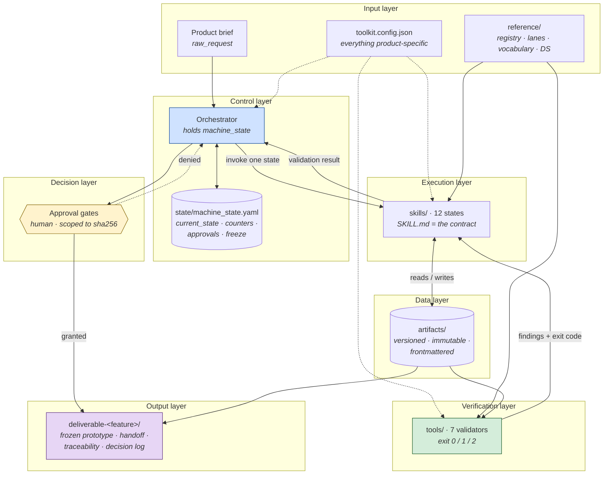
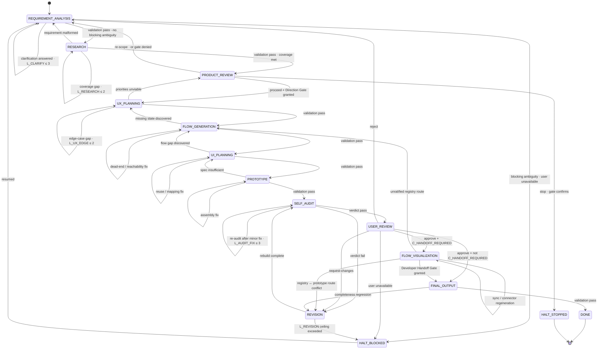
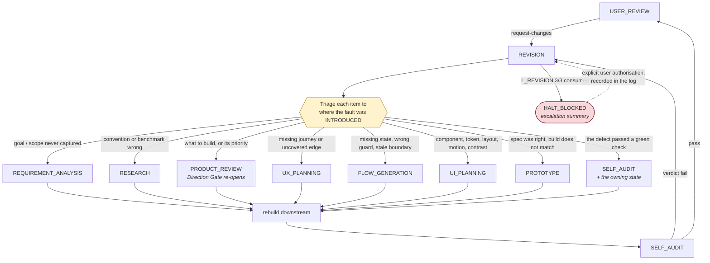
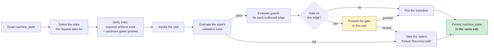
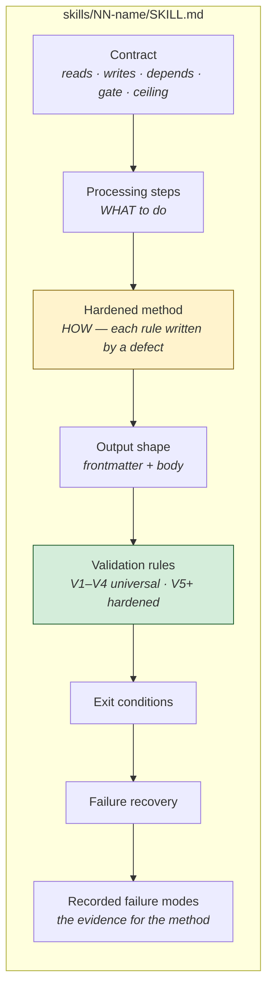
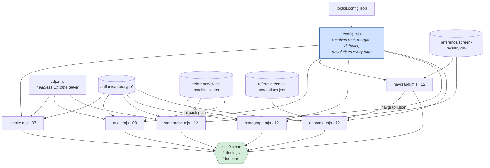
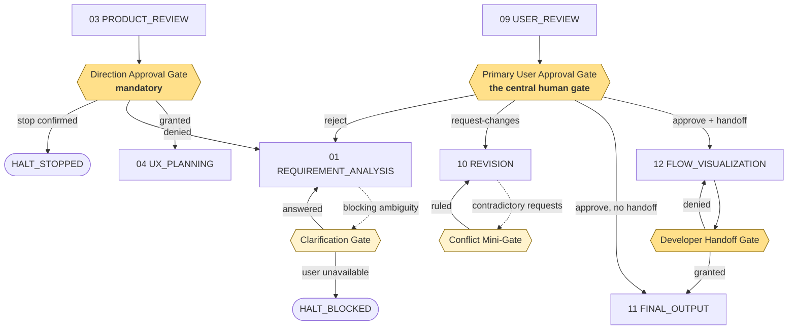
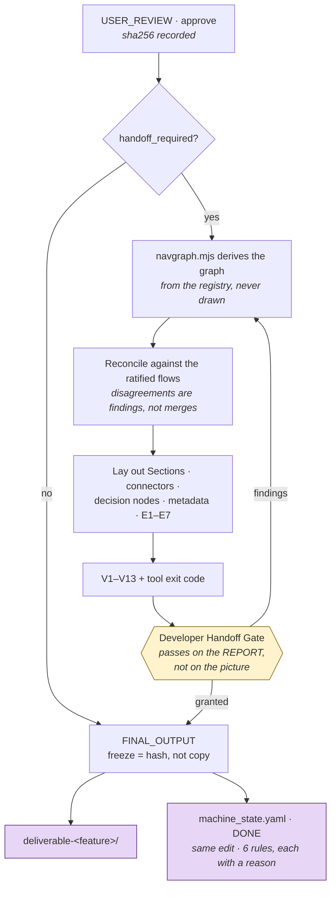
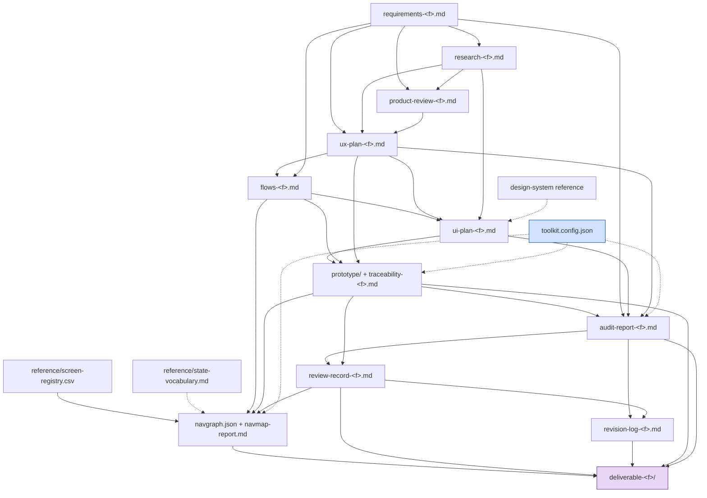

# Architecture

How the Design Toolkit is put together: the state machine, the orchestrator, the artifact store, the skills, the validators, the gates, and what comes out.

[← README](README.md) · [Workflow Guide →](WORKFLOW_GUIDE.md) · [Artifact Flow →](ARTIFACT_FLOW.md) · [Validation Engine →](VALIDATION_ENGINE.md)

---

## Contents

1. [High-level architecture](#1--high-level-architecture)
2. [The state machine](#2--the-state-machine)
3. [The orchestrator](#3--the-orchestrator)
4. [Claude Skills — the states](#4--claude-skills--the-states)
5. [The artifact store](#5--the-artifact-store)
6. [Reference inputs](#6--reference-inputs)
7. [The validation engine](#7--the-validation-engine)
8. [Approval gates](#8--approval-gates)
9. [Configuration](#9--configuration)
10. [Outputs](#10--outputs)
11. [Dependency graph](#11--dependency-graph)
12. [Design decisions and their consequences](#12--design-decisions-and-their-consequences)

---

## 1 · High-level architecture

Six layers. Each one has exactly one job, and the boundaries between them are the reason the system is checkable.



### The three separations that matter

| Separation | Rule | What it prevents |
|---|---|---|
| **Skills ↔ skills** | Skills communicate **only** through the artifact store, never directly. A skill's contract is its Reads and Writes. | A state reaching into another state's internals, which makes both un-replaceable and un-testable. |
| **Skills ↔ machine state** | No skill holds `machine_state`. The orchestrator holds it, evaluates guards, fires transitions and persists after every one. | Twelve places deciding what happens next, and twelve subtly different answers. |
| **Tools ↔ product** | No tool contains a product-specific value. Everything reads `toolkit.config.json` through [`tools/config.mjs`](tools/config.mjs). | The toolkit fossilising around the first product that used it. |

---

## 2 · The state machine

### 2.1 Full transition graph



`REVISION` additionally dispatches to any upstream state by root cause; those edges are omitted above for legibility and enumerated in [§ 2.4](#24-the-revision-loop).

### 2.2 Terminals

| Terminal | Meaning | Resumable |
|---|---|---|
| `DONE` | Success. All six completion rules hold. | terminal |
| `HALT_STOPPED` | A deliberate stop, ruled at Product Review or by the user. Recorded with rationale. Not a failure. | terminal |
| `HALT_BLOCKED` | Paused pending human input, an answer, or a ceiling reset. Fully persisted. | **yes** — resumes at the exact state |

`HALT_BLOCKED` is a working outcome. The machine reaching it with an escalation summary is the system doing its job; a fourth unbounded revision cycle would be the system failing.

### 2.3 Guards

A forward transition fires only if its guard conjunction holds. If a guard fails, the machine takes the state's declared Failure Recovery path — not the forward edge.

| Condition | Definition |
|---|---|
| `C_VALID(state)` | All validation rules of `state` pass. |
| `C_NO_BLOCKING_Q` | No `open_question` with severity `blocking` unresolved. |
| `C_COVERAGE_MET` | Goal-to-theme (or goal-to-task) mapping ≥ threshold. |
| `C_AUDIT_PASS` | `audit-report.md` verdict = `pass`, zero `blocker`. |
| `C_APPROVED(gate)` | `machine_state.approvals[gate]` = `granted`. |
| `C_LOOP_OK(loop)` | `machine_state.loop_count[loop]` < ceiling. |
| `C_RETRY_OK(state)` | `machine_state.entry_count[state]` < retry ceiling. |
| `C_ALL_CRITERIA_MET` | 100% acceptance criteria `met` or `waived` with record. |
| `C_HANDOFF_REQUIRED` | `machine_state.handoff_required` = true. |
| `C_NAVMAP_CLEAN` | Navigation derivation exits clean at the configured severity, or every remaining finding carries a granted waiver plus a rider debt item. |

### 2.4 The revision loop

`REVISION` is the only state that writes work into other states. It is also the primary product loop, and §7 of the specification requires it to terminate by user `approve` or by ceiling — it can never silently continue.



**Root cause is where the fault was introduced, not where it is visible.** Everything is visible in the prototype; that is not evidence it belongs to `PROTOTYPE`. A repeat is evidence of misrouting: on the extraction run, four consecutive change requests dispatched palette work downstream while the real fault was wrong-document adoption at `UI_PLANNING`, and the machine reached `HALT_BLOCKED` before the routing was re-examined.

### 2.5 Loops and ceilings

Ceilings live in `toolkit.config.json` → `loops`; counters live in `machine_state.loop_count`.

| Loop | Path | Ceiling | On breach |
|---|---|---|---|
| `L_CLARIFY` | `REQUIREMENT_ANALYSIS` self-loop | 3 | `HALT_BLOCKED` |
| `L_RESEARCH` | `RESEARCH` self-loop | 2 | continue with a logged `gap` |
| `L_UX_EDGE` | `UX_PLANNING` self-loop | 2 | flag `partial-coverage` |
| `L_REVISION` | `USER_REVIEW → REVISION → upstream → SELF_AUDIT → USER_REVIEW` | 3 full cycles | `HALT_BLOCKED` + escalation summary |
| `L_AUDIT_FIX` | `SELF_AUDIT ↔ REVISION` | 3 | escalates **into** `L_REVISION` accounting — it does not reset it |

Two invariants:

- Every loop increments its counter **before** re-entry, checked by `C_LOOP_OK`.
- Changes deduplicate against a `seen_changes` set, so a rejected change cannot re-enter the loop endlessly.

> **A ceiling nobody counts is not a ceiling.** On the extraction run the counters stopped being written after the second round; one flow then delivered five rounds against a ceiling of three, and an inner loop breached ×4 and ×8 with no escalation.

### 2.6 Retry versus back-transition

| | Retry (self-loop) | Back-transition |
|---|---|---|
| When | the fault is **inside** this state's output | the fault's root cause is **upstream** |
| Action | re-run processing steps with the failed rule injected as a corrective constraint | route to the owning state |
| Counter | `entry_count[state]` | the owning state's own counters |
| Example | a dead end in a flow graph → patch that segment | a *persistently* unreachable state → `UX_PLANNING` omitted it |

Non-validation errors have their own rule: a missing required input artifact back-transitions to the producing state; a tool or skill runtime error retries the failed step twice, then escalates to `HALT_BLOCKED` with a diagnostic.

---

## 3 · The orchestrator

The orchestrator is **not a skill**. It may be a person following the workflow document, an agent holding `machine_state`, or — from roadmap phase 2 — a CLI. Its responsibilities are fixed:



### 3.1 What it holds

`state/machine_state.yaml` — the machine's own record, not an artifact. Completion rule 1 is defined over it.

```yaml
machine_state:
  project: <slug>
  current_state: <STATE_NAME>
  scope: <the feature this run is about>
  gate: pending                    # pending | granted | denied
  handoff_required: false          # true → STATE 12 runs before FINAL_OUTPUT
  blocked_reason: null
  last_transition: { from, to, trigger, ts }
  entry_count: {}                  # per-state visit counter → C_RETRY_OK
  loop_count: { L_CLARIFY: 0, L_RESEARCH: 0, L_UX_EDGE: 0,
                L_REVISION: 0, L_AUDIT_FIX: 0 }
  approvals:                       # per-gate, resumable
    ClarificationGate: pending
    DirectionApprovalGate: pending
    PrimaryUserApprovalGate: pending
    ConflictMiniGate: pending
    DeveloperHandoffGate: pending
  artifact_versions: {}
  flows: []                        # one row per feature; `deliverable` names the freeze folder
  freeze: {}                       # sha256 per frozen file
  completion_check:                # boolean AND a one-line reason, each
    C1_state_is_done: false
    C2_approval_scoped_to_final_frozen_versions: false
    C3_all_criteria_met: false
    C4_audit_pass_on_final_version: false
    C5_deliverables_complete: false
    C6_no_open_revision_items: false
```

### 3.2 The rule that governs it

**Write it at decision time, in the same edit as the thing it records.** A record written later is a reconstruction.

On the extraction run this file sat two days and two approval rounds stale — still reading `current_state: USER_REVIEW`, gate `pending` — while seven flows had been approved and the machine was reporting itself as shipping. Nothing detected it, because nothing was reading the file the completion rule is defined over.

One operational side effect worth knowing: [`templates/prototype/serve.py`](templates/prototype/serve.py) gates live reload on the top-level `current_state` being `USER_REVIEW`. Outside review the same server serves plain pages.

---

## 4 · Claude Skills — the states

Each state is one folder under [`skills/`](skills/), holding:

- **`SKILL.md`** — the executable contract. Frontmatter (`name`, `description`) makes it discoverable; the body carries Contract, Purpose, Processing steps, hardened method, Output shape, Validation rules, Exit conditions, Failure recovery, Approval gate and Recorded failure modes.
- **`README.md`** — a one-screen orientation: machine state, reads, writes, dependencies, gate, ceiling, next states, and the single rule that matters most in that state.



### 4.1 The skill decomposition map

| Skill (state) | Reads | Writes | Must be preceded by |
|---|---|---|---|
| `01 requirement-analysis` | `raw_request` | `requirements.md` | — |
| `02 research` | requirements | `research.md` | 01 |
| `03 product-review` | requirements, research | `product-review.md` | 02 |
| `04 ux-planning` | requirements, research, product-review | `ux-plan.md` | 03 |
| `05 flow-generation` | ux-plan, requirements | `flows.md` | 04 |
| `06 ui-planning` | flows, ux-plan, research, DS reference | `ui-plan.md` | 05 |
| `07 prototype` | ui-plan, flows, ux-plan | `prototype/`, `traceability.md` | 06 |
| `08 self-audit` | prototype + all upstream | `audit-report.md` | 07 |
| `09 user-review` | prototype, audit-report | `review-record.md` | 08 |
| `10 revision` | audit-report and/or review-record | `revision-log.md` | 08 or 09 |
| `12 flow-visualization` | flows, registry, lanes, prototype, design file | `navgraph.json`, `navmap-report.md`, `flow-visualization.md`, design-file pages | 05 + 09 approve |
| `11 final-output` | the approved artifact set | `deliverable-<feature>/` | 09 approve (+ 12 gate when in scope) |

### 4.2 Why 12 is numbered after 11

`flow-visualization` is numbered 12 by **authoring order**, not machine order. It sits on the `USER_REVIEW (approve) → FINAL_OUTPUT` edge and runs before delivery whenever `handoff_required` is true.

It is deliberately distinct from STATE 05, which also holds graphs:

| | STATE 05 · `FLOW_GENERATION` | STATE 12 · `FLOW_VISUALIZATION` |
|---|---|---|
| A node is | a *state the user is in* | a *frame in the design file* |
| The question | is this flow correct? | can a developer build from this file without asking? |
| Screens | deliberately screen-free | screen-only — a node with no frame is a finding |
| Truth comes from | ratification by review of the prototype | derivation from the registry, checked by exit code |
| When | before any screen is named | after the approval gate, before the freeze |

---

## 5 · The artifact store

`artifacts/` is a single versioned store. Every artifact is **immutable once written**; a revision creates a new version and records what it supersedes.

### 5.1 Naming

```
<artifact>-<feature>.md          the file            flows-checkout.md
<abbrev>-<feature>-NN            the version id      proto-checkout-03
```

Per-feature naming is the convention. The contract is identical for a single-feature product.

### 5.2 Frontmatter — the load-bearing fields

Every artifact opens with YAML frontmatter. Three fields carry weight beyond bookkeeping, and each was added because its absence broke a downstream check.

```yaml
---
artifact: <type>                 # what this is
version: <id>                    # what to cite it as
produced_by: <skill name>        # which state owns it
reads_versions:                  # the EXACT versions consumed — not "the latest"
  ui-plan-<feature>.md: ui-<feature>-02
  prototype: proto-<feature>-05
supersedes: <prior version>      # when this replaces one
---
```

| Field | Why it is load-bearing |
|---|---|
| `reads_versions` | What `FINAL_OUTPUT` checks completion rule 2 against. A record naming its inputs only in a body table is not machine-checkable. This is the field a real gate record dropped, and it is the one that mattered. |
| `version` | On a prototype, the id every audit, gate and freeze must agree on. |
| `supersedes` | How an artifact set stays readable after a revision loop. |

### 5.3 The store

| Artifact | Produced by | Consumed by |
|---|---|---|
| `requirements-<feature>.md` | 01 | 02, 03, 04, 08, 11 |
| `research-<feature>.md` | 02 | 03, 04, 06 |
| `product-review-<feature>.md` | 03 | 04 |
| `ux-plan-<feature>.md` | 04 | 05, 06, 08 |
| `flows-<feature>.md` | 05 | 06, 07, 12 |
| `ui-plan-<feature>.md` | 06 | 07, 08 |
| `prototype/` | 07 | 08, 09, 12 |
| `traceability-<feature>.md` | 07 | 08, 09, 11, 12 |
| `audit-report-<feature>.md` | 08 | 09, 10, 11 |
| `review-record-<feature>.md` | 09 | 10, 11 |
| `revision-log-<feature>.md` | 10 | 11 (completion rule 6) |
| `navgraph.json` · `navmap-report.md` | 12 | 12, 11 |
| `flow-visualization-<scope>.md` | 12 | 11 |
| `deliverable-<feature>/` | 11 | — (terminal) |

Full descriptions and consumption rules: **[ARTIFACT_FLOW.md](ARTIFACT_FLOW.md)**.

---

## 6 · Reference inputs

`reference/` holds what the product owns and the pipeline **reads but never produces**.

| File | Owned by | Read by |
|---|---|---|
| `screen-registry.csv` | the product; rows added as flows are designed | `navgraph.mjs`, `stategraph.mjs`, STATE 12 |
| `nav-lanes.json` | STATE 12 (E1) | `navgraph.mjs` |
| `state-vocabulary.md` | STATE 12 (E5) | `navgraph.mjs`, `stategraph.mjs` |
| `state-machines.json` | STATE 12 (E5) | `stategraph.mjs`, `stateprobe.mjs`, `audit.mjs` (fallback plan) |
| `edge-annotations.json` | STATE 12 (E6) | `annotate.mjs` |
| `audit-plan.json` | STATE 08, optional | `audit.mjs` |
| design-system export, brand assets, sources | the product | STATE 06 |

### The registry is the spine

`tools/navgraph.mjs` derives the **entire** navigation model from the registry's cells. Two consequences:

1. **If the diagram and the derivation disagree, the diagram is wrong.** A connector drawn by hand is an assertion nobody can re-check.
2. **A cell carrying prose where an id belongs is a finding** (`N10-unparsed`), not a stylistic quibble — it silently drops an edge.

Two separators, not interchangeable: `states` is **comma**-separated; `entry_from` and `navigates_to` are **pipe**-separated.

---

## 7 · The validation engine

Seven Node ≥22 scripts, zero dependencies, all config-driven through [`tools/config.mjs`](tools/config.mjs).



### 7.1 Severity ladder

`blocking` → `major` → `advisory`. `--fail-on <level>` names the lowest rung that causes a non-zero exit. Default is `blocking`.

### 7.2 The instrument discipline

Two rules bind every tool in this layer, and both were written by real runs:

- **A failing probe is a hypothesis, not a finding.** One audit's first run reported 60 failures and 3 were real; a state probe reported 37 and all 37 were the harness. Confirm at source, correct the instrument, re-run. Never waive, never report unconfirmed.
- **Every check is rendering-class.** Computed visibility and measured geometry, never DOM presence. A node can exist, lay out, and accept a programmatic click while painting nothing.

Per-tool detail, output shapes, failure classes and fixes: **[VALIDATION_ENGINE.md](VALIDATION_ENGINE.md)**.

---

## 8 · Approval gates



| Gate | Location | Blocks | On deny |
|---|---|---|---|
| **Clarification** | `REQUIREMENT_ANALYSIS` | leaving with unresolved blocking ambiguity | self-loop or `HALT_BLOCKED` |
| **Direction Approval** | `PRODUCT_REVIEW → UX_PLANNING` | spending design effort on an unapproved direction | → `REQUIREMENT_ANALYSIS` |
| **Primary User Approval** | `USER_REVIEW → FINAL_OUTPUT` | shipping an unapproved deliverable | → `REVISION` or `REQUIREMENT_ANALYSIS` |
| **Conflict Mini-Gate** | `REVISION` | dispatching conflicting change requests | user resolves, then dispatch |
| **Developer Handoff** | `FLOW_VISUALIZATION → FINAL_OUTPUT` | shipping a design a build team cannot navigate | self-loop, or → `FLOW_GENERATION` / `REVISION` per the failing rule |

### 8.1 Gate semantics

- No forward transition through a gate without `C_APPROVED(gate)`.
- Gate state persists in `machine_state.approvals` and is resumable.
- **An approval is scoped to the artifact versions it saw.** If artifacts change after approval, the gate reverts to `pending`. This is the rule that prevents stale-approval shipping.
- The grantor is always the **user**. The machine cannot waive its own rules.

### 8.2 Classifying a post-approval delta

Bytes will move after approval. The two classes need different things from the user, and presenting one as the other is the defect:

| Class | Evidence required | What to ask for |
|---|---|---|
| **Bug-fix only** | Byte-level proof: identical token and hex inventory, diff confined to named regions, and the pre-fix file reconstructed from the inverse delta hashing back to the approved sha | a one-line **scope confirm** |
| **Feature delta** | The new behaviour, plus what it changes in the approved surface | a **ruling** — the gate is `pending` until it lands |

### 8.3 Waivers

A rule may be **waived**, never skipped. A waiver ships only when all three hold:

1. The **user** grants it — the machine cannot waive its own rules.
2. It is written into the deliverable's Known limitations **and** opened as a numbered debt item both sides can cite.
3. It states **what would close it**.

On the extraction run, two waivers were granted this way and both were closed the next day. The waiver was never the problem; the silence would have been.

---

## 9 · Configuration

One file: [`toolkit.config.json`](toolkit.config.json). Every tool reads it through `config.mjs`, which resolves the root (`--root` flag → `$TOOLKIT_ROOT` → nearest ancestor containing the config → cwd), merges over defaults section by section, and absolutises every path once so no tool joins a path itself.

| Section | Governs | Read by |
|---|---|---|
| `product` | name, slug, platform, viewport, locales, scripts | every tool; viewport drives capture and geometry |
| `paths` | where artifacts, reference files and state live | every tool |
| `screens` | screen-id pattern, flow section name format | STATE 12 |
| `review` | player port, player file, the state live reload is gated on | `serve.py`, STATE 09 |
| `prototype` | the harness contract — view selector, active class, screen selector, sid selector, paint floor | `smoke.mjs`, `audit.mjs`, `stateprobe.mjs` |
| `audit` | Chrome path, ports, tap-target floor, colour allowlist and ban list, palette-exempt selectors, benign console entries | `audit.mjs`, `smoke.mjs` |
| `flowPages` | screen-id prefix → prototype page, when it is not `<prefix>.html` | `navgraph.mjs` |
| `designSystem` | **name the DS by source id** | STATE 06 |
| `figma` | file key and page map | STATE 12 |
| `loops` | every loop ceiling | orchestrator |

### 9.1 The harness contract

Three harnesses read the prototype, and they all read it the same way — through `toolkit.config.json` → `prototype`:

```
.screen                            the viewport-sized container
  .view[data-view][data-sid]       one per flow state
  .view.active                     exactly the one being shown
  #sid                             prints the active view's screen id
```

`data-sid` is what makes registry ↔ prototype id drift **measurable rather than asserted**: the probe reads what the page prints and compares it to the id the registry claims, instead of trusting either.

**Change the convention in the config, never in a tool.** A prototype whose views are invisible to the contract reports as *blank* — indistinguishable from the defect the contract exists to catch.

### 9.2 The four fields most worth getting right

| Field | Why |
|---|---|
| `designSystem.sourceId` | A plan built on the wrong design system validates **perfectly** against it. That failure cost three revision cycles and a `HALT_BLOCKED`. |
| `audit.tapTargetFloorPx` | The number STATE 04 commits to and STATE 08 checks. Set it to what you will actually build — this is the last place it is free to change. |
| `product.scripts` | Empty turns the per-glyph font check off. A product rendering a non-Latin script with this empty ships the wrong-font-stack class blind. |
| `audit.colorAllowlist` | Written by STATE 06, enforced by STATE 08. Empty means palette enforcement is off. |

---

## 10 · Outputs

### 10.1 The developer package

```
artifacts/deliverable-<feature>/
├── prototype/                 the frozen bytes, each listed with its sha256
└── handoff-<feature>.md       what shipped · requirement source · key decisions ·
                               pipeline artifacts · acceptance criteria · freeze table ·
                               review packet with every deep-link hook · waivers ·
                               known limitations · all six completion rules
```

Plus, when `handoff_required`: `navgraph.json`, `navmap-report.md`, `flow-visualization-<scope>.md`, and the design-file Sections, cross-feature map, overview page and legend.

Plus, always: the terminal record in `state/machine_state.yaml`, written **in the same edit as the freeze**.

### 10.2 The handoff flow



### 10.3 Completion

The workflow is complete only when **all six** hold:

1. `current_state` = `DONE`.
2. `USER_REVIEW` outcome = `approve`, scoped to the final frozen versions and not superseded.
3. `C_ALL_CRITERIA_MET` — every acceptance criterion `met` or explicitly `waived` with record.
4. `C_AUDIT_PASS` held on the **final** prototype version.
5. `deliverable/` exists with frozen artifacts, handoff doc, traceability and decision log.
6. No `open` change items in the latest `revision-log.md`.

Plus, when `handoff_required`: the Developer Handoff Gate is `granted` and `C_NAVMAP_CLEAN` holds.

Each rule gets a boolean **and a one-line reason**. `C3: true` with no reason is the same silence a waiver without a rider would be.

### 10.4 Anti-patterns the machine forbids

- Reaching `FINAL_OUTPUT` without the Primary User Approval Gate.
- Shipping with unmet acceptance criteria.
- Infinite revision — bounded by `L_REVISION`.
- Stale-approval shipping — the gate reverts to `pending` on artifact change.
- Introducing scope in `PRODUCT_REVIEW` or later that was never validated in `REQUIREMENT_ANALYSIS`.

---

## 11 · Dependency graph

What must exist before what. Solid edges are hard dependencies; dashed edges are configuration or reference reads.



Read this graph as the answer to "what breaks if I skip a state": every downstream node loses an input, and the skill that owed it is where a missing-artifact error back-transitions to.

---

## 12 · Design decisions and their consequences

| Decision | Consequence | What it prevents |
|---|---|---|
| **Skills talk only through files** | A state is replaceable in isolation; its contract is fully readable. | A conversation-shaped dependency nobody can audit or re-run. |
| **The orchestrator is not a skill** | One place evaluates guards and persists state. | Twelve states each deciding what happens next, differently. |
| **Artifacts are immutable; revisions version** | Any claim can be checked against the exact bytes it was made about. | A green audit on superseded bytes reading as a green audit. |
| **Approvals are scoped to sha256** | A gate reverts to `pending` automatically when bytes move. | A deliverable and a prototype disagreeing about what shipped. |
| **Validation is an exit code** | "The map matches the registry" is verifiable by anyone, later. | Confidence substituting for evidence. |
| **Derive, never draw** | The navigation model has exactly one source, and it is re-derivable. | A hand-drawn connector nobody can re-check, and a stale arrow indistinguishable from a fresh one. |
| **`UNKNOWN` is legal; a guess is not** | Gaps are visible and counted. | A plausible-looking API endpoint that a developer will actually build. |
| **Every loop has a counted ceiling** | Escalation is structural, and `HALT_BLOCKED` is resumable. | A revision cycle that runs on its own exhaust. |
| **Zero dependencies in `tools/`** | The validation engine still runs in five years. | A verification layer that rots because of a transitive dependency. |
| **Config, not code, holds product values** | The same toolkit serves the next product without a fork. | The toolkit fossilising around its first product. |

---

[← README](README.md) · [Workflow Guide →](WORKFLOW_GUIDE.md) · [Artifact Flow →](ARTIFACT_FLOW.md) · [Validation Engine →](VALIDATION_ENGINE.md) · [Design Principles →](DESIGN_PRINCIPLES.md)
