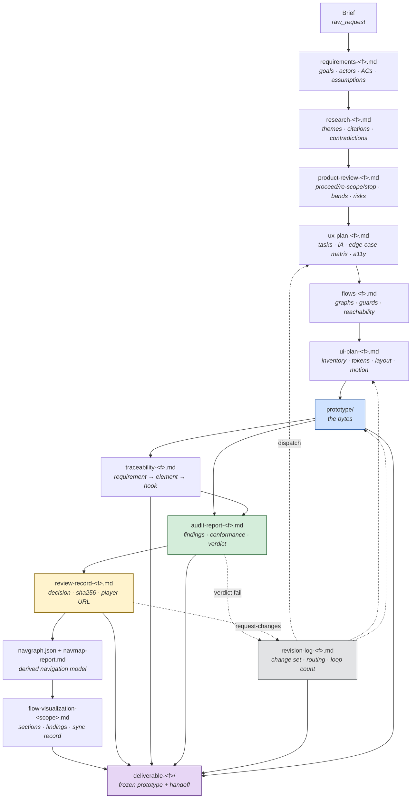
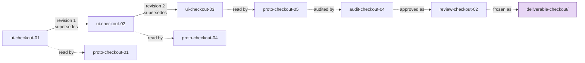
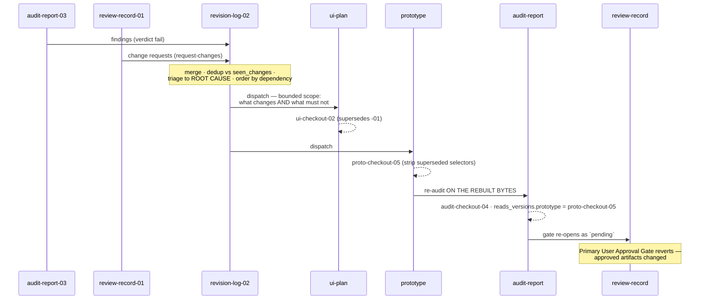
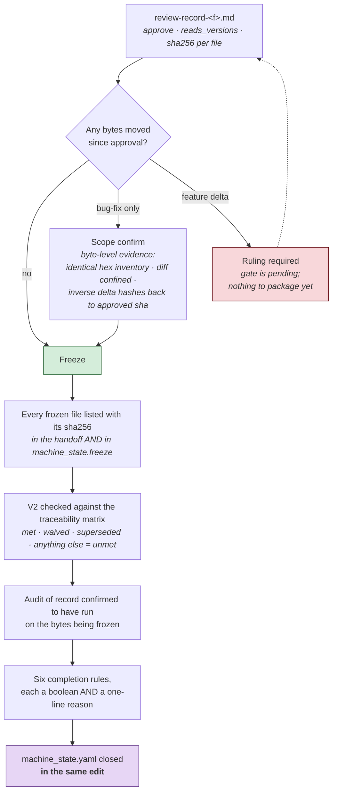

# Artifact Flow

The pipeline as data: what each artifact is, who produces it, who consumes it, what makes it valid, and how it survives a revision loop.

[← README](README.md) · [Architecture →](ARCHITECTURE.md) · [Workflow Guide →](WORKFLOW_GUIDE.md) · [Contracts spec →](docs/artifact-contracts.md)

---

## Contents

1. [The pipeline in one picture](#1--the-pipeline-in-one-picture)
2. [The rule that makes it composable](#2--the-rule-that-makes-it-composable)
3. [Naming and versioning](#3--naming-and-versioning)
4. [Frontmatter — the load-bearing fields](#4--frontmatter--the-load-bearing-fields)
5. [Every artifact, in detail](#5--every-artifact-in-detail)
6. [Reference inputs — read but never produced](#6--reference-inputs--read-but-never-produced)
7. [Machine state — not an artifact](#7--machine-state--not-an-artifact)
8. [What a revision does to the store](#8--what-a-revision-does-to-the-store)
9. [The freeze](#9--the-freeze)
10. [Consumption matrix](#10--consumption-matrix)

---

## 1 · The pipeline in one picture



Solid edges are the forward pipeline. Dashed edges are the revision loop — the only way work travels backwards.

### The short form

```
Brief → Requirements → Research → Product Review → UX Plan → Flows → UI Plan
      → Prototype (+ Traceability) → Audit → User Review → [Navigation Map]
      → Developer Package
```

`Revision` is not a stage in that line. It is the loop that routes a failure back to the state that caused it, and it produces a log rather than a stage output.

---

## 2 · The rule that makes it composable

**Skills communicate only through the artifact store, never directly.**

A skill's contract is its **Reads** and its **Writes**. Nothing reaches into another skill's internals; nothing is passed in a conversation that is not also in a file.

Three consequences worth stating plainly:

| Consequence | Why it matters |
|---|---|
| **A state is replaceable in isolation.** | You can rewrite STATE 06 entirely, and as long as it writes a conforming `ui-plan-<feature>.md`, STATE 07 does not notice. |
| **If it is not in the artifact, it did not happen.** | A decision that lives only in chat history is invisible to the next state, to the audit, and to the gate. |
| **Every claim is checkable later.** | The store is the evidence, and it is still there after the loop closes. |

---

## 3 · Naming and versioning

```
<artifact>-<feature>.md          the file            flows-checkout.md
<abbrev>-<feature>-NN            the version id      proto-checkout-03
```

| Artifact | Version id prefix | Example |
|---|---|---|
| requirements | `req-` | `req-checkout-01` |
| research | `res-` | `res-checkout-01` |
| product-review | `pr-` | `pr-checkout-02` |
| ux-plan | `ux-` | `ux-checkout-01` |
| flows | `flow-` | `flow-checkout-03` |
| ui-plan | `ui-` | `ui-checkout-02` |
| prototype | `proto-` | `proto-checkout-05` |
| traceability | `trace-` | `trace-checkout-05` |
| audit-report | `audit-` | `audit-checkout-04` |
| review-record | `review-` | `review-checkout-02` |
| revision-log | `rev-` | `rev-checkout-03` |
| flow-visualization | `navmap-` | `navmap-checkout-01` |

Per-feature file naming is the convention. **The contract is identical for a single-feature product** — `flows.md` works exactly as `flows-checkout.md` does.

### Versions increment, never overwrite

An artifact is **immutable once written**. A revision creates a new version and records what it supersedes.



This is what makes a claim checkable a month later. "The audit passed" is meaningless; "`audit-checkout-04` passed against `proto-checkout-05`, and `proto-checkout-05` is the sha in the freeze table" is a fact anyone can re-check.

---

## 4 · Frontmatter — the load-bearing fields

Every artifact opens with YAML frontmatter.

```yaml
---
artifact: <type>                 # what this is
version: <id>                    # what to cite it as
produced_by: <skill name>        # which state owns it
reads_versions:                  # the EXACT versions consumed — not "the latest"
  ui-plan-<feature>.md: ui-<feature>-02
  prototype: proto-<feature>-05
supersedes: <prior version>      # when this replaces one
feature: <feature id>
---
```

Three fields carry weight beyond bookkeeping. Each was added because its absence broke a downstream check.

| Field | What depends on it | The failure that added it |
|---|---|---|
| **`reads_versions`** | `FINAL_OUTPUT` checks completion rule 2 against it — *approval scoped to the final frozen versions*. | The most recent gate record on the extraction run **dropped it entirely**, naming its prototype and audit only in a body table. A record that names its inputs only in prose is not machine-checkable. |
| **`version`** | Every audit, gate and freeze must agree on the prototype's id. | Five of seven approved flows arrived at their gate past their audit of record, because nothing was comparing ids. |
| **`supersedes`** | How an artifact set stays readable after a revision loop. | An AC quietly dropped because a later round replaced its screen is indistinguishable from an AC that was never built, unless the supersession is written down. |

> **The general rule:** a field that a downstream rule is defined over belongs in **frontmatter**, not in a body table. Body tables are for humans; frontmatter is for the machine, and the machine is what checks the completion rules.

---

## 5 · Every artifact, in detail

### 5.1 `requirements-<feature>.md`

| | |
|---|---|
| **Produced by** | 01 `requirement-analysis` |
| **Consumed by** | 02, 03, 04, 08 (conformance matrix), 11 (completion rule 3) |
| **What it is** | The conversion from prose brief to checkable commitments. |
| **Contains** | Problem statement · goals (`G1`…) · actors · constraints · non-goals · requirements with falsifiable acceptance criteria (`R1` / `AC1.1`…) · assumptions flagged `assumed` \| `confirmed` · open questions with severity · scope class and effort tier. |
| **Load-bearing part** | The **acceptance criteria**. STATE 08 builds its conformance matrix from these ids, and STATE 11 checks 100% of them. An AC that cannot fail makes both unevaluable rather than failed. |
| **Template** | [`templates/requirements.md`](templates/requirements.md) |

### 5.2 `research-<feature>.md`

| | |
|---|---|
| **Produced by** | 02 `research` |
| **Consumed by** | 03 (every priority is scored against it), 04, 06 |
| **What it is** | The evidence base, with citations that resolve. |
| **Contains** | Themes (`T1`…) each citing sources and mapping to goal ids · evidence table · competitor notes · pattern catalogue · constraints · **contradictions, left unresolved** · goal-coverage map · gaps. |
| **Load-bearing part** | **Contradictions.** A quietly resolved disagreement means STATE 03 scores the direction against evidence that has been tidied. |
| **Template** | [`templates/research.md`](templates/research.md) |

### 5.3 `product-review-<feature>.md`

| | |
|---|---|
| **Produced by** | 03 `product-review` |
| **Consumed by** | 04 |
| **What it is** | The direction decision, and the artifact the Direction Approval Gate is answered on. |
| **Contains** | Recommendation `proceed` \| `re-scope` \| `stop` with rationale · prioritized requirements banded `must` / `should` / `could` / `cut` with evidence · risk register with mitigation-or-accept and a named owner · scope contradictions · decision record with reversal triggers · cut list. |
| **Load-bearing part** | The **priority bands**. STATE 04 derives tasks from `must` / `should`, not from the raw requirement set. |
| **Template** | [`templates/product-review.md`](templates/product-review.md) |

### 5.4 `ux-plan-<feature>.md`

| | |
|---|---|
| **Produced by** | 04 `ux-planning` |
| **Consumed by** | 05, 06, 08 (the accessibility audit runs against this strategy) |
| **What it is** | The UX strategy, deliberately screen-free. |
| **Contains** | Primary tasks traced to requirements · information architecture · navigation model · per-task state enumeration (happy + ≥3 non-happy) · edge-case matrix · accessibility strategy **with a stated target floor** · UX risks · open decisions (`o-<id>`). |
| **Load-bearing part** | The **edge-case matrix** and the **target floor**. Every non-happy state missing here is missing everywhere downstream, and the floor becomes an acceptance criterion the audit checks. |
| **Template** | [`templates/ux-plan.md`](templates/ux-plan.md) |

### 5.5 `flows-<feature>.md`

| | |
|---|---|
| **Produced by** | 05 `flow-generation` |
| **Consumed by** | 06, 07, 12 |
| **What it is** | Directed flow graphs — the graph STATE 06 lays out and STATE 12 reconciles its derivation against. |
| **Contains** | Canon entry paths · per-segment flow graphs with triggers and guards · decision log · **reachability report** · recovery-coverage table · **flow-boundary table** (`⟂` nodes with dated status) · open decisions. |
| **Load-bearing part** | The **reachability report** (evidence, not a claim) and the **boundary table** (a dated claim, re-checked whenever another feature ships). |
| **Template** | [`templates/flows.md`](templates/flows.md) |

### 5.6 `ui-plan-<feature>.md`

| | |
|---|---|
| **Produced by** | 06 `ui-planning` |
| **Consumed by** | 07, 08 |
| **What it is** | The UI specification — components, tokens, geometry and motion, all **by reference**. |
| **Contains** | Inherited-verbatim list · **strict colour allowlist + ban list** · component inventory → DS mapping with reuse-vs-new · layout rules at the real viewport · motion spec forked for reduced-motion · **contrast pairs with ratios** · token-resolution accounting · supersession table · Extension Note · open decisions. |
| **Load-bearing part** | The **allowlist**, which must also be written into `toolkit.config.json` → `audit.colorAllowlist` / `colorBanned`. An allowlist that lives only in this document is an allowlist nothing enforces. |
| **Also writes** | `toolkit.config.json` → `audit.colorAllowlist`, `audit.colorBanned` |
| **Template** | [`templates/ui-plan.md`](templates/ui-plan.md) |

### 5.7 `prototype/`

| | |
|---|---|
| **Produced by** | 07 `prototype` |
| **Consumed by** | 08, 09, 12, 11 |
| **What it is** | The bytes. One self-contained file per flow, plus the review player. |
| **Contains** | The flow pages · `run-local.sh`, `serve.py`, `play.html` copied from [`templates/prototype/`](templates/prototype/) · deep-link hooks per flow state, variant and error case · a demo bar for states unreachable by data alone. |
| **Load-bearing part** | The **harness contract** — `.screen`, `.view[data-view][data-sid]`, `.view.active`, `#sid` — as configured in `toolkit.config.json` → `prototype`. A prototype invisible to the contract reports as *blank*, which is indistinguishable from the defect the contract exists to catch. |
| **Template** | [`templates/prototype/`](templates/prototype/) |

### 5.8 `traceability-<feature>.md`

| | |
|---|---|
| **Produced by** | 07 `prototype` |
| **Consumed by** | 08, 09 (**it is the review packet**), 11 (completion rule 3 is checked against it), 12 |
| **What it is** | The proof that the prototype matches the specs, and the map back from any element to the spec entry that authorised it. |
| **Contains** | Requirement → task → flow → component → prototype element · **flow state → representation → hook** · transition → wiring, with *destination paints* evidence · decision → implementation · **superseded, stripped not left dead** (itemised) · un-specced additions · the verification record. |
| **Load-bearing part** | The **hook table**. It is what makes V1 checkable rather than assertable, it is the packet STATE 09 hands the user, and it is what makes the deliverable re-drivable after the loop closes. |
| **Template** | [`templates/traceability.md`](templates/traceability.md) |

### 5.9 `audit-report-<feature>.md`

| | |
|---|---|
| **Produced by** | 08 `self-audit` |
| **Consumed by** | 09 (known limitations are the gate's transparency input), 10, 11 (completion rule 4) |
| **What it is** | The machine's verdict on its own work, with evidence. |
| **Contains** | Verdict with rationale · **method** (what was actually run — screens driven, runs, assertion count, screenshots, sweeps) · findings by severity with *caught by* · conformance matrix marking every AC `met` / `unmet` / `waived` **with evidence** · **harness corrections** · known limitations. |
| **Load-bearing part** | `reads_versions.prototype` — the exact bytes audited. A stale verdict is not a verdict, and a green audit on superseded bytes is not a green audit. |
| **Template** | [`templates/audit-report.md`](templates/audit-report.md) |

### 5.10 `review-record-<feature>.md`

| | |
|---|---|
| **Produced by** | 09 `user-review` |
| **Consumed by** | 10, 11 |
| **What it is** | The gate record. The single most consequential artifact in the store, because delivery is checked against it. |
| **Contains** | Decision + **verbatim user instruction** · what was approved · verification at approval · change requests with target states · **deltas ratified, classed bug-fix or feature** · known limitations presented · opens carried forward · waivers with riders · **freeze hashes**. |
| **Load-bearing parts** | Three, and all three are mandatory: `reads_versions` naming the exact prototype and audit versions; the **sha256 of every approved file**; and the **player URL** the review was actually conducted at. |
| **Template** | [`templates/review-record.md`](templates/review-record.md) |

### 5.11 `revision-log-<feature>.md`

| | |
|---|---|
| **Produced by** | 10 `revision` |
| **Consumed by** | 11 (completion rule 6) |
| **What it is** | The record of every change item, where it was routed, and whether it closed. |
| **Contains** | Change set with **class + sweep count**, root cause, target state and status · conflicts with both sides and their Mini-Gate outcomes · dependency order · supersessions · recorded constraints · **deliberately not changed** · impact analysis · re-validation. |
| **Load-bearing part** | Frontmatter `iteration` and `loop: L_REVISION (n/3)`. A ceiling nobody counts is not a ceiling. And: **a missing log reads as no evidence, not as no open items** — rule 6 is failed, not passed, when the log does not exist. |
| **Template** | [`templates/revision-log.md`](templates/revision-log.md) |

### 5.12 `navgraph.json` + `navmap-report.md`

| | |
|---|---|
| **Produced by** | 12 `flow-visualization`, via `tools/navgraph.mjs` |
| **Consumed by** | 12 (every other output in that state is generated from `navgraph.json`), `tools/annotate.mjs`, 11 |
| **What it is** | The derived navigation model, and the report the Developer Handoff Gate is answered on. |
| **Contains** | `meta` (screens, edges, cross-flow count, flows, entry points) · `nodes` · `edges` · `crossFlow` · `heat` · `states` · `deepLinks` · `findings`. The report renders the same data plus the findings table. |
| **Load-bearing rule** | **Machine-derived, regenerated, never hand-edited.** If the diagram and the derivation disagree, the diagram is wrong. And the gate passes on the **report**, not on the picture. |

### 5.13 `flow-visualization-<scope>.md`

| | |
|---|---|
| **Produced by** | 12 `flow-visualization` |
| **Consumed by** | 11 |
| **What it is** | The state's own record of what was mapped and what the gate saw. |
| **Contains** | Sections built · findings at gate with waiver status · **boundary status with the date each was checked** · **sync record** with the edge-set delta · extension status with evidence · the gate record in frontmatter naming the registry sha, the derivation run and the prototype versions. |
| **Load-bearing part** | `scope`. Handoff status is **READY FOR DEVELOPMENT scoped to the flows named** — never a bare "handoff ready". |
| **Template** | [`templates/flow-visualization.md`](templates/flow-visualization.md) |

### 5.14 `deliverable-<feature>/`

| | |
|---|---|
| **Produced by** | 11 `final-output` |
| **Consumed by** | — (terminal) |
| **What it is** | The frozen package. One deliverable per **approval gate**, named for what that gate approved. |
| **Contains** | `prototype/` — the frozen bytes, each listed with its sha256 · `handoff-<feature>.md`. |
| **The handoff contains** | What this delivers (screens + states) · requirement source · key decisions · pipeline artifacts · acceptance criteria · **freeze table with sha256 per file** · review packet listing every deep-link hook · waivers with riders and closing conditions · **known limitations at full strength** · all six completion rules with a boolean and evidence. |
| **Load-bearing rule** | **A freeze is a hash, not a copy.** A screen that is in no frozen deliverable is not delivered, however finished it looks. |
| **Template** | [`templates/handoff.md`](templates/handoff.md) |

---

## 6 · Reference inputs — read but never produced

These live in [`reference/`](reference/). The pipeline reads them; the product owns them.

| File | Owner | Read by | Seed from |
|---|---|---|---|
| `screen-registry.csv` | the product; rows added as flows are designed | `navgraph.mjs`, `stategraph.mjs`, STATE 12 | [`templates/screen-registry.csv`](templates/screen-registry.csv) |
| `nav-lanes.json` | STATE 12 (E1) | `navgraph.mjs` | [`templates/nav-lanes.json`](templates/nav-lanes.json) |
| `state-vocabulary.md` | STATE 12 (E5) | `navgraph.mjs`, `stategraph.mjs` | [`templates/state-vocabulary.md`](templates/state-vocabulary.md) |
| `state-machines.json` | STATE 12 (E5) | `stategraph.mjs`, `stateprobe.mjs`, `audit.mjs` fallback | [`templates/state-machines.json`](templates/state-machines.json) |
| `edge-annotations.json` | STATE 12 (E6) | `annotate.mjs` | [`templates/edge-annotations.json`](templates/edge-annotations.json) |
| `audit-plan.json` | STATE 08, optional | `audit.mjs` | [`templates/audit-plan.json`](templates/audit-plan.json) |
| design-system export, brand assets, sources | the product | STATE 06 | — |

### The registry is the spine

`tools/navgraph.mjs` derives the **entire** navigation model from the registry's cells.

```csv
screen_id,flow,screen_name,purpose,data_content,key_components,states,entry_from,navigates_to,status,notes
S-FLOW-01,01 Flow Name,Screen Name,…,…,…,"happy, loading",app launch,S-FLOW-02 | S-OTHER-01 (condition),todo,…
```

Two separators, and they are **not interchangeable**:

- `states` is **comma**-separated: `happy, error{invalid-input}, loading`
- `entry_from` / `navigates_to` are **pipe**-separated: `S-FLOW-02 | S-OTHER-01 (condition)`

Getting them backwards makes `navgraph` read one cell as a single label — reported as `N11-state-syntax`, not silently swallowed.

**`entry_from` is the column that rots.** It gets written when a screen is designed and never updated when a *later* flow starts routing to it. The forward edge (`navigates_to`) is authoritative and the map draws correctly regardless — but `entry_from` is what a developer reads to answer "who can send me here", so it is worth repairing when `N3b-backedge` reports it.

---

## 7 · Machine state — not an artifact

`state/machine_state.yaml` is the machine's own record. Completion rule 1 is defined over it.

It holds `current_state`, per-state `entry_count`, per-loop `loop_count`, `approvals`, `handoff_required`, `blocked_reason`, `last_transition`, `artifact_versions`, per-feature `flows` rows, the `freeze` hash table and the six `completion_check` booleans.

> **Write it at decision time, in the same edit as the thing it records.** A record written later is a reconstruction. It once sat two days stale while the machine reported itself shipping, and nothing detected it, because nothing was reading the file the completion rule is defined over.

One operational side effect: [`templates/prototype/serve.py`](templates/prototype/serve.py) gates live reload on the top-level `current_state` being `USER_REVIEW`. Outside review the same server serves plain pages — check the state file before calling reload broken.

---

## 8 · What a revision does to the store

A revision does not edit artifacts in place. It creates new versions, records supersessions, and re-runs everything downstream.



Four rules govern what happens to the store during a loop:

| Rule | Effect on the store |
|---|---|
| **Supersession deletes** | The replaced component's CSS, strings and handlers are stripped in the same change, and the strip is recorded **itemised** in `traceability.md`. Leftovers are un-specced elements and fail V2 exactly as additions do. |
| **Aged items are re-verified** | An open change item ages against a moving prototype. Three of one carried defect's six reported selectors no longer existed by the time it was actioned. Re-verify against current bytes; close as `superseded`, naming the round that removed it. |
| **The return edge passes through the audit** | Targeted verification is evidence *inside* the loop. It is not the audit. Returning to the gate without a current audit is a **waiver**, and a waiver names its rider. |
| **The gate reverts** | The Primary User Approval Gate returns to `pending` the moment approved artifacts change. Record that reversion in the revision log's dependency order — it is a consequence of the dispatch. |

---

## 9 · The freeze



**What "frozen" means, precisely:**

- Every file is listed with its **sha256**, in the handoff and in `machine_state.freeze`. Those hashes are what the next gate, the next audit and the next revision compare against.
- **One deliverable per approval gate**, named for what that gate approved. A single gate covering five flows produces one deliverable folder and one handoff, and every flow's row in `machine_state.flows` names the folder it landed in.
- `designed` and `delivered` are **different claims**. A screen that is not in a frozen deliverable is not delivered, however finished it looks.
- **A frozen deliverable does not freeze the things it links to.** Handoffs that cited design-file pages found them four revision rounds out of sync. Cite the version, and re-check it at sync.

---

## 10 · Consumption matrix

Rows produce; columns consume. `●` = required input, `○` = optional or conditional.

| Artifact ↓ / Consumed by → | 02 | 03 | 04 | 05 | 06 | 07 | 08 | 09 | 10 | 12 | 11 |
|---|:--:|:--:|:--:|:--:|:--:|:--:|:--:|:--:|:--:|:--:|:--:|
| `requirements-<f>.md` | ● | ● | ● | ● | | | ● | | ○ | | ● |
| `research-<f>.md` | | ● | ● | | ● | | | | ○ | | |
| `product-review-<f>.md` | | | ● | | | | | | ○ | | |
| `ux-plan-<f>.md` | | | | ● | ● | ● | ● | | ○ | | |
| `flows-<f>.md` | | | | | ● | ● | ● | | ○ | ● | |
| `ui-plan-<f>.md` | | | | | | ● | ● | | ○ | | |
| `prototype/` | | | | | | | ● | ● | ○ | ● | ● |
| `traceability-<f>.md` | | | | | | | ● | ● | ○ | ● | ● |
| `audit-report-<f>.md` | | | | | | | | ● | ● | ● | |
| `review-record-<f>.md` | | | | | | | | | ● | ● | ● |
| `revision-log-<f>.md` | | | | | | | | | | | ● |
| `navgraph.json` | | | | | | | | | | ● | ○ |
| `navmap-report.md` | | | | | | | | | | | ● |
| `flow-visualization-<s>.md` | | | | | | | | | | | ● |
| **reference** `screen-registry.csv` | | | | | | | | | | ● | |
| **reference** `nav-lanes.json` | | | | | | | | | | ● | |
| **reference** `state-vocabulary.md` | | | | | | | | | | ● | |
| **reference** design system | | | | | ● | ○ | ○ | | | | |

Read a column to answer *"what must exist before I can run this state?"* Read a row to answer *"what breaks if I change this artifact?"* — and every `●` in that row is a downstream state that needs re-running.

---

[← README](README.md) · [Architecture →](ARCHITECTURE.md) · [Workflow Guide →](WORKFLOW_GUIDE.md) · [Validation Engine →](VALIDATION_ENGINE.md) · [Contracts spec →](docs/artifact-contracts.md)
