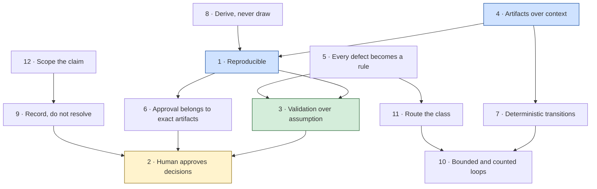

# Design Principles

The twelve rules that shape every decision in this repository. Each one has a purpose, an origin, a real example, and a cost if ignored.

[← README](README.md) · [Architecture →](ARCHITECTURE.md) · [Workflow Guide →](WORKFLOW_GUIDE.md) · [Method rules →](docs/method-rules.md)

---

## Contents

**Core principles** — the seven the machine is built on

1. [Every output is reproducible](#1--every-output-is-reproducible)
2. [The human approves decisions](#2--the-human-approves-decisions)
3. [Validation over assumption](#3--validation-over-assumption)
4. [Artifacts over context](#4--artifacts-over-context)
5. [Every defect becomes a rule](#5--every-defect-becomes-a-rule)
6. [Approval belongs to exact artifacts](#6--approval-belongs-to-exact-artifacts)
7. [State transitions are deterministic](#7--state-transitions-are-deterministic)

**Operating principles** — the five that make the core survivable in practice

8. [Derive, never draw](#8--derive-never-draw)
9. [Record, do not silently resolve](#9--record-do-not-silently-resolve)
10. [Every loop is bounded and counted](#10--every-loop-is-bounded-and-counted)
11. [Route the class, not the instance](#11--route-the-class-not-the-instance)
12. [Scope the claim inside the claim](#12--scope-the-claim-inside-the-claim)

Plus: [How the principles interlock](#how-the-principles-interlock) · [What these principles are not](#what-these-principles-are-not)

---

## A note on where these came from

None of these is a preference. Each was written by a defect that got past a green check on a complete product design run — 11 flows, 48 screens, 4 shipped deliverables — and each is enforced somewhere concrete: a validation rule, a tool exit code, a required frontmatter field, a gate.

Where a principle names a number, that number is real. The coded catalogue is [`docs/method-rules.md`](docs/method-rules.md).

---

# Core principles

## 1 · Every output is reproducible

### Purpose

Given the same state, the same inputs and the same artifacts, the machine resolves identically. Any claim the pipeline makes can be re-checked later, by someone who was not there.

### Why it exists

Design work is normally unrepeatable. A second run of the same brief produces different work, and nobody can say which run was right — so quality becomes a matter of who reviewed it and how tired they were.

Reproducibility is what converts "the design is good" from an opinion into a testable statement. It is also the precondition for every other principle here: an approval scoped to bytes only means something if the bytes can be re-derived; a validation only means something if it can be re-run.

### How it is enforced

- **Randomness is not a transition input.** Guards are explicit boolean conditions over `machine_state` and artifact contents.
- **Artifacts are immutable.** Versions increment; a revision creates a new version and records what it supersedes.
- **Every artifact names the exact versions it consumed** in `reads_versions` frontmatter — not "the latest".
- **Every derivation re-derives.** `navgraph.json` must re-derive byte-identically from the current registry (V13). A drifted derivation means the map is stale, whatever the picture looks like.
- **Every check is a command with an exit code**, runnable by anyone, later.

### Real-world example

The final audit on the extraction run returned **PASS 386/386, stable over two consecutive runs, 37 screens driven**, every check rendering-class. That number is meaningful precisely because the run can be repeated: the prototype version is named, the audit plan is a file, and the harness has no hidden state.

The counter-example from the same run: a deliverable and its prototype disagreed about what had shipped for a full day, because nothing named which bytes the deliverable held.

### Failure if ignored

You get a pipeline whose outputs cannot be audited after the fact. Every question — *did this pass? against what? when?* — has to be answered from memory, and memory is exactly the thing this system replaces. A green check nobody can re-run is indistinguishable from a green check nobody ran.

---

## 2 · The human approves decisions

### Purpose

The machine produces, checks and routes. It does not ratify direction, and it does not authorise shipping.

### Why it exists

An AI agent is very good at producing plausible work quickly, and a plausible wrong direction is more expensive than an obviously wrong one — it survives longer before anyone questions it. The two decisions that are irreversible in cost, not in bytes, are:

- **What to build.** Ratified at the Direction Approval Gate (STATE 03), which is the last cheap place to stop or re-cut scope. Everything downstream compounds on it.
- **Whether to ship.** Ratified at the Primary User Approval Gate (STATE 09), which is the machine's central human gate.

Both grantors are the **user**. The machine cannot waive its own rules, and it cannot grant itself a gate.

### How it is enforced

- Five gates, three of them blocking: Direction Approval, Primary User Approval, Developer Handoff. No forward transition through a gate without `C_APPROVED(gate)`.
- Gate state persists in `machine_state.approvals` and is resumable.
- STATE 08 exists so the user never debugs: the machine gates itself before spending human attention.
- STATE 09's packet is the deep-link **hook list**, so a user can reach every state — including the error and empty ones — in one step.
- Unresolved contradictions are presented **as unresolved**. A gate answered on a tidied-up picture is not an approval of the real direction.
- Known limitations are presented, not laundered. An acceptance with qualifications is recorded with its qualifications.

### Real-world example

Two waivers were granted at one gate: audit currency, and a missing traceability matrix. Both were user-granted, both carried a numbered rider debt item, and **both were closed the next day** — one by an audit re-run that immediately found three more real defects, the other by a backfill that reported 0 unmet across 90 acceptance criteria.

The waiver was never the problem. A machine quietly proceeding past the same two rules would have been.

### Failure if ignored

A machine that approves its own work produces a deliverable nobody has actually agreed to. The specific failure shape is worse than it sounds: the artifact record *looks* complete — there is a gate record, there are checks, there is a deliverable — and the one thing missing is the only thing that made any of it authoritative.

---

## 3 · Validation over assumption

### Purpose

A statement about the product is a check with an exit code, not a claim in prose.

### Why it exists

The most dangerous artifact in a design pipeline is a green assertion suite, because it produces confidence proportional to its own coverage rather than to the product's correctness.

> **A DOM-assertion suite is not a substitute for looking at the render.** `visibility:hidden` keeps layout boxes and accepts programmatic clicks. **"N/N assertions passed" is a statement about the suite, not about the product.**

The corollary is equally binding, and it points the other way:

> **A failing probe is a hypothesis, not a finding.** An instrument that is trusted without being checked produces false findings at scale, and false findings destroy the credibility of the true ones.

### How it is enforced

- **M1 — every check is rendering-class:** computed visibility and measured geometry, never DOM presence.
- **M2 — screenshot review is a required audit step**, across locale × theme × reduced-motion × state.
- **M3 — confirm every failure at source** before writing it into a report. Correct the harness and re-run. Never waive, never report unconfirmed. The known false-positive classes are catalogued.
- **M4 — sweep the source**, not just the surface: duplicate keys, stale placeholder routes, per-glyph font fallback — each invisible to both assertions and screenshots in at least one locale or theme.
- Every tool exits `0` clean / `1` findings / `2` tool error, so an unevaluable check is distinguishable from a passing one.

### Real-world example

**84 of 84 DOM assertions passed against a screen that displayed nothing.** The view container was `visibility:hidden` until activated, and nothing activated it. It was caught by looking at a screenshot.

And in the other direction: one audit's first run reported **60 failures, of which 3 were real**. A state probe reported **37 failures, and every single one was the harness** — an offline webfont counted as an app error, a node threshold tuned to a busy screen failing correctly-sparse empty states, and two hooks naming a fixture id the catalogue did not contain. All corrected in the instrument; none waived.

Four of one flow's six real defects were **screenshot-only finds**: a closed sheet bleeding back into the screen, a `scrollIntoView()` that pushed the header out of frame, a label ellipsized to its least useful word, an asset crop gap.

### Failure if ignored

Two symmetrical failures, and both are expensive:

- **Trusting the suite** ships defects with a green report attached, which is worse than shipping them with no report, because the report suppresses the next look.
- **Trusting the instrument** floods the process with false findings. On a 60-failure report where 3 are real, the rational response is to stop reading the report — and then the 3 ship too.

---

## 4 · Artifacts over context

### Purpose

Skills communicate **only** through the artifact store. A skill's contract is its Reads and its Writes.

### Why it exists

Anything that travels in conversation rather than in a file is invisible to the next state, invisible to the audit, invisible to the gate, and gone after the context window closes.

The rule has a blunt form worth memorising: **if it is not in the artifact, it did not happen.**

### How it is enforced

- No skill reaches into another skill's internals. Every input is a named file.
- No skill holds `machine_state`. The orchestrator holds it.
- Every artifact opens with frontmatter naming `artifact`, `version`, `produced_by`, `reads_versions` and `supersedes`.
- A field that a downstream rule is defined over belongs in **frontmatter**, not in a body table. Body tables are for humans; frontmatter is what the machine checks.
- A missing input artifact is a **back-transition to the state that owed it** — never a reason to work around the gap.

### Real-world example

The most recent gate record on the extraction run **dropped `reads_versions` entirely**, naming its prototype and audit versions only in a body table. That is the exact field `FINAL_OUTPUT` checks completion rule 2 against — *approval scoped to the final frozen versions*. The rule was not failed; it was **unevaluable**.

The same shape recurred elsewhere: the revision log only ever covered one flow out of eleven. Thirteen revision rounds across the other ten lived in status prose, so completion rule 6 — *no `open` change items* — could not be checked at all until a consolidated entry backfilled it at closure.

> **A missing log does not read as "no open items". It reads as no evidence.**

### Failure if ignored

You get a pipeline that works only while one context window holds it. Every state re-derives what the previous state already decided, slightly differently. And the failure is silent: the artifacts still exist, they are just missing the fields the checks are defined over — so the checks come back green, or come back unevaluable, and both look the same in a summary.

---

## 5 · Every defect becomes a rule

### Purpose

A defect that got past a green check produces a permanent, coded rule in the state that owns it — stated as a class, not as an anecdote.

### Why it exists

Fixing an instance and moving on is the default behaviour of every process, and it is why the same defect classes recur across projects. A rule with a code, attached to a state, indexed in a catalogue, is the only version of "we learned that" that survives a team change.

Hence the structure of every skill: **Processing steps** say what to do; the **hardened method** says how, and each rule in it names the defect that produced it; **Recorded failure modes** is the evidence.

### How it is enforced

- Every project-hardened rule carries a code — `B1`–`B8`, `M1`–`M6`, `G1`–`G8`, `R1`–`R8`, `P1`–`P8`, `W1`–`W10`, `E1`–`E7`, `F1`–`F3` — citable from a plan, a log or a gate record.
- Validation rules split: `V1`–`V4` come from the specification and hold for every product; **`V5+` are project-hardened, each written by a defect that passed `V1`–`V4`.**
- The catalogue is [`docs/method-rules.md`](docs/method-rules.md), and the left column is the code you cite.
- A rule may be **waived, never skipped** — and a waiver names its rider debt item.
- When the root cause is the *check* rather than the artifact, the dispatch is **two** states: the owning state, and `SELF_AUDIT` for the new permanent rule.

### Real-world example

One change request read *"colours deviate from the design system"*. The values were wrong, but the root cause was that the audit had **no token-conformance rule at all** — it checked DS *presence* and never non-DS *absence*. Fixing only the values would have left the class open, so the dispatch was two states: a new permanent `SELF_AUDIT` rule, and the values.

That is why STATE 06's output carries a **BANNED** list alongside its allowlist: an allowlist alone cannot catch a value that was never supposed to exist.

### Failure if ignored

The same defect ships again, in a different file, and the second occurrence is harder to find than the first because the first one is remembered as fixed. The concrete number: a defect first reported as six selectors in one file resurfaced **24 days later at 138 instances across 7 flows**, with a second defect behind it.

---

## 6 · Approval belongs to exact artifacts

### Purpose

An approval is scoped to the bytes it saw. Those bytes are named by sha256. If they move, the approval does not follow them.

### Why it exists

Bytes move after approval. That is not a pathology; it is normal. What is pathological is a record that cannot tell you whether they moved, and a gate that keeps reading `granted` while the thing it approved no longer exists.

### How it is enforced

- Gate records carry three mandatory things: `reads_versions` naming the exact prototype and audit versions, the **sha256 of every approved file**, and the player URL the review was actually conducted at.
- **The gate reverts to `pending` the moment approved artifacts change.** Stale-approval shipping is one of five anti-patterns the machine explicitly forbids.
- A post-approval delta is **classified before it is asked about**:

  | Class | Evidence required | What to ask for |
  |---|---|---|
  | **Bug-fix only** | Identical hex/token inventory, diff confined to named regions, and the pre-fix file reconstructed from the inverse delta hashing back to the approved sha | a one-line **scope confirm** |
  | **Feature delta** | The new behaviour, plus what it changes in the approved surface | a **ruling** — the gate is `pending` until it lands |

- **A freeze is a hash, not a copy.** One deliverable per approval gate.
- The audit of record must have run on **the bytes being frozen**. A green audit on superseded bytes is not a green audit.

### Real-world example

Bytes moved after approval **three times in one session** — two bug-fix deltas and one **feature** delta, in which a whole screen was rebuilt as a new surface on top of already-frozen deliverables. The feature one needed a ruling and got a confirm, and for a full day the deliverable and the prototype disagreed about what had shipped.

Separately: **five of seven approved flows arrived at their gate past their audit of record**, one four rounds past. Each round had been verified with targeted headless assertions — evidence *inside* the loop, and not the audit. When the audit was finally re-run against the frozen bytes it returned PASS 386/386 and found **three more real defects** on the way there.

### Failure if ignored

You ship something nobody approved, with a record saying somebody did. There is no error state for this; the artifacts all exist and all look right. It surfaces later as a build team implementing a screen the designer does not recognise.

---

## 7 · State transitions are deterministic

### Purpose

The machine's next step is a function of its state, its artifacts and its guards — not of judgement exercised in the moment.

### Why it exists

A workflow that is followed differently each time is not a workflow; it is a habit. Determinism is what makes the pipeline resumable, auditable and delegable — you can halt it, hand it to someone else, and they can continue without reconstructing why it was where it was.

### How it is enforced

- **Explicit guards.** Every forward transition names its condition — `C_VALID`, `C_AUDIT_PASS`, `C_APPROVED`, `C_LOOP_OK`, `C_RETRY_OK`, `C_ALL_CRITERIA_MET`, `C_HANDOFF_REQUIRED`, `C_NAVMAP_CLEAN`. If a guard fails, the machine takes the state's declared **Failure Recovery** path, not the forward edge.
- **A clean distinction between retry and back-transition.** Retry when the fault is *inside* this state's output; back-transition when the root cause is upstream.
- **Persistence after every transition**, written at decision time in the same edit as the thing it records.
- **Declared terminals.** `DONE`, `HALT_STOPPED`, and `HALT_BLOCKED` — the last of which is fully resumable at the exact state.
- **Six completion rules**, each checked explicitly with a boolean **and a one-line reason**.

### Real-world example

`machine_state.yaml` sat **two days and two approval rounds stale** — still reading `current_state: USER_REVIEW`, gate `pending` — while seven flows had been approved and the machine was reporting itself as shipping. Nothing detected it, because nothing was reading the file the completion rule is defined over.

The positive example from the same run: when a fourth `request-changes` arrived with no change items against a consumed 3/3 ceiling, the machine halted, wrote an escalation summary listing everything resolved, the unresolved set and the standing disclosed minors, gave a three-step resume path, and reset the window **only** on explicit user authorisation, recorded in the log.

### Failure if ignored

The machine's self-report and its actual state diverge, and nothing notices — because the only thing that could notice is the record that has gone stale. Every downstream claim inherits the divergence.

---

# Operating principles

## 8 · Derive, never draw

### Purpose

A model with more than one source has no source. Derive it from one place with a tool, and let disagreement be a finding.

### Why it exists

A hand-drawn navigation connector is an assertion nobody can re-check. In a Figma **Design** file it is worse than that: a connector is a vector and **does not reflow**. Move a frame and the arrow stays where it was, still looking correct.

> **A stale arrow is indistinguishable from a fresh one.** This is the single most dangerous property of the artifact.

### How it is enforced

- Every connector traces to a cell in `reference/screen-registry.csv`, and the derivation is a tool with an exit code.
- Connectors are **regenerated wholesale** on every sync, never hand-patched.
- Sync is triggered by a hash: a re-derivation whose edge set differs from the committed one **is** the signal. *"We updated the Figma"* is not a sync record; a diff of the edge set is.
- Every frame carries the prototype version it depicts. A frame that cannot say which bytes it depicts cannot be checked against them.
- Extensions are derived too — the cross-feature map, the heatmap, the deep-link inventory. **Heat is measured, never assigned:** a designer's sense of which screen is important is exactly the input this replaces.
- **The gate passes on the report, not on the picture.**

### Real-world example

A first derivation opened at **2 blocking · 8 major · 52 advisory**, and *every finding was a real defect in the registry*. Repairing **three cells** added **six edges** and **five cross-feature routes** — a navigation model can be 6% wrong and look complete.

The most instructive single finding was a boundary that had been **promoted to a real handoff in the code and never written back to the registry**: caught by derivation, invisible to reading.

And the failure this prevents, from the same run: one flow's design-file page went out of sync at revision 5 and stayed wrong through revision 8 — four separate rebuilds missing — while the page still looked complete.

### Failure if ignored

You hand a build team a beautiful picture of a navigation model that is 6% wrong, and they find out which 6% during implementation. **A flow map that renders beautifully over a derivation reporting broken routes is the exact failure STATE 12 exists to prevent.**

---

## 9 · Record, do not silently resolve

### Purpose

A disagreement, a gap or an unknown is written down as itself. It is never smoothed into agreement.

### Why it exists

Silently editing one of two disagreeing sources hides the disagreement rather than resolving it — and the disagreement was real information about the product.

The rule generalises into three surfaces:

| Surface | The rule |
|---|---|
| **Conflicts** | A conflict between two change requests, or between a change request and a ratified decision, goes to the **Conflict Mini-Gate**, never into the bytes. Ship the reversible reading, open the item, put it to the gate. |
| **Unknowns** | **`UNKNOWN` is a legal value and a guessed value is not.** Every `UNKNOWN` is counted in the report. |
| **Open decisions** | An unruled question is an open decision (`o-<id>`) carried forward, never a branch invented at build time. |

### How it is enforced

- STATE 02 lists contradictions rather than resolving them.
- STATE 08's **M6**: a conflict between two approved artifacts, or between a project criterion and an external standard, is a finding with a recommendation.
- STATE 10's **R8** and the Conflict Mini-Gate.
- STATE 12's **E6**: annotations cite rather than restate, and `UNKNOWN` counts.
- STATE 11's **P8**: known limitations ship inside the deliverable **at full strength**, in the terms they were discovered in.
- STATE 10's `Deliberately NOT changed` table, which makes the "no open items" rule honest rather than merely satisfied.

### Real-world example

Two **approved** deliverables shipped contradictory values for the same user-visible fact. It was deliberately **not** patched, and the conflict shipped in the handoff's Known limitations table with both sides stated. Silently editing one approved deliverable to hide a disagreement with another is worse than the disagreement, and it moves frozen bytes without a ruling.

Separately: ~140 interactive elements on 20 screens passed the external WCAG 2.5.8 AA standard (24px) and missed the project's **own** acceptance criterion of 44px. Pre-existing across four approved gates; raising them would have restyled 20 approved screens. Recorded as debt with a recommendation — a **product decision**, not an audit verdict.

And the positive case for `UNKNOWN`: on the extraction run every `api` annotation read `none (simulated)` — no network call existed anywhere in the prototypes — and **saying so in the field was the single most useful thing that layer did for the receiving team.**

### Failure if ignored

The deliverable becomes internally consistent by deletion. A developer reads a document with no gaps, builds against it, and discovers the gaps at the point where they are most expensive. An `api` field filled with a plausible endpoint is worse than an empty one, because **the developer will build it**.

---

## 10 · Every loop is bounded and counted

### Purpose

Every loop has a ceiling, an escalation path, and a counter that is actually written down.

### Why it exists

An unbounded revision loop is the most common failure mode of any AI-assisted process, because each round feels locally productive. The ceiling is not the hard part; the counting is.

> **A ceiling nobody counts is not a ceiling.**

### How it is enforced

- Five named loops with ceilings in `toolkit.config.json` → `loops`: `L_CLARIFY` 3, `L_RESEARCH` 2, `L_UX_EDGE` 2, `L_REVISION` 3, `L_AUDIT_FIX` 3.
- Every loop increments its counter **before** re-entry, checked by `C_LOOP_OK`.
- Changes deduplicate against a `seen_changes` set, so a rejected change cannot re-enter endlessly.
- **One round = one prototype rebuild**, however many sub-lettered asks it folds.
- `L_AUDIT_FIX` on breach **escalates into `L_REVISION` accounting** — it does not reset it.
- The counter is written in the log frontmatter, the progress snapshot and the flow row, **in the same edit**.
- On breach: `HALT_BLOCKED` with an escalation summary. The ceiling resets **only** by explicit user authorisation, recorded in the log.

### Real-world example

The counters stopped being written after the second round of the first flow. That flow was recorded at `L_REVISION = 2` and then delivered three more rounds — **five against a ceiling of three**, with no breach ever detected. The inner audit-fix loop ran **×4 on one flow and ×8 on another** against a ceiling of three, neither escalating.

The same run also has the model of doing it right: 3/3 consumed → `HALT_BLOCKED` with an escalation summary → the user authorised a fresh bounded window → reset to 1/3, written down.

### Failure if ignored

The process runs on its own exhaust. Each round is individually justified, the total is nobody's decision, and the escalation that was supposed to force a conversation never fires — because the condition that would have fired it was never evaluated.

---

## 11 · Route the class, not the instance

### Purpose

The reported defect is a **sample**. Before dispatching a fix, state the class, sweep for it, and record the count.

### Why it exists

Patching what was reported is the fastest way to close a ticket and the slowest way to close a defect. And routing it to where the symptom is *visible* rather than where the fault was *introduced* multiplies the cost by the number of cycles it takes to notice.

> **Root cause is where the fault was introduced, not where it is visible. A repeat is evidence of misrouting.**

### How it is enforced

- STATE 10's **R2**: name the class, sweep for it, record the sweep count. "Fixed in 1 file" and "fixed in 11 files" are different claims.
- STATE 10's **R3** and the routing table, mapping each kind of ask to the state that owns it.
- **V4** on the revision log: every item names its defect class and the sweep result. An item recorded as a single instance asserts the class was *checked*, not that it was not looked for.
- **R4**: dispatch a bounded scope — what changes **and what must not**. A revision that does more than the item asked manufactures the next revision item.
- **R5**: carried items are re-verified against current bytes before dispatch; an item that no longer applies is closed as `superseded`, naming the round that removed it.

### Real-world example

A defect was diagnosed as six selectors rendering a script on the wrong font stack in one file. Three were patched; **the class was never swept.** The actual root cause — the script token was an *opt-in* layer under a foreign base — surfaced **24 days later at 138 instances across 7 flows**, and behind it a second defect: the base stack carried no face for that script at all. One class, one root cause, three patched selectors, twenty-four days.

The routing failure, from the same run: four consecutive change requests dispatched palette work to `UI_PLANNING` and `PROTOTYPE`. The machine reached `HALT_BLOCKED` before it was established that the real fault was **wrong-document adoption** — a design-system spec belonging to a different project. Three cycles were spent on colour values because the routing was never re-examined after the first return.

And the over-application case: a request for a palette change on a single screen was applied so broadly that the brand mark was remixed. The next cycle's first item was *"restore the original mark"*.

### Failure if ignored

Three wasted cycles instead of one, and a defect that returns after everyone has stopped looking for it. The compounding version: because the class was never named, the sweep was never run, so nobody knows the true size of the remaining problem — only the size of the part that was reported.

---

## 12 · Scope the claim inside the claim

### Purpose

A clearance claim states what it covers. "This is clean" is not a statement until it says *what* is clean.

### Why it exists

A finding true of one flow gets read as true of the set, and a clearance true of one flow gets read the same way. Both directions cost, and both are invisible at the moment they are written — because the sentence reads correctly either way.

### How it is enforced

- STATE 05's boundary table: a `⟂` boundary `status` is a **dated claim**, re-checked whenever any other feature reaches `FINAL_OUTPUT`.
- STATE 12's **W8**: every boundary port is re-derived at each sync and the table records the **date** its status was last checked. **A status with no date is not a status.**
- STATE 12's handoff status: **READY FOR DEVELOPMENT scoped to the flows named in `scope`** — never a bare "handoff ready".
- STATE 08's **M5**: the verdict is scoped to the bytes it audited.
- STATE 11's **P2**: one deliverable per approval gate, named for what that gate approved.
- Mechanical sweeps set the scope, not intuition.

### Real-world example

*"No boundary mocks left"* was written about one flow's mocks and read as holding for the set. **Eleven live boundary call sites** were still routing to a placeholder screen after every destination flow had shipped. One of them carried a source comment naming the destination flow as "still todo" — written before that flow shipped, never revisited.

The mirror case, running the other way: a tracked debt item recorded *"no deep-link hook"* for **one** flow. The mechanical scan found the same defect in **three**. The finding was true and its scope was not.

### Failure if ignored

Both directions produce a false record. An over-scoped clearance ships known defects under a clean claim; an under-scoped finding leaves two-thirds of the problem unrecorded, and the debt item that was supposed to track it says the work is smaller than it is.

---

## How the principles interlock

None of these works alone. The dependency runs roughly in this direction:

Read it as: **artifacts** make the pipeline reproducible; **reproducibility** makes validation and approval meaningful; **validation** makes human approval cheap enough to be real; **recording** and **scoping** keep the record honest enough for the approval to mean anything; **bounded loops** and **class routing** stop the whole thing running forever.

Remove any one and the ones below it stop holding. Remove **artifacts over context** and none of the others can be checked at all.

---

## What these principles are not

| Not | Because |
|---|---|
| **Not process for its own sake** | Every rule names a defect. If a rule cannot name what it prevents, it does not belong here. |
| **Not a substitute for design judgement** | The machine cannot tell you what to build. It can tell you whether what you built matches what you said, and it can stop you shipping something nobody approved. |
| **Not a guarantee of quality** | A validated deliverable is one whose claims are checkable. Whether the product is good is a human judgement, made at the gates — which is exactly why the gates are human. |
| **Not immutable** | A principle that a real defect contradicts should change. The requirement is that the change names the defect, the same way every rule here does. |

---

[← README](README.md) · [Architecture →](ARCHITECTURE.md) · [Workflow Guide →](WORKFLOW_GUIDE.md) · [Validation Engine →](VALIDATION_ENGINE.md) · [Method rules →](docs/method-rules.md)
