# Diagrams

Every diagram in the toolkit, in one place. Each is also embedded where it is used; this page is the gallery and the copy source.

[← README](README.md) · [Architecture →](ARCHITECTURE.md) · [Workflow Guide →](WORKFLOW_GUIDE.md)

---

## Contents

1. [Workflow](#1--workflow)
2. [Architecture](#2--architecture)
3. [Artifact flow](#3--artifact-flow)
4. [State machine](#4--state-machine)
5. [Validation pipeline](#5--validation-pipeline)
6. [Approval gates](#6--approval-gates)
7. [Repository structure](#7--repository-structure)
8. [Developer handoff flow](#8--developer-handoff-flow)
9. [Dependency graph](#9--dependency-graph)
10. [Revision loop](#10--revision-loop)
11. [Freeze sequence](#11--freeze-sequence)

All diagrams are Mermaid, rendered natively by GitHub. To reuse one, copy the fenced block.

---

## 1 · Workflow

The twelve states in machine order. Also in [README § Workflow overview](README.md#workflow-overview).

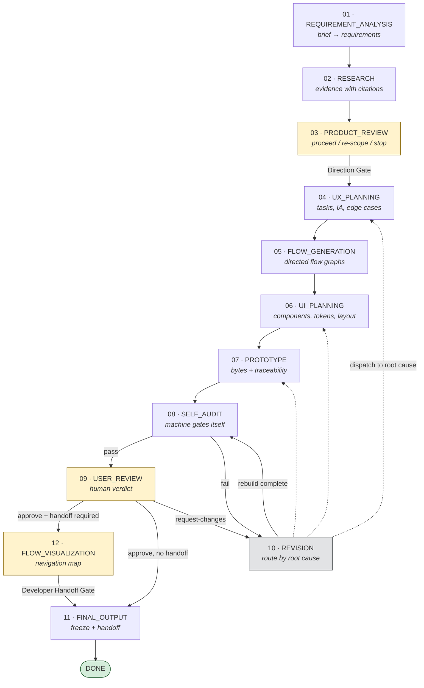

**Reads as:** yellow states carry a blocking human gate. The grey state is a loop, not a step. `12` runs only when `handoff_required` is true.

---

## 2 · Architecture

Six layers, each with one job. Also in [ARCHITECTURE.md § 1](ARCHITECTURE.md#1--high-level-architecture).

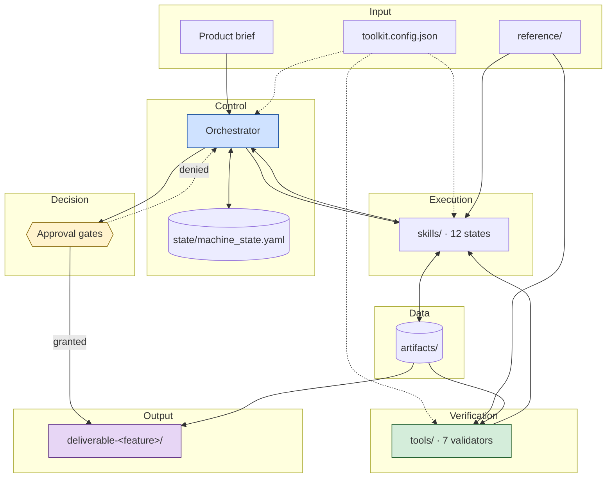

**Reads as:** skills never talk to each other — every edge between them passes through the artifact store. The orchestrator is the only thing holding machine state.

---

## 3 · Artifact flow

The pipeline as data. Also in [ARTIFACT_FLOW.md § 1](ARTIFACT_FLOW.md#1--the-pipeline-in-one-picture).

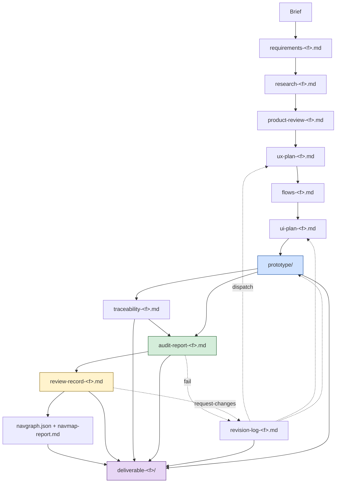

**Reads as:** solid edges are the forward pipeline; dashed edges are the only way work travels backwards.

---

## 4 · State machine

Every transition, including self-loops and terminals. Also in [ARCHITECTURE.md § 2.1](ARCHITECTURE.md#21-full-transition-graph).

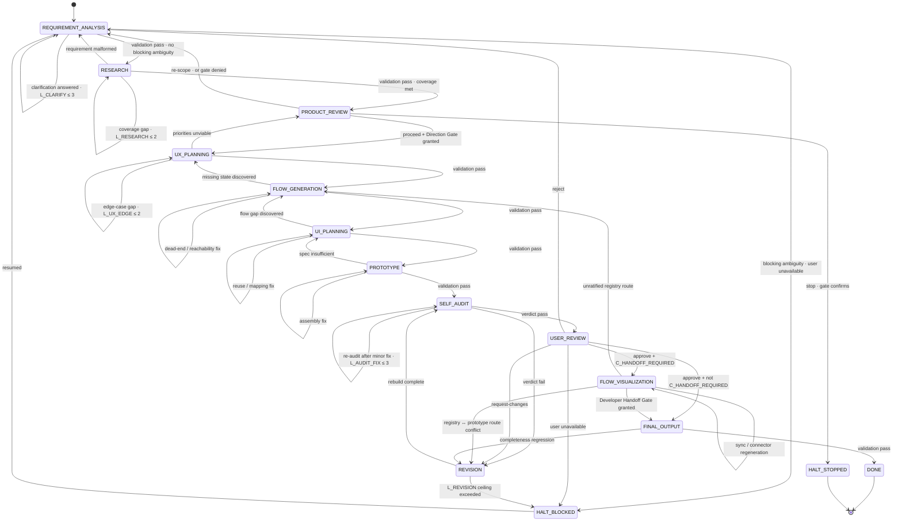

**Reads as:** three terminals. `DONE` and `HALT_STOPPED` end the machine; `HALT_BLOCKED` is fully persisted and resumes at the exact state. `REVISION` additionally dispatches to any upstream state by root cause — those edges are in [diagram 10](#10--revision-loop).

---

## 5 · Validation pipeline

What each tool reads, and what it produces. Also in [ARCHITECTURE.md § 7](ARCHITECTURE.md#7--the-validation-engine).

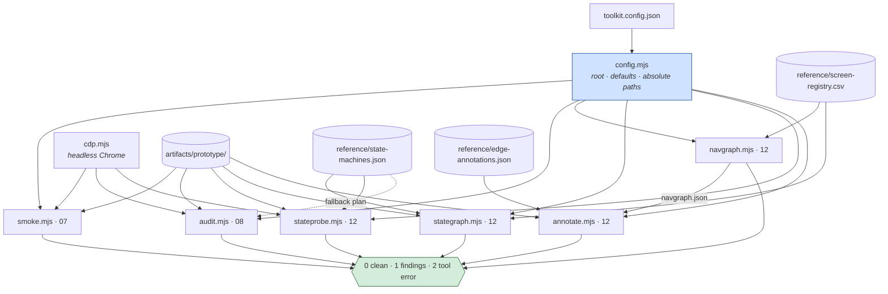

**Reads as:** no tool contains a product-specific value; everything arrives through `config.mjs`. `annotate` depends on `navgraph`, so run order matters in STATE 12.

### The instrument discipline

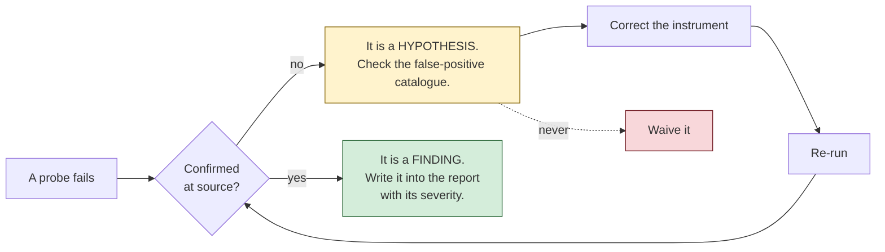

**Reads as:** one audit's first run reported 60 failures and 3 were real; one state probe reported 37 and all 37 were the harness. Corrections are recorded, because an uncorrected harness re-reports them next run.

---

## 6 · Approval gates

Five gates, three of them blocking. Also in [ARCHITECTURE.md § 8](ARCHITECTURE.md#8--approval-gates).

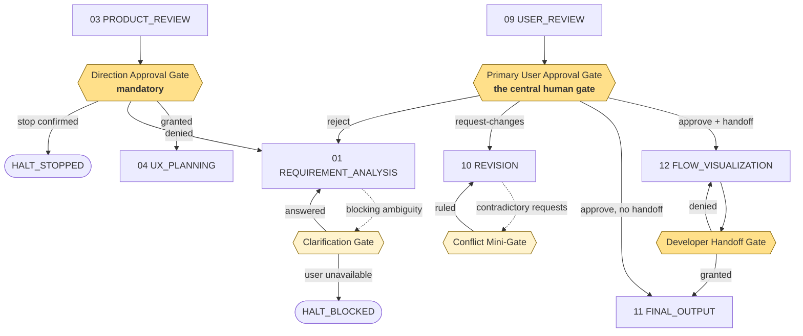

### Gate lifecycle

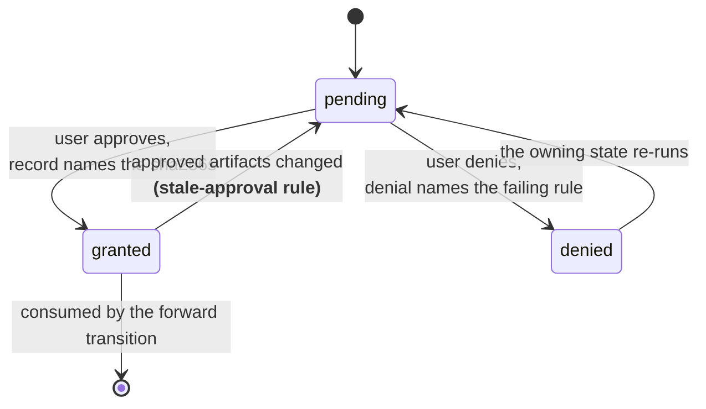

**Reads as:** the darker gates block a forward transition. The reversion edge is the one that matters most — an approval is scoped to the bytes it saw, and it does not follow them when they move.

---

## 7 · Repository structure

```mermaid
flowchart TD
    ROOT["design-toolkit/"]
    ROOT --> CFG["toolkit.config.json<br/><i>the only file a new product must edit</i>"]
    ROOT --> DOCS["docs/<br/><i>the specification layer</i>"]
    ROOT --> SKILLS["skills/<br/><i>12 states · one folder each</i>"]
    ROOT --> TOOLS["tools/<br/><i>7 validators · zero dependencies</i>"]
    ROOT --> TPL["templates/<br/><i>artifact shapes + review player</i>"]
    ROOT --> REF["reference/<br/><i>product-owned inputs</i>"]
    ROOT --> ART["artifacts/<br/><i>runtime output</i>"]
    ROOT --> ST["state/<br/><i>machine_state.yaml</i>"]
    ROOT --> EX["examples/<br/><i>empty by design</i>"]

    DOCS --> D1["workflow.md · SOURCE OF TRUTH"]
    DOCS --> D2["method-rules.md · the rule catalogue"]
    DOCS --> D3["artifact-contracts.md · the store"]

    SKILLS --> SK1["01-requirement-analysis/ … 11-final-output/"]
    SKILLS --> SK2["12-flow-visualization/"]

    TOOLS --> T1["smoke · audit"]
    TOOLS --> T2["navgraph · stategraph · stateprobe · annotate"]
    TOOLS --> T3["cdp · config · config.schema.json"]

    TPL --> TP1["one .md per artifact type"]
    TPL --> TP2["prototype/ · run-local.sh · serve.py · play.html"]

    REF --> R1["screen-registry.csv · THE SPINE"]
    REF --> R2["nav-lanes · state-vocabulary · state-machines · edge-annotations · audit-plan"]

    ART --> A1["pipeline artifacts"]
    ART --> A2["prototype/ · shots/"]
    ART --> A3["deliverable-&lt;feature&gt;/ · COMMITTED"]

    style CFG fill:#cfe2ff,stroke:#084298
    style D1 fill:#fff3cd,stroke:#856404
    style R1 fill:#fff3cd,stroke:#856404
    style A3 fill:#e7d6f5,stroke:#5a2a82
```

**Reads as:** two files are load-bearing beyond their size — `docs/workflow.md` (where a skill disagrees with it, the skill is the bug) and `reference/screen-registry.csv` (the entire navigation model is derived from its cells).

---

## 8 · Developer handoff flow

What happens between approval and freeze when `handoff_required` is true. Also in [ARCHITECTURE.md § 10.2](ARCHITECTURE.md#102-the-handoff-flow).

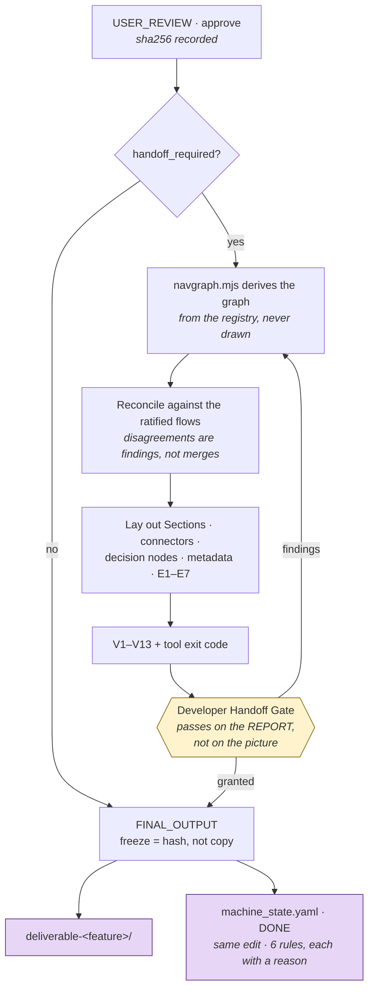

### What the developer receives

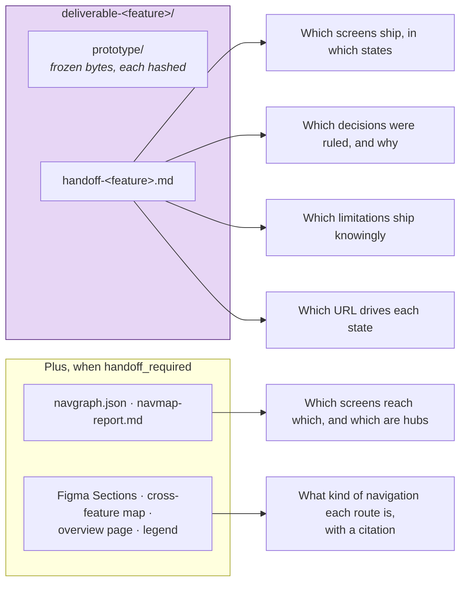

**Reads as:** the deliverable answers the six questions a build team otherwise asks a designer. Every answer carries the artifact it came from.

---

## 9 · Dependency graph

What must exist before what. Also in [ARCHITECTURE.md § 11](ARCHITECTURE.md#11--dependency-graph).

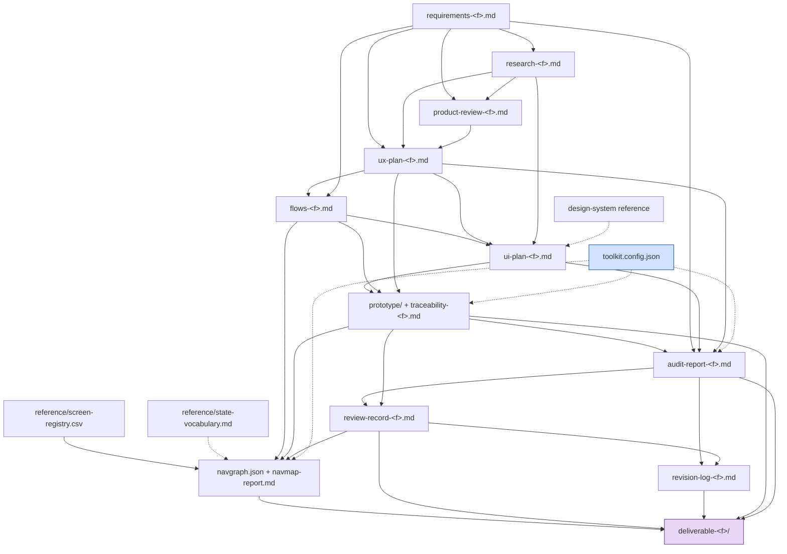

**Reads as:** the answer to "what breaks if I skip a state" — every downstream node loses an input, and the skill that owed it is where a missing-artifact error back-transitions to.

---

## 10 · Revision loop

Root-cause routing, and the only way work travels backwards. Also in [ARCHITECTURE.md § 2.4](ARCHITECTURE.md#24-the-revision-loop).

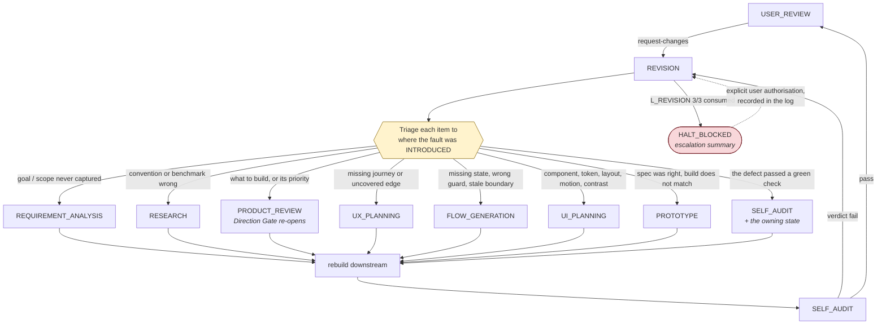

**Reads as:** everything is visible in the prototype, and that is not evidence it belongs to `PROTOTYPE`. A repeat is evidence of misrouting.

---

## 11 · Freeze sequence

What `FINAL_OUTPUT` actually checks. Also in [ARTIFACT_FLOW.md § 9](ARTIFACT_FLOW.md#9--the-freeze).

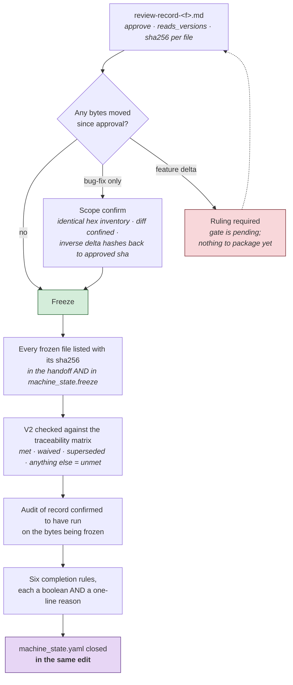

**Reads as:** a freeze is a hash, not a copy. And `designed` and `delivered` are different claims — a screen not in a frozen deliverable is not delivered, however finished it looks.

---

## Diagram conventions

Used consistently across the documentation, so a colour means the same thing everywhere.

| Convention | Meaning |
|---|---|
| **Blue fill** `#cfe2ff` | Control — the orchestrator, config, the thing that decides. |
| **Green fill** `#d4edda` | Verification — validators, exit codes, confirmed findings. |
| **Yellow fill** `#fff3cd` / `#ffe08a` | Human decision — gates, triage. Darker yellow blocks a forward transition. |
| **Purple fill** `#e7d6f5` | Terminal output — the frozen deliverable and the closed machine record. |
| **Red fill** `#f8d7da` | A failure state or a forbidden path. |
| **Grey fill** `#e2e3e5` | A loop rather than a step. |
| **Solid edge** | The forward pipeline, or a hard dependency. |
| **Dashed edge** | A loop, a configuration read, or a conditional path. |
| `{{hexagon}}` | A gate or a decision the machine cannot make alone. |
| `[(cylinder)]` | A store — artifacts, reference files, machine state. |
| `([stadium])` | A terminal state. |

---

[← README](README.md) · [Architecture →](ARCHITECTURE.md) · [Workflow Guide →](WORKFLOW_GUIDE.md) · [Artifact Flow →](ARTIFACT_FLOW.md) · [Validation Engine →](VALIDATION_ENGINE.md)
