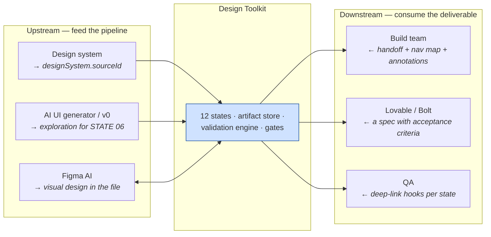

# Differentiators

What this repository is, stated against what it is not — and why the difference is methodological rather than competitive.

[← README](README.md) · [Design Principles →](DESIGN_PRINCIPLES.md) · [Architecture →](ARCHITECTURE.md)

---

> **A note on fairness.** Every tool named below is good at what it was built for, and several are excellent. This document does not argue that they are wrong; it argues that they answer a **different question**. Most of them make design *production* faster. Design Toolkit makes design *decisions* checkable. Those are complementary problems, and in several cases the tools compose rather than compete.
>
> Product capabilities change quickly. Descriptions here are at the category level and are intended to be accurate as such; where a specific product has moved, the category comparison is what to trust.

---

## Contents

1. [The one-sentence difference](#1--the-one-sentence-difference)
2. [The axis that actually separates them](#2--the-axis-that-actually-separates-them)
3. [Traditional design process](#3--traditional-design-process)
4. [Prompt collections and prompt libraries](#4--prompt-collections-and-prompt-libraries)
5. [AI UI generators](#5--ai-ui-generators)
6. [Design systems](#6--design-systems)
7. [Figma AI](#7--figma-ai)
8. [Lovable](#8--lovable)
9. [Bolt](#9--bolt)
10. [v0](#10--v0)
11. [Summary matrix](#11--summary-matrix)
12. [What composes, and how](#12--what-composes-and-how)
13. [When not to use this](#13--when-not-to-use-this)

---

## 1 · The one-sentence difference

**Most AI design tooling produces artifacts. This produces artifacts plus the evidence that they are correct, plus the record of who approved which exact bytes.**

Put another way: the interesting output of a Design Toolkit run is not the prototype. It is the prototype **and**:

- a traceability matrix from every requirement to the element that satisfies it, with a deep-link hook per state,
- an audit report whose every check is computed visibility and measured geometry, with screenshots read,
- a gate record naming the sha256 of everything a human approved and the URL they reviewed at,
- a navigation model **derived** from a registry by a tool with an exit code,
- a revision log with the loop counter written down, and
- six completion rules, each with a boolean and a one-line reason.

None of that is faster. All of it is checkable.

---

## 2 · The axis that actually separates them

Comparing on "which one makes a better screen" produces a useless answer, because the tools are optimised on different axes.

| Category | Optimises for | Scope | What it treats as "done" |
|---|---|---|---|
| AI UI generators | production speed | one artifact | the screen looks right |
| v0 | production speed | one artifact | the component is shippable code |
| Figma AI | production speed | one file | the file reflects the intent |
| Lovable · Bolt | production speed | one application | it runs |
| Design systems | consistency | many products | components are reused correctly |
| Prompt collections | instruction quality | any output | the model followed the instruction |
| Traditional process | judgement | the whole pipeline | a stakeholder said yes |
| **Design Toolkit** | **decision integrity** | **the whole pipeline** | **every claim is checkable and a human approved the exact bytes** |

The honest framing:

| Question | Who answers it well |
|---|---|
| *"Give me a good-looking screen, now."* | AI UI generators, Figma AI, v0 |
| *"Turn this idea into a running app I can click."* | Lovable, Bolt, v0 |
| *"Make my components consistent across products."* | design systems |
| *"Give me better instructions for my AI."* | prompt collections |
| *"Prove that what shipped matches what was approved, and that what was approved matches what was asked for."* | **this** |

The last question is the one that gets expensive at scale, in regulated contexts, and in any team where the person who approves is not the person who builds.

---

## 3 · Traditional design process

### What it is

A designer interprets a brief, produces screens in a design tool, shows them to stakeholders, iterates on feedback, and hands off — typically as a file plus a conversation.

### What it does well

Judgement, taste, negotiation, and the parts of the work that are genuinely about knowing an audience. Nothing here replaces those, and this toolkit does not try to.

### Where the difference is

| Traditional | Design Toolkit |
|---|---|
| Requirements are prose. | Requirements carry **falsifiable acceptance criteria**, and STATE 08 marks each one met / unmet / waived with evidence. |
| Approval is a meeting and a Slack message. | Approval is a record naming the **sha256** of every approved file. Bytes move → the gate reverts to `pending`. |
| Edge cases are discovered in build. | STATE 04 enumerates happy **plus ≥3 non-happy** states per task before any screen exists, and STATE 05 gives every one a recovery route. |
| Revision rounds are counted informally, if at all. | Every loop has a ceiling in config and a counter written into log frontmatter. On breach: `HALT_BLOCKED` with an escalation summary. |
| Handoff is a design file plus availability. | Handoff is a derived navigation model with an exit code, per-screen state machines, cited developer annotations, deep-link addressing and a provenance block. |
| Quality is a function of who reviewed it. | Quality is a function of which checks passed against which bytes. |

### The methodological point

The traditional process is not slow because designers are slow. It is slow because **nothing in it is re-checkable**, so every question — *did we cover that state? was that approved? against which version?* — has to be answered by a person from memory, in a meeting.

This toolkit does not make the design work faster. It makes the **answering** free.

---

## 4 · Prompt collections and prompt libraries

### What they are

Curated sets of prompts, personas or instructions that improve the output of a general-purpose model — "act as a senior product designer and…".

### What they do well

They are the cheapest possible quality improvement. A good prompt library raises the floor of every output immediately, requires no infrastructure, and is trivially shareable.

### Where the difference is

A prompt is an **input**. This is a **contract with a verifier**.

| Prompt collection | Design Toolkit |
|---|---|
| Improves the instruction. | Defines the instruction **and the output shape and the check on the output**. |
| Quality is whatever the model produced this time. | Quality is what passed `V1`–`V4` plus the project-hardened `V5+` rules, with the evidence named. |
| Stateless — each prompt starts fresh. | `machine_state.yaml` persists after every transition; the run is resumable at the exact state. |
| No dependency order. | Twelve states with declared reads, writes and dependencies. A missing input back-transitions to the state that owed it. |
| Nothing carries between prompts except what you paste. | Skills communicate **only** through the artifact store, and `reads_versions` names the exact versions consumed. |
| No gate. | Five gates; three of them block, and all five are granted by a human. |

### The methodological point

The failure mode of a prompt collection is not bad output — it is **unverifiable** output. When the model returns something plausible, there is no artifact that says whether it is right, and no record of what it was checked against.

The skills in [`skills/`](skills/) look superficially like very long prompts. They are not: roughly half of each one is the **validation rules, exit conditions, failure recovery and recorded failure modes**. That half is the product.

---

## 5 · AI UI generators

### What they are

Tools that take a text description and return a designed screen, component or layout — often with strong visual defaults.

### What they do well

Speed to a visual, exploration breadth, and unblocking a blank canvas. For divergent early exploration they are genuinely hard to beat.

### Where the difference is

An AI UI generator answers *"what could this look like?"* This answers *"is this the right thing, does it cover every state, does it match the design system, does it render correctly, and did a human approve these exact bytes?"*

| AI UI generator | Design Toolkit |
|---|---|
| Starts at the screen. | Starts four states before the screen: requirements → research → direction → UX strategy. STATE 04 is deliberately **screen-free**. |
| Produces the happy path. | STATE 04's edge-case matrix and STATE 05's recovery coverage are validation rules, not options. |
| Design-system adherence is a styling preference. | STATE 06 maps components to DS primitives **reuse-first**, and every `new` carries a written justification. A token that does not resolve is an extension request, never a new hex. |
| Output looks right. | Output is checked by geometry: paint, tap targets, overflow, content spill, composited contrast, per-glyph script fonts — **plus the screenshots are read**. |
| No record of approval. | The gate record names bytes, versions and the URL reviewed at. |

### The methodological point

**Looking right and being right are different claims**, and only one of them is checkable. The extraction run's defining example: a screen passed **84 of 84 DOM assertions while displaying nothing**, because `visibility:hidden` keeps layout boxes and accepts programmatic clicks.

A generator that produced that screen would have produced something that looks perfect in a preview. The audit that catches it is the product.

---

## 6 · Design systems

### What they are

A library of components, tokens and usage guidance that makes many products look and behave consistently.

### What they do well

Consistency, reuse, accessibility defaults, and a shared vocabulary between design and engineering. A good design system is the highest-leverage artifact most product organisations own.

### Where the difference is

**A design system is a vocabulary. This is a grammar.** A design system tells you what a button is. It does not tell you whether this flow needs one here, whether the state you forgot exists, or whether the person who approved the screen saw the version that shipped.

They are complements, and the toolkit is explicit about it:

| Design system | Design Toolkit |
|---|---|
| Owns components and tokens. | **Consumes** them. `designSystem.sourceId` names the system; STATE 06 maps to it reuse-first. |
| Adherence is a review question. | Adherence is a machine check: STATE 06 writes a strict allowlist **and a ban list** into `toolkit.config.json`, and STATE 08 enforces both by hex extraction. |
| Gaps surface as ad-hoc one-offs. | Gaps surface as an **Extension Note** — informational, non-blocking, and readable later by a DS owner as "what the product needed and the system did not have". |
| Says nothing about process. | Is entirely about process. |

### The methodological point

The most expensive design-system failure this toolkit records is not a violation of the system. It is **adopting the wrong one**: a specification belonging to a different project was used, survived four revision cycles, and the machine reached `HALT_BLOCKED` before the tell was spotted — a desktop-first viewport assumption inside a mobile product.

> **A plan built on the wrong design system validates perfectly against it.** No downstream rule can catch it.

Hence the rule that the DS is named **by source id**, in two places, and that its own assumptions — viewport, platform, brand — are sanity-checked against the product's. A design system cannot enforce that about itself.

---

## 7 · Figma AI

### What it is

AI capabilities inside the design tool where the work already lives — generation, editing, assistance, and increasingly a bridge between design files and code.

### What it does well

It is where designers are. Proximity to the file is a real advantage: no export, no round-trip, no second source of truth for the visual design.

### Where the difference is

This toolkit **uses** the design file as an output surface, and treats it as one that cannot be trusted to describe itself.

| Figma AI | Design Toolkit |
|---|---|
| Operates inside the file. | Derives from a registry and **generates into** the file. `navgraph.json` is the authority; the file is a rendering of it. |
| Correctness is what a designer sees. | Correctness is `node tools/navgraph.mjs --fail-on major` exiting 0, and thirteen validation rules. |
| The file is the source of truth. | The file is a **downstream artifact**. If the diagram and the derivation disagree, **the diagram is wrong**. |
| A frame is a frame. | Every frame carries seven metadata fields, including the prototype version it depicts. A frame that cannot say which bytes it depicts cannot be checked against them. |

### The methodological point

The single most dangerous property of a design file, and the reason the derivation exists:

> **In a Figma Design file a connector is a vector and does not reflow.** Move a frame and the arrow stays where it was, still looking correct. **A stale arrow is indistinguishable from a fresh one.**

That is why connectors are **regenerated wholesale** on every sync and never hand-patched, why sync is triggered by an edge-set hash rather than by memory, and why the Developer Handoff Gate passes on the **report**, not the picture. *"We updated the Figma"* is not a sync record; a diff of the edge set is.

On the extraction run, one flow's design-file page went out of sync at revision 5 and stayed wrong through revision 8 — four rebuilds missing — while the page still looked complete.

The toolkit's Figma work uses the official MCP tooling and the `/figma-use` skill. It is not an alternative to Figma; it is a discipline about what a Figma page is allowed to claim.

---

## 8 · Lovable

### What it is

A platform for going from a natural-language description to a working, deployable application, with the AI handling the build.

### What it does well

Compression of the idea-to-running-software distance. For validating whether a thing is worth building at all, that compression is the whole point, and it is a genuinely different capability from producing screens.

### Where the difference is

Lovable optimises for **getting to a working app**. This optimises for **being able to prove the app is what was agreed**.

| Lovable | Design Toolkit |
|---|---|
| Output is a deployable application. | Output is a **design deliverable** — a prototype plus the evidence, plus the handoff a build team implements from. |
| The design decisions are implicit in the generated app. | Every design decision has an id, an owning state, a rationale and a reversal trigger. Unruled questions are carried as open decisions (`o-<id>`), never defaulted at build time. |
| Iteration is conversational. | Iteration is a **bounded loop** with a ceiling, a counter, root-cause routing and an escalation path. |
| Correctness is "it runs". | Correctness is a conformance matrix against acceptance criteria, with evidence per criterion. |
| Approval is deployment. | Approval is a gate record naming sha256s, and it reverts when the bytes move. |

### The methodological point

These are complementary in an obvious way: **the deliverable this toolkit produces is a good input to a build**, whether that build is done by a team, by an AI app builder, or by both.

The thing the toolkit adds that a build-first flow structurally cannot is the **record of intent** — what was asked for, what was ruled out and why, which states were enumerated, which limitations shipped knowingly. When a generated app is wrong, you can regenerate it. When nobody wrote down what "right" was, regenerating does not help.

---

## 9 · Bolt

### What it is

An in-browser AI development environment: describe what you want, get a running project you can edit, run and deploy.

### What it does well

Removing environment friction entirely, and keeping the loop between intent and running code very tight.

### Where the difference is

The comparison is largely the same as Lovable's, with one distinct axis worth naming: **verification layer ownership**.

| Bolt | Design Toolkit |
|---|---|
| Verification is what the running code tells you. | Verification is a separate, adversarial layer with its own rules — and it is explicitly adversarial **toward its own instrument**. |
| A green run is a green run. | A failing probe is a **hypothesis** until confirmed at source. One audit opened at 60 failures with 3 real; one state probe reported 37 and **all 37 were the harness**. |
| Testing is whatever you add. | Screenshot review across locale × theme × reduced-motion × state is a **required** audit step, because four of one flow's six real defects were screenshot-only finds. |
| Fast iteration is the goal. | Fast iteration is bounded on purpose: `L_REVISION` 3 full cycles, then `HALT_BLOCKED` with an escalation summary. |

### The methodological point

Speed and verifiability trade against each other only when verification is manual. The toolkit's answer is to make verification a **program with an exit code** — seven of them, zero dependencies, config-driven — so that re-checking costs a command rather than an afternoon.

That is also why `tools/` has no npm tree: a verification layer that rots because of a transitive dependency is not a verification layer.

---

## 10 · v0

### What it is

Generation of production-shaped UI components and pages from prompts, aligned to a common React/Tailwind/component-library stack.

### What it does well

The gap between generated markup and code you would actually ship is narrower here than in most of the category, and the stack alignment is a real advantage for teams already on it.

### Where the difference is

v0 answers *"what does this component look like in code?"* This answers *"which components does this product need, in which states, from which design system, and who approved that?"*

| v0 | Design Toolkit |
|---|---|
| Component-first. | **Flow-first**: STATE 05's graphs come before STATE 06 names a single component. |
| Stack-aligned by design. | **Stack-agnostic by design.** The prototype is whatever the product needs; the harness contract is four selectors in `toolkit.config.json`. |
| The component inventory is emergent. | The inventory is an artifact, with a reuse-vs-new classification and a justification against every `new`. |
| States are whatever you asked for. | Every flow state, variant and error case ships a **deep-link hook** recorded in traceability — because a state that cannot be driven cannot be audited or demonstrated at a gate. |
| No notion of supersession. | **Supersession deletes.** When a revision rebuilds a component, the old CSS, strings and handlers are stripped, itemised, and recorded — leftovers are un-specced elements and fail the traceability rule exactly as additions do. |

### The methodological point

The toolkit's prototype is deliberately not production code, and that is a design decision rather than a limitation. Its job is to be **drivable, auditable and reviewable**: one self-contained file per flow, a deep-link hook per state, and a harness contract three tools read.

A production-shaped component is the *right* output for a build. It is the wrong output for a review packet, because you cannot hand a stakeholder a component library and ask them to approve the error state.

---

## 11 · Summary matrix

`●` full · `◐` partial or product-dependent · `○` not the tool's job

| Capability | Traditional | Prompt collections | AI UI generators | Design systems | Figma AI | Lovable | Bolt | v0 | **Design Toolkit** |
|---|:--:|:--:|:--:|:--:|:--:|:--:|:--:|:--:|:--:|
| Speed to a first visual | ○ | ◐ | ● | ○ | ● | ● | ● | ● | ○ |
| Working, deployable software | ○ | ○ | ○ | ○ | ◐ | ● | ● | ◐ | ○ |
| Component consistency | ◐ | ○ | ◐ | ● | ◐ | ◐ | ◐ | ● | ● |
| Requirements with falsifiable criteria | ◐ | ○ | ○ | ○ | ○ | ○ | ○ | ○ | ● |
| Non-happy-path enumeration enforced | ◐ | ○ | ○ | ○ | ○ | ○ | ○ | ○ | ● |
| Flow reachability proven | ○ | ○ | ○ | ○ | ○ | ○ | ○ | ○ | ● |
| Rendering-class verification | ○ | ○ | ○ | ○ | ○ | ◐ | ◐ | ○ | ● |
| Screenshot review as a required step | ◐ | ○ | ○ | ○ | ○ | ○ | ○ | ○ | ● |
| Human gates with byte-scoped approval | ○ | ○ | ○ | ○ | ○ | ○ | ○ | ○ | ● |
| Bounded, counted revision loops | ○ | ○ | ○ | ○ | ○ | ○ | ○ | ○ | ● |
| Root-cause routing of defects | ◐ | ○ | ○ | ○ | ○ | ○ | ○ | ○ | ● |
| Derived navigation model with exit code | ○ | ○ | ○ | ○ | ○ | ○ | ○ | ○ | ● |
| Requirement→element traceability | ◐ | ○ | ○ | ○ | ○ | ○ | ○ | ○ | ● |
| Frozen deliverable with sha256 | ○ | ○ | ○ | ○ | ○ | ○ | ○ | ○ | ● |
| Resumable across sessions | ◐ | ○ | ○ | ○ | ◐ | ◐ | ◐ | ○ | ● |
| Model agnostic | n/a | ● | ○ | n/a | ○ | ○ | ○ | ○ | ● |
| Runs offline, no account | ● | ● | ○ | ● | ○ | ○ | ○ | ○ | ● |

The shape of that table is the argument. This toolkit is **weak** on every row about speed and running software, and it is the only column filled on every row about evidence, approval and traceability.

---

## 12 · What composes, and how

The toolkit is a pipeline with declared inputs and outputs, which makes it composable with most of the above rather than exclusive of them.

| Composition | How it works |
|---|---|
| **Design system → STATE 06** | Name it by source id. The toolkit maps to your primitives reuse-first and raises an Extension Note for genuine gaps. |
| **AI UI generator → STATE 06** | Generated explorations are legitimate input to a UI plan. They become spec entries, at which point they are checkable. |
| **Figma ↔ STATE 12** | The toolkit derives the navigation model and generates it into the file, then hashes the drawn rows back against `annotations.json` to prove the page says what the artifact says. |
| **Deliverable → app builder** | A handoff with acceptance criteria, per-screen state machines, edge annotations and deep-link hooks is a far better prompt for an app builder than a paragraph. |
| **Deliverable → QA** | Every state is addressable by URL. That is the E4 extension's whole purpose, and a flow with no hooks is a **major** finding with a rider debt item, not an omission. |

---

## 13 · When not to use this

Being honest about the boundary is part of the argument.

| Situation | Use something else |
|---|---|
| You need a visual in ten minutes to unblock a conversation. | An AI UI generator or Figma AI. The pipeline's first four states are the wrong overhead for a throwaway. |
| You are exploring whether an idea is worth building at all. | An app builder. Get to something runnable, then bring the surviving idea here. |
| The work is a one-off marketing page nobody will maintain. | Almost anything. The traceability matrix is not earning its keep. |
| There is no human available to grant gates. | Nothing here works. Two of the five gates are structurally required, and the machine cannot grant them to itself. |
| You want production code as the output. | This produces a design deliverable. Feed it to whatever builds. |

Where it earns its keep: **multi-flow products, regulated or audited contexts, teams where the approver is not the builder, handoffs across an organisational boundary, and any product that will still be maintained in a year by someone who was not in the room.**

---

[← README](README.md) · [Design Principles →](DESIGN_PRINCIPLES.md) · [Architecture →](ARCHITECTURE.md) · [Roadmap →](PUBLIC_ROADMAP.md)
