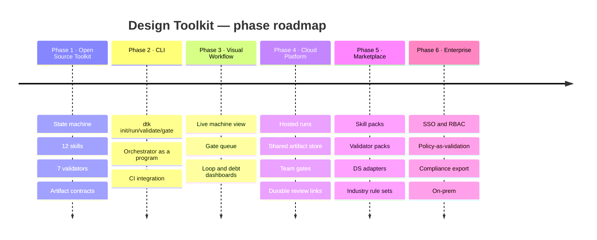

# Public Roadmap

Six phases, from an open-source toolkit to an enterprise design operating system — and what each one explicitly does not change.

[← README](README.md) · [Architecture →](ARCHITECTURE.md) · [Differentiators →](DIFFERENTIATORS.md)

---

## The invariant

Every phase below adds surface area around the same engine. None of them changes the methodology.

> **The state machine, the artifact contracts, the validation rules and the gate semantics are the product.** Everything on this roadmap is a better way to run them, see them, share them or govern them. A phase that required weakening a validation rule to ship would not be on this list.

Three commitments hold across all six phases:

1. **The engine stays open.** A methodology nobody can inspect is a methodology nobody should trust. Every rule in this repository names the defect that produced it, and that only works in the open.
2. **Artifacts stay portable.** A deliverable is a folder of markdown, HTML and hashes. It is readable, gradable and re-runnable with or without any platform. Lock-in would contradict the first principle the system is built on.
3. **Gates stay human.** No phase introduces machine-granted approval. Automation of the *routing* to a human is in scope; automation of the *decision* is not.

---

## Overview



| Phase | Deliverable | Primary user | Status |
|---|---|---|---|
| **1** | [Open Source Toolkit](#phase-1--open-source-toolkit) | an individual designer or a small team | **current** |
| **2** | [CLI](#phase-2--cli) | the same, plus CI | next |
| **3** | [Visual Workflow](#phase-3--visual-workflow) | design leads, PMs | planned |
| **4** | [Cloud Platform](#phase-4--cloud-platform) | product teams | planned |
| **5** | [Marketplace](#phase-5--marketplace) | the ecosystem | planned |
| **6** | [Enterprise](#phase-6--enterprise) | regulated and large organisations | planned |

---

## Phase 1 · Open Source Toolkit

**Status: current — this repository.**

### What it is

The complete methodology, executable today with a terminal, an AI agent and Node ≥22.

- **The state machine** — twelve states, five gates, five bounded loops, three terminals, specified in [`docs/workflow.md`](docs/workflow.md).
- **Twelve skills** — one folder per state, each with a typed contract, validation rules, failure recovery and recorded failure modes.
- **Seven validators** — dependency-free Node tools, all config-driven, all exiting `0` / `1` / `2`.
- **Artifact contracts** — versioned, immutable artifacts with load-bearing frontmatter.
- **The hardened rule catalogue** — [`docs/method-rules.md`](docs/method-rules.md), every rule indexed by the code you cite it as.
- **Templates** — every artifact shape, plus the Run Local review player.

### What it unlocks

A single practitioner can run a complete, checkable design pipeline on a laptop, offline, with no account and no network dependency. The output is a frozen deliverable a build team can implement from without asking a question.

### What is still manual

The orchestrator. Someone — a person or an agent — holds `machine_state`, evaluates guards, fires transitions and persists the record. That works, and it is where the discipline currently lives. It is also the obvious thing to automate.

### Open questions this phase is still answering

- Which validators generalise across product types, and which turn out to be mobile-web-shaped?
- How much of the orchestrator's judgement is genuinely mechanical?
- What does the pipeline look like for a product with 200 screens rather than 48?

---

## Phase 2 · CLI

**The orchestrator as a program instead of a discipline.**

### What it is

```bash
dtk init                          # scaffold config, reference files, machine state
dtk status                        # where the machine is, what is blocking, loop counters
dtk run <state>                   # invoke a state, enforce entry conditions, persist on exit
dtk validate [--state <n>]        # run the validators that belong to a state
dtk gate <gate-id> --grant|--deny # record an approval, with the sha256s it saw
dtk freeze <feature>              # package, hash, check all six completion rules
dtk resume                        # continue from HALT_BLOCKED at the exact state
```

### What it unlocks

| Capability | Why it matters |
|---|---|
| **Mechanical guard evaluation** | Entry conditions, loop ceilings and gate status are checked by a program, so "the ceiling was not counted" stops being possible. |
| **Same-edit persistence, guaranteed** | The most-broken rule in the whole system — *write the record at decision time* — becomes structural rather than remembered. |
| **CI integration** | `dtk validate --fail-on major` in a pipeline. A pull request that moves the prototype fails until the audit is re-run against the new bytes. |
| **Gate records that cannot drop a field** | `reads_versions`, the sha256 table and the player URL are written by the tool, not by hand. That is the exact field a real gate record dropped. |
| **Resumability without archaeology** | `dtk resume` reads the record instead of reconstructing it. |

### What it explicitly does not change

The states, the rules, the artifact shapes or the gate semantics. `dtk run 07` invokes the same skill you invoke today, and refuses for the same reasons.

### Design constraints carried forward

- **Zero runtime dependencies** stay zero. A verification layer that rots because of a transitive dependency is not a verification layer.
- **Model-agnostic.** The CLI orchestrates; it does not embed a vendor.
- **Local-first.** No account, no network required.

---

## Phase 3 · Visual Workflow

**A live view of the machine, for the people who do not read YAML.**

### What it is

A local, read-mostly interface over the same files:

- **Machine view** — current state, last transition, what is blocking, what is next.
- **Gate queue** — pending approvals with the packet already assembled: the prototype URL, the hook list, the known limitations and the exact versions.
- **Loop and ceiling dashboard** — `L_REVISION` and `L_AUDIT_FIX` per feature, with the escalation threshold visible before it is hit.
- **Findings view** — the validators' output rendered, with severity, code and the artifact each finding belongs to.
- **Artifact version graph** — which prototype version each audit ran against, and which one the approval names.
- **Debt and open decisions** — every waiver's rider, every `o-<id>`, and what would close each.

### What it unlocks

| Capability | Why it matters |
|---|---|
| **Gates become answerable by non-technical stakeholders** | The Direction and Primary User gates are the two decisions the machine cannot make. Making them easy to answer well is the highest-leverage improvement available. |
| **Drift becomes visible before it is expensive** | A prototype version ahead of its audit of record is a visual state, not a discovery at freeze time. |
| **Ceilings become anticipated rather than breached** | Seeing `L_REVISION 2/3` changes the conversation before the third round starts. |
| **Progress is a fact, not a status update** | The alignment snapshot in [`templates/PROGRESS.md`](templates/PROGRESS.md) generated rather than maintained. |

### What it explicitly does not change

It reads the same `machine_state.yaml`, the same artifact frontmatter and the same validator JSON. **The files remain the source of truth**; the interface is a rendering, exactly as the Figma flow map is a rendering of `navgraph.json`.

---

## Phase 4 · Cloud Platform

**Everything a team needs that a repository structurally cannot provide.**

### What it is

| Capability | What it adds |
|---|---|
| **Hosted runs** | Long states — a full prototype build, a multi-pass audit — run somewhere that is not a laptop, and survive the laptop closing. |
| **Shared artifact store** | Real version history across a team, with the same immutability and the same frontmatter contracts. |
| **Team gates** | A gate routes to the person who owns that decision, with the packet attached, and records who granted it. |
| **Durable review links** | A prototype URL that outlives a `run-local.sh` session, with the deep-link hooks intact, so a stakeholder can reach the error state directly. |
| **Audit history** | Every audit run, against every prototype version, retained. "Did this ever pass?" becomes a query. |
| **Cross-feature boundary tracking** | `⟂` boundary status is a **dated claim**. A platform can re-derive every port whenever any flow ships, which is exactly the class of check a human forgets. |
| **Notifications on state change** | A gate that is pending is a person who has not been asked yet. |

### What it unlocks

The failure this phase targets is organisational rather than technical: on the extraction run, the record went stale because **nothing was reading the file the completion rule is defined over.** A platform is a thing that always reads it.

### What it explicitly does not change

- Artifacts remain **portable** — export is a folder of markdown, HTML and hashes, identical to what the open engine produces.
- The engine remains **runnable offline**. The platform is where scale lives, not where the method lives.
- Gates remain **human-granted**. Routing to the right human is in scope; deciding for them is not.

---

## Phase 5 · Marketplace

**Publishable extensions, on the same contracts.**

### What it is

| Pack type | Example |
|---|---|
| **Skill packs** | A state's `SKILL.md` specialised for a domain — a fintech `requirement-analysis` that knows which regulatory constraints are non-negotiable, a healthcare `ux-planning` with a stricter non-happy-path floor. |
| **Validator packs** | New tools on the same `0` / `1` / `2` contract — a11y rule sets beyond the built-in geometry checks, i18n expansion checks, performance budgets, print-layout probes. |
| **Design-system adapters** | Token and component resolvers so STATE 06's V4 — *token references resolve to the provided design system* — is a machine check for your specific system rather than a reading exercise. |
| **Industry rule sets** | Pre-hardened `V5+` rules for a domain, each still carrying the defect that produced it. |
| **Artifact templates** | Alternative shapes for the same contracts — a handoff format your build team already reads. |

### What it unlocks

Phase 5's real subject is [principle 5 — every defect becomes a rule](DESIGN_PRINCIPLES.md#5--every-defect-becomes-a-rule), operating **across organisations**. A hardened rule is currently learned once per team. A marketplace makes a defect learned once, learned everywhere.

### The publishing bar

The bar is the same one this repository holds itself to, and it is not negotiable:

- **A rule names the defect that produced it.** Rules here are not opinions; they are recorded failures with codes.
- **A validator has an exit code**, distinguishes findings (`1`) from tool error (`2`), and reads its configuration from `toolkit.config.json`.
- **A skill declares its contract** — reads, writes, dependencies, validation rules, exit conditions, failure recovery.
- **Nothing in a pack weakens a core rule.** A pack may add `V5+` rules. It may not remove `V1`–`V4`.

### What it explicitly does not change

`docs/workflow.md` remains the specification. A pack extends a state; it does not redefine the machine.

---

## Phase 6 · Enterprise

**The same engine, under organisational governance.**

### What it is

| Capability | What it adds |
|---|---|
| **SSO and RBAC** | Who may grant which gate, enforced rather than conventional. The Direction gate and the Primary User gate frequently belong to different people. |
| **Policy-as-validation** | An organisation's design standards expressed as `V5+` rules that run in the engine, with the same exit codes. A policy nobody can check is a policy nobody follows. |
| **Compliance evidence export** | The artifact set is *already* an audit trail: acceptance criteria with evidence, approvals scoped to sha256, revision logs with counted loops, waivers with grantors and closing conditions. This phase packages it in the shapes auditors ask for. |
| **Private registries** | Internal skill packs, validators and DS adapters, published inside the organisation. |
| **On-prem and air-gapped runs** | The engine already has zero network dependencies. This phase makes the platform match. |
| **Retention and legal hold** | Frozen deliverables and their hashes, retained under policy. |

### What it unlocks

For regulated work, the expensive question is not *"is the design good?"* It is *"can you demonstrate, later, that this was reviewed, by whom, against what, and that what shipped is what was reviewed?"*

That is the question this system was built to answer, and phase 6 is the phase where the answer becomes exportable in the format the person asking needs.

### What it explicitly does not change

Everything above. Enterprise controls sit **around** the engine, not inside the methodology. A run in an air-gapped environment produces the same artifacts, checked by the same rules, as a run on a laptop.

---

## What is deliberately not on this roadmap

| Not planned | Why |
|---|---|
| **Machine-granted approvals** | Two of the five gates exist specifically because the machine cannot be trusted to grant them. Automating them would remove the reason the system is trustworthy. |
| **A proprietary artifact format** | Artifacts stay markdown, JSON, CSV, YAML and HTML. Portability is a principle, not a feature. |
| **A required hosted service** | The engine runs offline. That is not a fallback; it is the definition. |
| **Weakening a validator to reduce friction** | A rule that fires too often is either a real signal or a badly-specified rule. The fix is to specify it better or to correct the instrument — never to lower the bar. |
| **Replacing design judgement** | The machine can tell you whether what you built matches what you said. It cannot tell you what to build. That is what the gates are for. |
| **A single-vendor model dependency** | The states are contracts. Any agent that can read files, write files and run Node can execute them. |

---

## How to influence this

The roadmap is shaped by defects, the same way every rule in the repository is.

- **A rule that failed you** is the most valuable input. If a validation rule fired on something that was not a defect, that is an instrument correction. If a defect got past every rule, that is a new `V5+` rule — and it names the defect.
- **A state that does not fit your product type** is a signal about whether the pipeline generalises, which is Phase 1's open question.
- **A validator you had to write yourself** is a Phase 5 pack.

Two conventions apply to any contribution:

1. [`docs/workflow.md`](docs/workflow.md) is the source of truth. If a skill and that document disagree, the document wins and the skill is the bug.
2. A new project-hardened rule names the defect that produced it, stated as a **class** rather than as an anecdote about one product.

---

[← README](README.md) · [Architecture →](ARCHITECTURE.md) · [Design Principles →](DESIGN_PRINCIPLES.md) · [Differentiators →](DIFFERENTIATORS.md)
