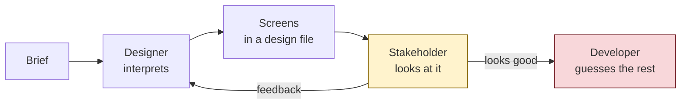
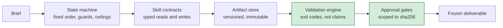
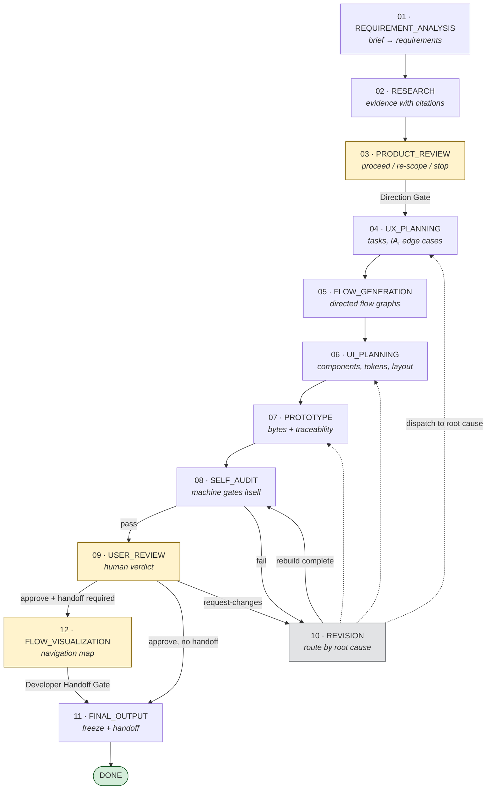
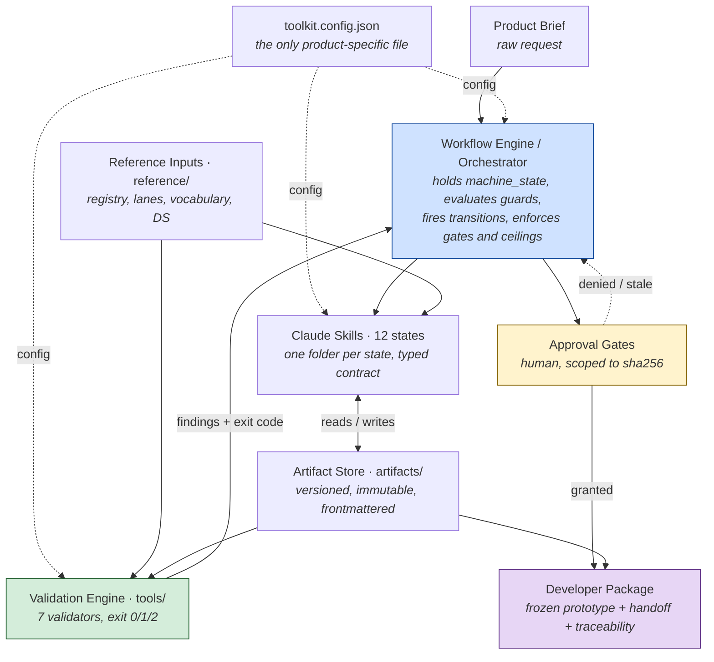
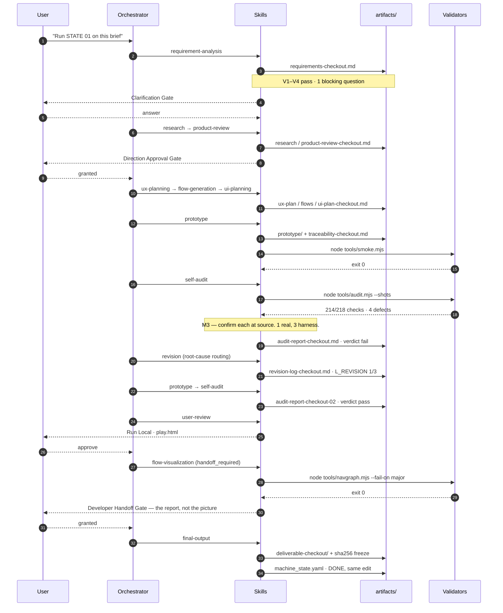

<div align="center">

# Design Toolkit

**An AI Design Operating System for taking a product brief to a validated, approved, developer-ready deliverable through a structured twelve-state workflow.**

Not a prompt pack. A state machine, twelve skill contracts, an artifact store, and a validation engine that proves the output instead of asserting it.

[](PUBLIC_ROADMAP.md)
[](#requirements)
[](tools/)
[](LICENSE)
[](DIFFERENTIATORS.md)

**[Start Here](START_HERE.md)** · **[Workflow Guide](WORKFLOW_GUIDE.md)** · **[Architecture](ARCHITECTURE.md)** · **[Validation Engine](VALIDATION_ENGINE.md)** · **[Principles](DESIGN_PRINCIPLES.md)** · **[Differentiators](DIFFERENTIATORS.md)** · **[Roadmap](PUBLIC_ROADMAP.md)**

</div>

---

## Contents

| Section | Answers |
|---|---|
| [What is this?](#what-is-this) | What you get |
| [Why this exists](#why-this-exists) | What problem it solves |
| [Key features](#key-features) | What is in the box |
| [Workflow overview](#workflow-overview) | How the twelve states connect |
| [Architecture overview](#architecture-overview) | How the parts fit together |
| [Getting started](#getting-started) | How to run it in five minutes |
| [Repository structure](#repository-structure) | What every folder is for |
| [Validation tools](#validation-tools) | What each validator checks and why |
| [Philosophy](#philosophy) | The rules that shape every decision |
| [Example project](#example-project) | One feature, end to end |
| [FAQ](#faq) | The questions people actually ask |
| [Roadmap](#roadmap) | Where this is going |
| [Commercial vision](#commercial-vision) | Engine today, platform tomorrow |

> **Operating documentation, not an execution trigger.** Reading this repository does not start a run. An agent executes a state only when a request explicitly asks for that state's work. Absent a task, treat this repo as the operating manual.

---

## What is this?

Design Toolkit is a repeatable process for designing digital products with an AI agent, written down precisely enough that a machine can follow it and a human can check it.

You point it at a product brief. It runs twelve states in a fixed order — requirements, research, product review, UX planning, flows, UI planning, prototype, audit, review, revision, navigation mapping, delivery. Each state reads named files, writes named files, and passes machine-checkable validation rules before the next one starts. Two decisions stay with a human: the product direction, and the approval to ship.

What comes out is a frozen deliverable: an interactive prototype, a handoff document, a traceability matrix from every requirement to the element that satisfies it, an audit report with evidence, and hashes proving what was approved.

It is product-agnostic and model-agnostic. One configuration file holds everything a specific product owns.

---

## Why this exists

### The traditional workflow



Bringing an AI agent into that loop makes it faster without making it better. The agent produces plausible screens quickly, and the loop keeps every property that made it expensive.

### The problems that survive

| Problem | What it looks like in practice |
|---|---|
| **Requirements stay ambiguous** | Nobody wrote a falsifiable acceptance criterion, so nothing can fail a check. |
| **Assertion is mistaken for evidence** | "All checks passed" is a statement about the checks. One screen passed 84 of 84 DOM assertions while painting nothing at all. |
| **Approvals go stale silently** | Bytes move after the approval; the deliverable and the prototype disagree about what shipped. |
| **Loops run unbounded** | A revision ceiling of three delivered five rounds, because nobody was counting out loud. |
| **Defects are patched, not routed** | Six selectors get fixed; the class resurfaces later at 138 instances across seven flows. |
| **Handoff is a picture** | The design file renders beautifully over a navigation model with broken routes. |
| **Nothing is reproducible** | A second run of the same brief produces different work, and no one can say which run was right. |

### How this system solves them



Every rule in this repository was written by a defect. The pipeline was extracted from a complete product design run — 11 flows, 48 screens, 4 shipped deliverables — and each "project-hardened" rule is a defect that got past a green check on that run. The catalogue is [`docs/method-rules.md`](docs/method-rules.md). Read it before deciding a step is optional: the cheap version of each step is exactly the version that failed.

Three of them, stated once, because they shape everything else:

1. **A DOM-assertion suite is not a substitute for looking at the render.** `visibility:hidden` keeps layout boxes and accepts programmatic clicks.
2. **A failing probe is a hypothesis, not a finding.** One audit's first run reported 60 failures and 3 were real; a state probe reported 37 and all 37 were the harness.
3. **An approval is scoped to the bytes it saw.** A gate that cannot name its sha256 cannot be shipped from.

---

## Key features

| Feature | What it means |
|---|---|
| **Structured twelve-state workflow** | A fixed, documented order with declared inputs, outputs and exit criteria per state. No improvised sequencing. |
| **Human approval gates** | Five gates. The two that matter — direction and delivery — are granted by a person, never by the machine. |
| **Artifact contracts** | Skills communicate only through the artifact store. A skill's contract is its Reads and its Writes; nothing reaches into another skill's internals. |
| **Validation engine** | Seven Node validators for the product, plus two that check this repository's own documentation. Zero dependencies. Every one exits `0` clean / `1` findings / `2` tool error, so "the map matches the registry" is a check, not a claim. |
| **Resumable state machine** | `state/machine_state.yaml` persists after every transition. Halt anywhere, resume at the exact state. |
| **Bounded loops** | Every loop has a ceiling and an escalation path. `HALT_BLOCKED` is a legitimate, resumable outcome; an infinite revision cycle is not. |
| **Developer handoff** | A navigation map derived from the screen registry by a tool, with swimlanes, a cross-feature map, a measured heatmap, deep-link addressing, per-screen state machines and cited developer annotations. |
| **Product agnostic** | Nothing in `docs/`, `skills/` or `tools/` names a product. Everything a product owns lives in [`toolkit.config.json`](toolkit.config.json). |
| **AI model agnostic** | The states are contracts, not prompts for one vendor. Any agent that can read files, write files and run Node can execute them. |
| **Evidence-first delivery** | A freeze is a hash, not a copy. Known limitations ship inside the deliverable at full strength. |

---

## Workflow overview

Twelve states. The happy path runs left to right; `revision` is not in the line — it is the loop that routes failures back to the state that caused them.



`flow-visualization` runs only when `handoff_required` is true — the work is going to a build team. Everything else is unconditional.

### The gates

| Gate | Where | Blocks | Grantor |
|---|---|---|---|
| Clarification | 01 | leaving with unresolved blocking ambiguity | user |
| **Direction Approval** | 03 → 04 | spending design effort on an unapproved direction | user |
| **Primary User Approval** | 09 → 11 | shipping an unapproved deliverable | user |
| Conflict Mini-Gate | 10 | dispatching contradictory change requests | user |
| **Developer Handoff** | 12 → 11 | shipping a design a build team cannot navigate | user |

Gates are granted by the user, never by the machine, and revert to `pending` the moment approved artifacts change.

Full detail per state: **[WORKFLOW_GUIDE.md](WORKFLOW_GUIDE.md)**.

---

## Architecture overview



The load-bearing rule: **skills communicate only through the artifact store, never directly.** The orchestrator — not a skill — holds `machine_state`, evaluates guards, fires transitions, enforces gates and loop ceilings, and persists state after every transition. The orchestrator is the state machine; the skills are the states.

Full detail: **[ARCHITECTURE.md](ARCHITECTURE.md)**.

---

## Getting started

### Requirements

- **Node ≥22** — the tools use global `fetch` and `WebSocket`. No `npm install`, no dependencies.
- **Python 3** — the Run Local review server.
- **Chrome** — path in `toolkit.config.json` → `audit.chrome`, or `$TOOLKIT_CHROME`.
- **Figma MCP access** — only if `handoff_required` is true and STATE 12 is in scope.

### Five-minute quick start

```bash
# 1. Get the repository
git clone <this-repo> design-toolkit && cd design-toolkit
node --version                       # must be ≥ 22

# 2. Name your product — the ONLY file you must edit to begin
#    product.name, product.slug, product.viewport, designSystem.sourceId
$EDITOR toolkit.config.json

# 3. Seed the product-owned reference files and the machine record
cp templates/screen-registry.csv  reference/screen-registry.csv
cp templates/nav-lanes.json       reference/nav-lanes.json
cp templates/state-vocabulary.md  reference/state-vocabulary.md
cp templates/machine_state.yaml   state/machine_state.yaml

# 4. Run STATE 01 against your brief, in your agent of choice:
#    "Run STATE 01 requirement-analysis on this brief: <your brief>"
#    → writes artifacts/requirements-<feature>.md

# 5. Continue one state per request. After the prototype exists:
node tools/smoke.mjs "home:dash,stack"        # STATE 07 self-check
node tools/audit.mjs --shots artifacts/shots  # STATE 08 — then READ the screenshots
```

New to the toolkit? **[START_HERE.md](START_HERE.md)** takes you from zero knowledge to a finished first project in under thirty minutes. Configuring for a real product? **[SETUP.md](SETUP.md)** is the field guide.

---

## Repository structure

```
design-toolkit/
├── toolkit.config.json     ← the only file a new product must edit
├── README.md               ← you are here
├── START_HERE.md           ← zero-knowledge onboarding, first project in 30 min
├── SETUP.md                ← pointing the toolkit at a real product
├── WORKFLOW_GUIDE.md       ← all twelve states, in full
├── ARCHITECTURE.md         ← engine, store, validators, gates
├── ARTIFACT_FLOW.md        ← what each artifact is and who consumes it
├── VALIDATION_ENGINE.md    ← every validator, output, failure and fix
├── DESIGN_PRINCIPLES.md    ← the philosophy, with failure modes
├── DIFFERENTIATORS.md      ← how this differs from adjacent tools
├── DIAGRAMS.md             ← every diagram in one place
├── GLOSSARY.md             ← canonical terminology
├── PUBLIC_ROADMAP.md       ← phases 1–6
├── DOCS_AUDIT.md           ← documentation audit before launch
├── CONTRIBUTING.md         ← the bar for a rule, a validator, a spec change
├── CODE_OF_CONDUCT.md      ← Contributor Covenant 2.1
├── SECURITY.md             ← reporting, scope, and the trust model
├── CHANGELOG.md            ← release history · what counts as breaking
├── LICENSE                 ← Apache-2.0
├── .github/                ← issue templates (rule report · bug) + PR template + CI
├── docs/
├── skills/
├── tools/
├── templates/
├── reference/
├── artifacts/
├── state/
└── examples/
```

| Folder | Purpose | Owner | Committed? |
|---|---|---|---|
| **[`docs/`](docs/)** | The specification layer. [`workflow.md`](docs/workflow.md) is the **source of truth** for the state machine — where a skill and this document disagree, the document wins and the skill is the bug. [`method-rules.md`](docs/method-rules.md) is the hardened rule catalogue, indexed by code so a rule can be cited from a plan or a gate record. [`artifact-contracts.md`](docs/artifact-contracts.md) defines the store, the naming scheme and the load-bearing frontmatter fields. | toolkit | yes |
| **[`skills/`](skills/)** | One folder per state, twelve in total. Each holds a `SKILL.md` — the executable contract, with processing steps, output shape, validation rules, exit conditions, failure recovery and recorded failure modes — and a short `README.md` for orientation. These are the states; they hold no machine state of their own. | toolkit | yes |
| **[`tools/`](tools/)** | The validation engine. Config-driven, dependency-free Node ≥22 scripts. Nothing product-specific lives here: every tool reads `toolkit.config.json` through [`config.mjs`](tools/config.mjs). Change a convention in the config, never in a tool. | toolkit | yes |
| **[`templates/`](templates/)** | Empty artifact shapes with the load-bearing fields marked, plus [`templates/prototype/`](templates/prototype/) — the Run Local review player (`run-local.sh`, `serve.py`, `play.html`) that STATE 07 copies into the prototype directory. Copy from here; do not edit in place. | toolkit | yes |
| **[`reference/`](reference/)** | Product-owned inputs the pipeline **reads but does not produce**: the screen registry (the spine of the navigation model), swimlane assignments, the closed state vocabulary, per-screen state machines, edge annotations, the audit plan, and the design-system export. | your product | yes |
| **[`artifacts/`](artifacts/)** | The runtime artifact store. Every pipeline output lands here — requirements, research, plans, flows, the prototype, audit reports, gate records, revision logs, navigation graphs and the frozen deliverable. Derived JSON and screenshots are gitignored; **frozen deliverables are committed**, because a freeze that is not in version control is not a freeze. | pipeline | selectively |
| **[`state/`](state/)** | `machine_state.yaml` — the machine's own record, and the file §8 completion rule 1 is defined over. Not an artifact. Written at decision time, in the same edit as the thing it records. | orchestrator | yes |
| **[`examples/`](examples/)** | Empty by design. The toolkit ships the method from a completed run, not that product's artifacts. Run the pipeline once on a small feature and keep those artifacts here as your own reference set. | you | optional |

Each folder carries its own `README.md` with purpose, inputs, outputs, examples and best practices.

---

## Validation tools

All seven read `toolkit.config.json`; none contains a product-specific value. Node ≥22, zero dependencies. Every validator exits `0` clean / `1` findings / `2` tool error.

| Tool | Runs at | Answers | Why it exists |
|---|---|---|---|
| [`tools/smoke.mjs`](tools/smoke.mjs) | **07** before handoff to the audit | For each page and view: does it paint, are there console errors, is any target below the floor? | So the audit's budget is not spent on defects assembly could have found. |
| [`tools/audit.mjs`](tools/audit.mjs) | **08** | The rendering-class audit: paint, tap targets, horizontal overflow, content spill, composited contrast, per-glyph script fonts, plus source sweeps for duplicate keys, off-palette hexes and undeclared network calls. | Because a screen can pass every structural assertion while painting nothing. It produces evidence; the verdict is the state's, written after the screenshots are read. |
| [`tools/navgraph.mjs`](tools/navgraph.mjs) | **12** | Which screen leads to which screen — derived from the registry, never drawn. Plus the cross-feature map, the measured heatmap, deep-link hook coverage and state-vocabulary conformance. | A hand-drawn connector is an assertion nobody can re-check. If the diagram and the derivation disagree, the diagram is wrong. |
| [`tools/stategraph.mjs`](tools/stategraph.mjs) | **12** | Within a screen: which states exist, what moves between them, and does each transition's cited `file:line` still exist in the frozen bytes? | The node set is derived from the registry; the edge set is authored **with evidence**. An unevidenced arrow looks like a spec and is a guess. |
| [`tools/stateprobe.mjs`](tools/stateprobe.mjs) | **12** | Does each state's deep-link hook actually **paint**? And does the id the page prints match the id the registry claims? | Proving a hook is *read* is not proving the state is *shown*. Id drift is measured here, not asserted. |
| [`tools/annotate.mjs`](tools/annotate.mjs) | **12** | Per edge: navigation kind, motion preset, API call, guard — each with a citation the tool resolves against the frozen bytes. Per frame: auth and permission. | `UNKNOWN` is a legal value and a guessed value is not. An `api` field filled with a plausible endpoint is worse than an empty one, because the developer will build it. |
| [`tools/cdp.mjs`](tools/cdp.mjs) | — | Headless Chrome driver used by the harnesses. | Dependency-free browser control, so the validation engine needs no npm tree. |

```bash
node tools/smoke.mjs "home:dash,stack"        # 07
node tools/audit.mjs --shots artifacts/shots  # 08
node tools/navgraph.mjs   --fail-on major     # 12
node tools/stategraph.mjs --fail-on major     # 12
node tools/stateprobe.mjs                     # 12
node tools/annotate.mjs   --fail-on major     # 12
```

Full detail — what each checks, typical output, common failures, and how to fix them: **[VALIDATION_ENGINE.md](VALIDATION_ENGINE.md)**.

---

## Philosophy

Seven principles hold the system together. Each one has a purpose, a real failure that produced it, and a cost if ignored.

| Principle | In one line |
|---|---|
| **Every output is reproducible** | Same state, same inputs, same artifacts → same transition. Randomness is not a transition input. |
| **The human approves decisions** | The machine can produce, check and route. It cannot ratify direction or authorise shipping. |
| **Validation over assumption** | A check with an exit code beats a claim in prose. A failing probe is a hypothesis until confirmed at source. |
| **Artifacts over context** | Skills talk through files, not through a shared conversation. What is not in the artifact did not happen. |
| **Every defect becomes a rule** | A defect that got past a green check produces a permanent, coded rule in the state that owns it. |
| **Approval belongs to exact artifacts** | An approval is scoped to the bytes it saw, named by sha256. Bytes move → the gate reverts to `pending`. |
| **State transitions are deterministic** | Guards are explicit, ceilings are counted out loud, and every loop terminates by approval or by escalation. |

Expanded, with real-world examples and the failure mode of ignoring each: **[DESIGN_PRINCIPLES.md](DESIGN_PRINCIPLES.md)**.

---

## Example project

A single feature — `checkout` — from brief to frozen deliverable. Full narrative with commands, artifacts and gate records: [START_HERE.md § Your first project](START_HERE.md#part-3--your-first-project).



The step people skip is the one after `V-->>S: 4 defects`. Three of those four were the harness. Confirming each at source, correcting the instrument and re-running is the difference between an audit and a rumour.

---

## FAQ

<details>
<summary><b>Do I have to run all twelve states?</b></summary>

Two are legitimately skippable. **STATE 12** is skipped when the work is not going to a build team — set `handoff_required: false`. **STATE 02** may be waived per goal when a goal is explicitly marked `no-research-needed`; that is per goal, not wholesale.

You cannot skip STATE 08 before STATE 09, or STATE 09 before STATE 11. The audit exists so the user never debugs; the gate exists so the machine never ships on its own authority.
</details>

<details>
<summary><b>Does this only work with Claude?</b></summary>

The skills are written as Claude Skills and that is the smoothest path, but nothing in the contracts is vendor-specific. A state is a document that says what to read, what to write, what must be true on exit and what to do on failure. Any agent that can read files, write files and run Node can execute one. The validators are plain Node and know nothing about any model.
</details>

<details>
<summary><b>Does the agent design the product, or do I?</b></summary>

You rule; it produces and proves. The two decisions the machine is structurally forbidden from making are the product direction (Direction Approval Gate, STATE 03) and the decision to ship (Primary User Approval Gate, STATE 09). Between those, the machine does the work and shows its evidence. An unruled question is carried forward as an open decision (`o-<id>`), never defaulted at build time.
</details>

<details>
<summary><b>How long does a feature take?</b></summary>

Agent time is dominated by STATE 07 and STATE 08; human time is dominated by the two gates. A small feature — one flow, five to eight screens — is typically a working session plus two review passes. See the per-state indicative durations in [WORKFLOW_GUIDE.md](WORKFLOW_GUIDE.md). Treat them as planning aids, not commitments.
</details>

<details>
<summary><b>What if the audit reports dozens of failures?</b></summary>

Assume the instrument first. On the extraction run, one audit opened at 60 failures with 3 real, and one state probe reported 37 failures of which every single one was the harness. The known false-positive classes are catalogued in [`skills/08-self-audit/SKILL.md`](skills/08-self-audit/SKILL.md#b-harness-false-positives) — scroll rails read as overflow, `#feed` read as a colour, harness chrome read as off-palette, deliberate crops, timing flakes. Confirm at source, correct the harness, re-run. Never waive, never report unconfirmed.
</details>

<details>
<summary><b>What happens when a revision loop hits its ceiling?</b></summary>

`HALT_BLOCKED`, with an escalation summary of unresolved items — never a fourth unbounded cycle. The state is fully persisted and resumable. The ceiling resets only by explicit user authorisation, recorded in the revision log. This is a working outcome, not a crash.
</details>

<details>
<summary><b>Can I use my own design system?</b></summary>

That is the intended path. Name it in `toolkit.config.json` → `designSystem.sourceId`, **by source id**. STATE 06 maps components to your primitives reuse-first and raises an Extension Note for genuine gaps. The rule exists because a plan built on the wrong design system validates perfectly against it — one such mix-up survived four revision cycles and reached `HALT_BLOCKED` before anyone spotted the tell.
</details>

<details>
<summary><b>Is Figma required?</b></summary>

Only for STATE 12, and only when `handoff_required` is true. The navigation graph, the state graphs, the annotations and the reports are all produced by local tools and are readable without Figma. The Figma layer is where those derivations get drawn for a build team.
</details>

<details>
<summary><b>Where do I put my product's screens, routes and states?</b></summary>

[`reference/screen-registry.csv`](reference/README.md). It is the spine: `tools/navgraph.mjs` derives the entire navigation model from its cells. Rows are added as flows are designed, not up front — but the columns are fixed. Two separators, not interchangeable: `states` is comma-separated, `entry_from` and `navigates_to` are pipe-separated.
</details>

<details>
<summary><b>Why is examples/ empty?</b></summary>

Deliberately. Shipping another product's artifacts as examples invites the exact failure STATE 06 records first — a plan built on a borrowed source validates perfectly against it. Run the pipeline once on a small feature and keep that feature's artifacts as your reference set.
</details>

---

## Roadmap

| Phase | Deliverable | Status |
|---|---|---|
| **1 · Open Source Toolkit** | The repository you are reading: state machine, twelve skills, validation engine, artifact contracts. | current |
| **2 · CLI** | `dtk init`, `dtk run <state>`, `dtk validate`, `dtk gate` — the orchestrator as a program instead of a discipline. | next |
| **3 · Visual Workflow** | A live view of the machine: current state, gate status, loop counters, findings, artifact versions. | planned |
| **4 · Cloud Platform** | Hosted runs, shared artifact store, team gates, audit history, review links that outlive a laptop. | planned |
| **5 · Marketplace** | Publishable skill packs, validators, design-system adapters and industry rule sets. | planned |
| **6 · Enterprise** | SSO, policy-as-validation, compliance evidence export, private registries, on-prem runs. | planned |

Detail on each phase, with what it unlocks and what it explicitly does not change: **[PUBLIC_ROADMAP.md](PUBLIC_ROADMAP.md)**.

---

## Commercial vision

**This repository is the engine.** It is the specification of how product design work becomes checkable: the state machine, the artifact contracts, the validation rules, the gate semantics. It runs on a laptop, in a terminal, with no account and no network.

**The platform is the operating system built around the engine.** Everything a team needs that a repository cannot provide: hosted execution, a shared artifact store with real version history, gates that route to the person who owns the decision, an audit trail that survives a laptop reimage, dashboards over loop counters and open debt, and a marketplace for skill packs and design-system adapters.

The split is deliberate and load-bearing:

- The **engine stays open**, because a methodology nobody can inspect is a methodology nobody should trust. Every rule in here names the defect that produced it, and that only works in the open.
- The **platform is where scale lives** — multi-team coordination, permanence, compliance evidence, and the operational surfaces around the same contracts.
- **Artifacts stay portable.** A deliverable produced by the open engine is a folder of markdown, HTML and hashes. It is readable, gradable and re-runnable with or without any platform. Lock-in would contradict the principle the whole system is built on: every output is reproducible.

---

## Contributing

Contributions that improve documentation, add validators, or harden a rule with a recorded defect are welcome. Two conventions to know before opening a pull request:

1. **[`docs/workflow.md`](docs/workflow.md) is the source of truth.** If a skill and that document disagree, the document wins and the skill is the bug.
2. **A new project-hardened rule names the defect that produced it.** Rules in this repository are not opinions; they are recorded failures with codes, indexed in [`docs/method-rules.md`](docs/method-rules.md).

Full guidance — including the bar for a new rule, the bar for a new validator, and what will be declined — is in **[CONTRIBUTING.md](CONTRIBUTING.md)**. By participating you agree to the [Code of Conduct](CODE_OF_CONDUCT.md). To report something exploitable, follow [SECURITY.md](SECURITY.md) rather than opening a public issue.

Release history and the definition of a breaking change: [CHANGELOG.md](CHANGELOG.md).

## License

[Apache License 2.0](LICENSE). Chosen over a permissive-only licence for its explicit patent grant and contribution terms — the engine stays open, and the commitments in [PUBLIC_ROADMAP.md](PUBLIC_ROADMAP.md) depend on that staying true as a platform is built around it.

---

<div align="center">

**[Start Here](START_HERE.md)** · **[Workflow Guide](WORKFLOW_GUIDE.md)** · **[Architecture](ARCHITECTURE.md)** · **[Artifact Flow](ARTIFACT_FLOW.md)** · **[Validation Engine](VALIDATION_ENGINE.md)** · **[Design Principles](DESIGN_PRINCIPLES.md)** · **[Differentiators](DIFFERENTIATORS.md)** · **[Diagrams](DIAGRAMS.md)** · **[Glossary](GLOSSARY.md)** · **[Roadmap](PUBLIC_ROADMAP.md)**

</div>
