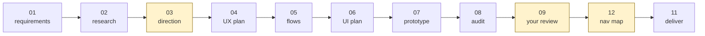

# Start Here

**Zero knowledge assumed. Thirty minutes to your first finished project.**

[← README](README.md) · Next: [Workflow Guide →](WORKFLOW_GUIDE.md)

---

## Contents

- [Part 0 — What you are about to do](#part-0--what-you-are-about-to-do) · 2 min
- [Part 1 — Set up](#part-1--set-up) · 5 min
- [Part 2 — The five ideas you need](#part-2--the-five-ideas-you-need) · 5 min
- [Part 3 — Your first project](#part-3--your-first-project) · 20 min
- [Part 4 — What you now have](#part-4--what-you-now-have)
- [Part 5 — Where to go next](#part-5--where-to-go-next)
- [Troubleshooting](#troubleshooting)

---

## Part 0 — What you are about to do

You will take a one-paragraph product brief and turn it into a **finished, checked, approved design deliverable** — using an AI agent that follows a written process instead of improvising one.

By the end you will have produced, in order:

1. A requirements document with acceptance criteria that can actually fail.
2. A research file where every claim cites a source.
3. A direction decision that **you** approved before any design effort was spent.
4. A UX plan covering the error and empty states, not just the happy path.
5. A flow graph with no dead ends and no unreachable states.
6. A UI plan mapped to a design system, reuse-first.
7. A working, clickable prototype you can open in a browser.
8. An audit report backed by screenshots and geometry measurements, not claims.
9. A gate record naming the exact sha256 of everything you approved.
10. A frozen deliverable with a handoff document.

**You do not need to know what a state machine is.** You do not need to write code. You will run about six shell commands and have a conversation with an agent.

**What you do need:** a terminal, an AI coding agent with file access (Claude Code, or any equivalent), and one small feature idea. Pick something you can describe in three sentences — a login flow, a settings page, a checkout step. Small is correct for a first run.

---

## Part 1 — Set up

### 1.1 Check your machine

```bash
node --version     # must print v22.x or higher
python3 --version  # must print 3.x
```

If Node is below 22, install a newer one before continuing. The tools use `fetch` and `WebSocket` as globals; they will not run on Node 20.

You also need **Google Chrome** installed. The audit harness drives it headlessly.

### 1.2 Get the toolkit

```bash
git clone <this-repo> design-toolkit
cd design-toolkit
```

There is no `npm install`. The tools have zero dependencies, on purpose — a validation engine that rots because of a transitive dependency is not a validation engine.

### 1.3 Name your product

Open [`toolkit.config.json`](toolkit.config.json). This is the only file you must edit before starting. For a first run, change four things:

```jsonc
{
  "product": {
    "name": "My First Feature",       // ← anything readable
    "slug": "first-feature",          // ← lowercase, used in ids and profile names
    "viewport": { "width": 393, "height": 852 }   // ← 393×852 is a modern phone; leave it
  },
  "designSystem": {
    "name": "None yet",
    "sourceId": "none-first-run"      // ← for a real product, name your DS BY SOURCE ID
  }
}
```

Everything else has a working default. Two fields are worth understanding now even if you leave them alone:

- **`audit.tapTargetFloorPx`** (default `44`) — the minimum size of anything tappable. STATE 04 commits to this number and STATE 08 checks against it. Set it to what you will actually build.
- **`product.scripts`** (default `[]`) — every writing system your product renders. Empty means the per-glyph font check is off. A product that renders a non-Latin script with this empty ships a whole class of font defects blind.

### 1.4 Seed the working files

```bash
cp templates/screen-registry.csv  reference/screen-registry.csv
cp templates/nav-lanes.json       reference/nav-lanes.json
cp templates/state-vocabulary.md  reference/state-vocabulary.md
cp templates/machine_state.yaml   state/machine_state.yaml
```

What you just created:

| File | What it is |
|---|---|
| `reference/screen-registry.csv` | The spine. Every screen your product has, one row each. The navigation model is **derived** from it. Rows get added as you design flows — not up front. |
| `reference/nav-lanes.json` | Which actor drives each screen — customer, admin, system, api. For a first run, everything is `customer`. |
| `reference/state-vocabulary.md` | The closed list of state names a screen may be in. Closed on purpose: free text cannot be diagrammed. |
| `state/machine_state.yaml` | The machine's own record — where you are, what is approved, how many loops you have burned. |

You are set up. That was five minutes.

---

## Part 2 — The five ideas you need

Read this once. It is the whole mental model.

### Idea 1 — Twelve states, one at a time

The work is split into twelve named steps. Each one reads specific files, writes specific files, and has to pass specific checks before the next one runs.



You run **one state per request**. You say "run STATE 04" and the agent does exactly that state and stops. It does not run ahead. That is the point: every step has a stopping place where you can look.

State 10 (`revision`) is not in the line. It is the loop that sends failures back to whichever state caused them.

### Idea 2 — Files talk, skills do not

States never talk to each other directly. State 05 does not ask State 04 a question — it reads `artifacts/ux-plan-<feature>.md` and works from that.

This has one consequence that matters to you: **if it is not in the file, it did not happen.** A decision that lives only in your chat history is a decision the next state cannot see.

### Idea 3 — Checks have exit codes

When a tool says the navigation map matches the registry, it means a program compared them and returned `0`. Not that an agent read both and felt confident.

```bash
node tools/navgraph.mjs --fail-on major
echo $?     # 0 = clean · 1 = findings · 2 = tool error
```

Everything in `tools/` works this way.

### Idea 4 — Two decisions are yours

The agent produces and proves. **You** rule on two things:

- **Direction** (after STATE 03) — is this the right thing to build? Approving here means design effort is about to be spent.
- **Delivery** (after STATE 09) — is this good enough to ship?

The machine cannot grant either one to itself. If the files change after you approve, the approval reverts to `pending` automatically. That is not bureaucracy; it is the rule that stops a deliverable and a prototype from disagreeing about what shipped.

### Idea 5 — Every rule here came from a defect

The unusual-looking rules in this repository are not preferences. Each was written by something that broke on a real product run and got past a green check. A few you will meet today:

> **84 out of 84 assertions passed against a screen that displayed nothing.** `visibility:hidden` keeps the layout boxes and accepts programmatic clicks. That is why STATE 08 measures computed visibility and geometry, and why you are asked to look at the screenshots.

> **One audit's first run reported 60 failures; 3 were real.** That is why a failing check is treated as a hypothesis until confirmed at source.

The full catalogue is [`docs/method-rules.md`](docs/method-rules.md).

---

## Part 3 — Your first project

We will design **a sign-in screen with a "forgot password" path**. Substitute your own feature if you prefer; keep it this small.

Throughout, `<feature>` is `signin`.

### Step 1 — Requirements (3 min)

Ask your agent:

> Run STATE 01 `requirement-analysis` from `skills/01-requirement-analysis/SKILL.md` on this brief:
>
> "Users sign in with an email and a password. If they have forgotten their password they can request a reset link. Wrong credentials should be recoverable without losing what they typed. Mobile first."
>
> Write `artifacts/requirements-signin.md`.

**What you should get back:** a file with goals, actors, constraints, non-goals, requirements each carrying a falsifiable acceptance criterion, assumptions tagged `assumed` or `confirmed`, and open questions tagged `blocking` or `non-blocking`.

**Check it yourself.** Open the file and read the acceptance criteria. Every one must be something that could *fail*. "The sign-in screen is user-friendly" cannot fail. "Submitting wrong credentials preserves the entered email and returns focus to the password field" can.

If the agent raised a **blocking** question, answer it. That is the Clarification Gate, and it exists so an invented answer never becomes a spec nobody chose.

### Step 2 — Research (2 min)

> Run STATE 02 `research` on `artifacts/requirements-signin.md`. Write `artifacts/research-signin.md`.

**What to look for:** every theme cites at least one source, and every goal from step 1 maps to a theme or is explicitly marked `no-research-needed`. Contradictions are listed, not quietly resolved.

For a feature this small, marking a goal `no-research-needed` is legitimate — but it is a decision you can see, which is the point.

### Step 3 — Direction, and your first gate (3 min)

> Run STATE 03 `product-review` on the requirements and research. Write `artifacts/product-review-signin.md` and present the Direction Approval Gate.

**What you get:** a `proceed` / `re-scope` / `stop` recommendation, requirements scored on value / effort / risk, a risk register where every high-severity item carries a mitigation or a named person accepting it, and a cut list.

**Your job here:** read the recommendation and the cut list, then say `approve` or `deny`. This is the cheapest place in the entire process to stop or re-cut scope — everything after this compounds on the direction you ratify.

Record it in `state/machine_state.yaml`:

```yaml
  approvals:
    DirectionApprovalGate: granted
```

### Step 4 — UX plan (3 min)

> Run STATE 04 `ux-planning`. Write `artifacts/ux-plan-signin.md`.

**The rule that makes this state useful:** every primary task must enumerate its happy path **and at least three non-happy paths** — loading, empty, error, interrupted, offline, permission-denied.

This is where most design processes quietly fail. A sign-in screen has a wrong-password state, a network-failure state, a rate-limited state and a "reset link expired" state. If they are not enumerated here, they will not be in the flows, will not be in the prototype, and will be discovered by a developer in build.

**Also check:** no screen names, no layout, no colours. This state is deliberately screen-free. Design detail arriving here pre-commits the UI plan to a layout nobody chose.

### Step 5 — Flows (2 min)

> Run STATE 05 `flow-generation`. Write `artifacts/flows-signin.md`.

**What you get:** a directed graph per task, decision points with mutually exhaustive branches, a recovery route for every non-happy state, and a reachability report stating `Unreachable nodes: 0` and `Dead ends without justification: 0`.

"Mutually exhaustive" means the branch set covers the whole domain of the guard — including null, not-yet-loaded and permission-denied. Not merely that two plausible cases are listed. This is the validation rule that fails quietest.

### Step 6 — UI plan (3 min)

> Run STATE 06 `ui-planning`. Write `artifacts/ui-plan-signin.md`.

**What you get:** every flow state mapped to a component set, components mapped to design-system primitives reuse-first with a written justification against every `new` one, layout rules with real numbers at your real viewport, a motion spec forked for reduced-motion, contrast decided on the token pair with ratios written down, and a strict colour allowlist.

**One action for you:** copy that allowlist into `toolkit.config.json` → `audit.colorAllowlist`. An allowlist that lives only in a document is an allowlist nothing enforces.

### Step 7 — Prototype (5 min)

> Run STATE 07 `prototype`. Build `artifacts/prototype/signin.html` and write `artifacts/traceability-signin.md`.
>
> Follow build method B1–B8. Every flow state, variant and error case gets a deep-link hook recorded in the traceability table.

Then copy the review player in:

```bash
cp templates/prototype/{run-local.sh,serve.py,play.html} artifacts/prototype/
chmod +x artifacts/prototype/run-local.sh
```

Ask the agent to register your page in `play.html`'s `FEATURES` array. **A flow missing from that array is a flow you will not review.**

Now run the build-time check:

```bash
node tools/smoke.mjs "signin:main,error,reset"
```

You want `PASS` on each. `BLANK` means the view exists in the DOM and paints nothing — the single most common defect this whole toolkit exists to catch.

### Step 8 — The audit (3 min)

> Run STATE 08 `self-audit`. Write `artifacts/audit-report-signin.md`.

Run the harness:

```bash
node tools/audit.mjs --shots artifacts/shots
```

You will see something like:

```
214 / 218 checks · 7 runs · 7 screenshots
wrote artifacts/audit-data.json · screenshots in artifacts/shots

4 defect(s) — per M3, confirm each at source before writing it into audit-report.md:
  ✗ signin·error 44px targets — link.forgot 120x28
  ✗ signin·main no console errors — 404 http://127.0.0.1:8797/favicon.ico
  ...

M2: the screenshots are part of this audit. Read them before writing the verdict.
```

**Now do the two things that make this an audit rather than a rumour.**

1. **Confirm each failure at source.** The favicon 404 is not a product defect — add `favicon.ico` to `audit.benignConsole`, which it already is by default, or check why it is not filtered. The 120×28 link genuinely fails your own 44px floor. One real, one instrument.
2. **Open the screenshots.** `artifacts/shots/`. Look at every one. On the extraction run, four of one flow's six real defects were screenshot-only finds — a closed sheet bleeding back into the screen, a scroll that pushed the header out of frame, a label truncated to its least useful word, an asset crop gap. No assertion suite sees any of those.

Then have the agent write the verdict: `pass` or `fail`, with the conformance matrix marking every acceptance criterion `met` / `unmet` / `waived` **with evidence**.

A `fail` here is normal and correct. It routes to STATE 10, which sends each finding back to the state that caused it, and you come back through STATE 08 again.

### Step 9 — Your review, and the gate that matters (3 min)

> Run STATE 09 `user-review`. Serve the prototype and present the packet.

```bash
artifacts/prototype/run-local.sh
# → http://localhost:8765/play.html
```

Open it. **Review through the player, not by opening the HTML file directly** — the player sidebar is the review chrome, and the rule exists because reviewing raw pages was a real correction on a real run.

The agent should hand you the **hook list** from the traceability table: a direct URL for every state, including the error and empty ones. Use them. A state you cannot reach in one step is a state that gets approved unseen.

The agent must also present the **known limitations** from the audit report, unlaundered. An acceptance with qualifications is recorded with its qualifications.

Say `approve`, `request-changes` or `reject`. On approve, the gate record must name:

- `reads_versions` — the exact prototype and audit versions,
- the **sha256 of every approved file**,
- the player URL you actually reviewed at.

An approval that cannot name its bytes cannot be shipped from. That is not a formality; it is the rule that prevents the deliverable and the prototype from disagreeing about what shipped.

### Step 10 — Deliver (2 min)

For a first run, set `handoff_required: false` in `state/machine_state.yaml` and skip STATE 12. (When you do need a developer handoff, STATE 12 derives the navigation map — see [WORKFLOW_GUIDE.md § STATE 12](WORKFLOW_GUIDE.md#state-12--flow_visualization).)

> Run STATE 11 `final-output`. Freeze and package into `artifacts/deliverable-signin/`.

**What you get:**

```
artifacts/deliverable-signin/
├── prototype/          # the frozen bytes, each listed with its sha256
└── handoff-signin.md   # what shipped, key decisions, freeze hashes,
                        # review packet, waivers, known limitations,
                        # and all six completion rules checked individually
```

And — **in the same edit** — `state/machine_state.yaml` closes with `current_state: DONE` and a boolean plus a one-line reason for each of the six completion rules. A record written later is a reconstruction. On the extraction run that file sat two days stale while the machine reported itself shipping.

---

## Part 4 — What you now have

```
artifacts/
├── requirements-signin.md       goals, actors, acceptance criteria
├── research-signin.md           cited evidence, contradictions preserved
├── product-review-signin.md     the direction YOU approved
├── ux-plan-signin.md            tasks, IA, every non-happy path
├── flows-signin.md              graphs, guards, reachability report
├── ui-plan-signin.md            components, tokens, contrast, motion
├── traceability-signin.md       requirement → element, with hooks
├── prototype/                   the clickable thing
├── audit-report-signin.md       findings with evidence, verdict
├── review-record-signin.md      your approval, scoped to sha256
└── deliverable-signin/          the frozen package + handoff
state/machine_state.yaml         DONE, with all six rules checked
```

Every one of those is readable by a person and checkable by a machine. You can hand the deliverable folder to a developer and they can re-drive every state from a URL without asking you a question.

That is the whole product.

---

## Part 5 — Where to go next

| If you want to… | Read |
|---|---|
| Understand any state in full — inputs, outputs, exit criteria, common mistakes | [WORKFLOW_GUIDE.md](WORKFLOW_GUIDE.md) |
| See how the engine, store, validators and gates fit together | [ARCHITECTURE.md](ARCHITECTURE.md) |
| Learn what every artifact is and who consumes it | [ARTIFACT_FLOW.md](ARTIFACT_FLOW.md) |
| Understand each validator's output and how to fix its findings | [VALIDATION_ENGINE.md](VALIDATION_ENGINE.md) |
| Know *why* the rules are shaped this way | [DESIGN_PRINCIPLES.md](DESIGN_PRINCIPLES.md) |
| Point the toolkit at a real product with a real design system | [GETTING-STARTED.md](GETTING-STARTED.md) |
| Read every hardened rule with the defect that produced it | [`docs/method-rules.md`](docs/method-rules.md) |
| Produce a developer handoff with a derived navigation map | [WORKFLOW_GUIDE.md § STATE 12](WORKFLOW_GUIDE.md#state-12--flow_visualization) |
| Compare this against other AI design tooling | [DIFFERENTIATORS.md](DIFFERENTIATORS.md) |

**Recommended second project:** the same feature, but with `handoff_required: true`. That turns on STATE 12 and the four navigation validators, and it is where the toolkit's developer-handoff work actually lives.

---

## Troubleshooting

| Symptom | Cause | Fix |
|---|---|---|
| `node: bad option` or `fetch is not defined` | Node below 22 | Upgrade Node. The tools use global `fetch` and `WebSocket`. |
| `audit: prototype dir not found` | STATE 07 has not run, or `paths.prototype` is wrong | Check `toolkit.config.json` → `paths.prototype`. |
| `audit: no reference/audit-plan.json and no reference/state-machines.json` | The harness has nothing to drive | `cp templates/audit-plan.json reference/audit-plan.json` and list your URLs. |
| `navgraph: registry not found` | The registry was never seeded | `cp templates/screen-registry.csv reference/screen-registry.csv`. |
| Smoke says `BLANK` on a view that exists | The view never gets `.active`, so it is `visibility:hidden` | This is defect class B6. Wire the activation; do not lower the paint threshold. |
| Live reload does not work in the review player | Live reload is gated on workflow state | `serve.py` only reloads while `current_state` in `state/machine_state.yaml` is `USER_REVIEW`. Check the state file before calling reload broken. |
| A new page is missing from the player sidebar | Not registered in `play.html` | Add it to the `FEATURES` array, in the same edit that creates the page. |
| The audit reports dozens of failures on the first run | Almost certainly the harness | Rule out the catalogued false-positive classes in [`skills/08-self-audit/SKILL.md`](skills/08-self-audit/SKILL.md#b-harness-false-positives). Correct the instrument, re-run. Never waive. |
| Empty states reported as "failing to paint" | `prototype.minVisibleNodes` tuned to a busy screen | An empty state is sparse by design. Keep the threshold low. |
| Chrome will not launch | Wrong path | Set `audit.chrome` in the config, or export `$TOOLKIT_CHROME`. |

---

[← README](README.md) · [Workflow Guide →](WORKFLOW_GUIDE.md)
