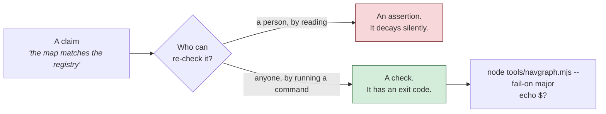
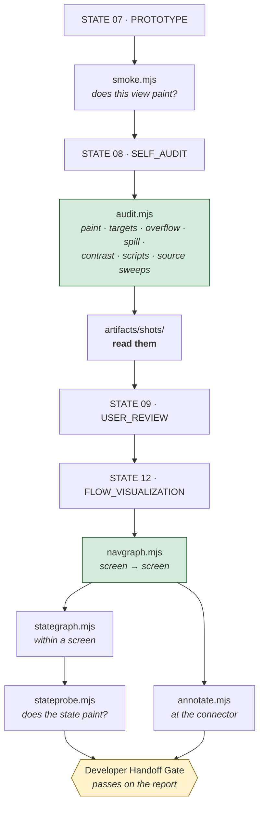
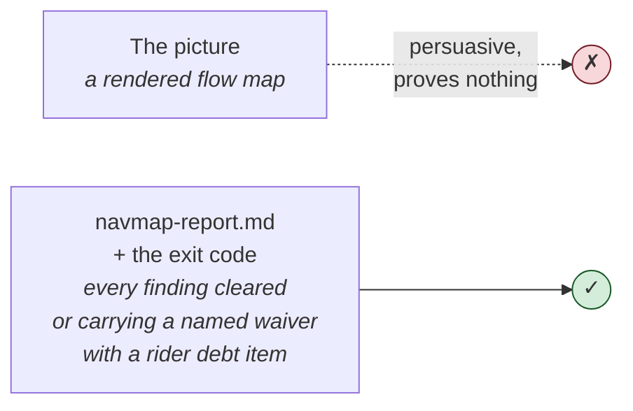

# Validation Engine

Nine tools. Zero dependencies. Every one of them turns a claim into an exit code.

[← README](README.md) · [Architecture →](ARCHITECTURE.md) · [Workflow Guide →](WORKFLOW_GUIDE.md) · [Method rules →](docs/method-rules.md)

---

## Contents

1. [What the validation engine is for](#1--what-the-validation-engine-is-for)
2. [Shared conventions](#2--shared-conventions)
3. [`smoke.mjs` — build-time paint check](#3--smokemjs--build-time-paint-check)
4. [`audit.mjs` — the rendering-class audit](#4--auditmjs--the-rendering-class-audit)
5. [`navgraph.mjs` — the navigation derivation](#5--navgraphmjs--the-navigation-derivation)
6. [`stategraph.mjs` — per-screen state machines](#6--stategraphmjs--per-screen-state-machines)
7. [`stateprobe.mjs` — does the state actually paint](#7--stateprobemjs--does-the-state-actually-paint)
8. [`annotate.mjs` — developer annotations](#8--annotatemjs--developer-annotations)
9. [`cdp.mjs` and `config.mjs` — the shared layer](#9--cdpmjs-and-configmjs--the-shared-layer)
10. [The false-positive catalogue](#10--the-false-positive-catalogue)
11. [Waivers](#11--waivers)
12. [Running the full suite](#12--running-the-full-suite)
13. [Documentation checks — `linkcheck.mjs` and `mermaidcheck.mjs`](#13--documentation-checks--linkcheckmjs-and-mermaidcheckmjs)

---

## 1 · What the validation engine is for

Every tool in [`tools/`](tools/) exists to move a statement from *asserted* to *checked*.



Two rules bind every tool in this layer. Both were written by real runs, and both are part of the contract rather than advice.

> **M1 — Every check is rendering-class.** Computed visibility and measured geometry, never DOM presence. A node can exist, lay out, and accept a programmatic click while painting nothing. On the extraction run, **84 of 84 DOM assertions passed against a screen that displayed nothing.**

> **M3 — A failing probe is a hypothesis, not a finding.** One audit's first run reported **60 failures and 3 were real**. A state probe reported **37 failures and all 37 were the harness.** Confirm at source, correct the instrument, re-run. Never waive, never report unconfirmed.

### Where each tool runs



---

## 2 · Shared conventions

### Exit codes

| Code | Meaning |
|---|---|
| `0` | No findings at or above `--fail-on`. |
| `1` | Findings at or above `--fail-on`. |
| `2` | Tool error — a missing input, an unparseable config, an unknown flag. **Not** a product defect. |

Distinguishing `1` from `2` matters: a `2` means the check did not run, which is *unevaluable*, not *passing*.

### Severity ladder

`blocking` → `major` → `advisory`. `--fail-on <level>` names the lowest rung that causes a non-zero exit. The default is `blocking`.

```bash
node tools/navgraph.mjs                    # fails only on blocking
node tools/navgraph.mjs --fail-on major    # fails on blocking + major
node tools/navgraph.mjs --fail-on advisory # fails on everything
```

### Common flags

| Flag | Effect | Available on |
|---|---|---|
| `--root <dir>` | Override the project root. Otherwise: `$TOOLKIT_ROOT` → nearest ancestor containing `toolkit.config.json` → cwd. | all |
| `--json <file>` | Where to write the machine-readable output. | navgraph, stategraph, stateprobe, annotate, audit |
| `--md <file>` | Where to write the human-readable report. | navgraph, stategraph, annotate |
| `--fail-on <sev>` | The severity threshold. | navgraph, stategraph, annotate |
| `--shots <dir>` | Where to write screenshots. | audit, stateprobe |
| `--plan <file>` | An explicit audit plan. | audit |
| `--quiet` | Suppress progress output; the exit code still holds. | all |

### Configuration

No tool contains a product-specific value. Everything is read from [`toolkit.config.json`](toolkit.config.json) via [`tools/config.mjs`](tools/config.mjs), which merges over defaults section by section and absolutises every path once — so no tool ever joins a path itself.

**Change a convention in the config, never in a tool.**

---

## 3 · `smoke.mjs` — build-time paint check

**Runs at:** STATE 07, before handing anything to the audit · **Rule:** B8

### What it checks

For each `(page, view)` pair you name:

| Check | Method |
|---|---|
| Does the view **paint**? | `getComputedStyle` display/visibility + `getBoundingClientRect` width and height above 100px |
| Is the **right** view active? | reads `data-view` off the active element and compares it to the one requested |
| Any **console errors**? | console capture plus network responses ≥ 400 from the local host, benign entries filtered **by name** |
| Any **tap target below the floor**? | measures the hit area of every interactive element against `audit.tapTargetFloorPx` |
| Any **horizontal overflow**? | `documentElement.scrollWidth > clientWidth` |

It also prints the `data-sid` the page reports, which is the first place registry ↔ prototype id drift becomes visible.

### Why it matters

The audit is expensive — it drives every screen across every pass and produces screenshots a human has to read. Spending that budget on defects assembly could have caught is waste. Smoke is the cheap pre-filter that STATE 07 owns.

### Usage

```bash
node tools/smoke.mjs "signin:main,error,reset" "home:dash,stack"
```

Each argument is `<page>:<view>[,<view>…]`, resolving to `<page>.html?view=<view>`.

### Typical output

```
PASS  signin:main   S-SIGN-01  painted
FAIL  signin:error  S-SIGN-02  BLANK
PASS  signin:reset  S-SIGN-03  painted  small:link.forgot 120x28

2 pass / 1 fail
```

### Common failures and fixes

| Output | What it means | Fix |
|---|---|---|
| `BLANK` | The view exists in the DOM and paints nothing — almost always `.active` was never added, so the container stays `visibility:hidden`. | Wire the activation. This is defect class **B6**. Do **not** lower the paint threshold. |
| `view: null` | No element matched `viewSelector` + `activeClass`. | The prototype does not honour the harness contract. Fix the markup, or change the contract in `toolkit.config.json` → `prototype` — never in the tool. |
| `small:…` | An interactive element is below `audit.tapTargetFloorPx`. | Either raise the element, or — if it has a deliberate `::after` hit-area expansion — confirm the measurement is reading the hit area. |
| `H-OVERFLOW` | The document scrolls horizontally at the review viewport. | Usually a fixed width or an un-wrapped row. Genuine horizontal scroll rails are a known false positive — see [§10](#10--the-false-positive-catalogue). |
| `errs:404 …/favicon.ico` | Environment noise, not a build defect. | Add the name to `audit.benignConsole`. Filter **by name**, never wholesale. |

---

## 4 · `audit.mjs` — the rendering-class audit

**Runs at:** STATE 08 · **Rules:** M1, M2, M3, M4

### What it checks

Per driven URL, entirely from computed style and measured geometry:

| Check | What it asserts |
|---|---|
| **paints** | The active view has non-`none` display, `visible` visibility, non-zero opacity, and a box larger than half the configured viewport. |
| **no console errors** | No console errors and no local network responses ≥ 400, after filtering `audit.benignConsole` **by name**. |
| **tap targets** | Every rendered interactive element meets `audit.tapTargetFloorPx`. Zero-size, `[hidden]`, `visibility:hidden` and `tabindex="-1"` elements are excluded — they are not reachable targets. |
| **no h-overflow** | Neither the screen container nor the document scrolls horizontally. |
| **no content spill** | No element with `overflow: visible` has `scrollHeight` exceeding `clientHeight` — content taller than its own box paints over its neighbours, which structural assertions never see. |
| **contrast** | Text contrast computed on **composited** backgrounds — semi-transparent layers are alpha-composited up the ancestor chain until an opaque one is found. Gradients are counted as skipped rather than guessed at. |
| **script fonts** | For every entry in `product.scripts`, every text node containing that script's range resolves on a stack matching `fontMatch`. CSS falls back **per glyph**. |
| **id matches registry** | The `data-sid` the page prints equals the id the plan row claims. |

Plus three **source sweeps** (M4), which are invisible on any single screen:

| Sweep | What it finds |
|---|---|
| **off-palette** | Hex values not in `audit.colorAllowlist`, after stripping CSS id and class selectors — `#feed` is a selector, not a colour. |
| **duplicate-keys** | Keys defined more times than `product.locales.length` in an object literal. Duplicate keys do not error; the later definition silently wins, and one locale can hide the defect completely. |
| **network-call-site** | Any `fetch` / `XMLHttpRequest` / `WebSocket` / `sendBeacon` / `EventSource`. If the prototype issues real requests, the handoff must say so. |

And it captures a **screenshot per driven URL per pass**.

### Why it matters

Every one of these check classes exists because a defect of that class shipped past a green assertion suite:

- **paints** — 84/84 assertions passed against a screen that displayed nothing.
- **content spill / geometry** — four of one flow's six real defects were screenshot-only finds: a closed sheet bleeding back in, a scroll that pushed the header out of frame, a label truncated to its least useful word, an asset crop gap.
- **script fonts** — an opt-in font token over a foreign base produced **138 instances across 7 flows** rendering a script on an arbitrary OS fallback; the base stack turned out to carry no face for that script at all.
- **duplicate-keys** — navigation labels silently clobbered twice, with **one locale hiding it entirely**.
- **off-palette** — invented colours passed a green audit because the audit checked DS *presence* and never non-DS *absence*.

### Usage

```bash
node tools/audit.mjs --shots artifacts/shots
```

What to drive comes from `reference/audit-plan.json` when it exists, and otherwise is derived from the hooks in `reference/state-machines.json`. Start from [`templates/audit-plan.json`](templates/audit-plan.json):

```jsonc
{
  "passes": [
    { "name": "base", "query": "" },
    { "name": "alt-locale-dark-rm", "query": "lang=fr&mode=dark&rm=1" }
  ],
  "screens": [
    { "id": "S-SIGN-01", "label": "S-SIGN-01", "url": "signin.html?view=main" }
  ],
  "states": [
    { "label": "signin-error", "url": "signin.html?view=main&state=error" }
  ]
}
```

The `passes` array is how M2's *locale × theme × reduced-motion × state* matrix is expressed. Every row is driven once per pass, and every combination gets its own screenshot.

### Typical output

```
— pass: base —————————————
.......X..

— pass: alt-locale-dark-rm (lang=fr&mode=dark&rm=1) —————————————
..........

214 / 218 checks · 20 runs · 20 screenshots
wrote artifacts/audit-data.json · screenshots in artifacts/shots

4 defect(s) — per M3, confirm each at source before writing it into audit-report.md:
  ✗ S-SIGN-02 paints — painted=false view=error
  ✗ S-SIGN-03 44px targets — link.forgot 120x28
  ✗ S-SIGN-01 no console errors — 404 http://127.0.0.1:8797/fonts/x.woff2
  ✗ sweep duplicate-keys · signin.html — navHome×3, navBack×3

M2: the screenshots are part of this audit. Read them before writing the verdict.
```

### The two steps that make this an audit rather than a rumour

1. **Confirm each failure at source.** Work through the [false-positive catalogue](#10--the-false-positive-catalogue) first. Correct the harness and re-run; record the correction in the report's **Harness corrections** section, because an uncorrected harness re-reports the same noise next run.
2. **Read the screenshots.** `artifacts/shots/`. Every one. This is a required audit step, not a supplement.

### Common failures and fixes

| Output | Likely cause | Fix |
|---|---|---|
| `audit: prototype dir not found` (exit 2) | STATE 07 has not run, or `paths.prototype` is wrong. | Check the config. Exit 2 means the check did not run. |
| `audit: no reference/audit-plan.json and no reference/state-machines.json` (exit 2) | Nothing to drive. | `cp templates/audit-plan.json reference/audit-plan.json` and list your URLs. |
| `audit: the plan drives nothing` (exit 2) | The plan parsed but has no `screens` and no `states`. | Populate it. |
| `painted=false` on an empty state | `prototype.minVisibleNodes` or the size floor is tuned to a busy screen. | An empty state is **sparse by design**. Keep the paint floor low; do not raise it to silence the check. |
| Hundreds of overflow findings | Horizontal **scroll rails** — legitimate, and `genuinelyClipped` is 0. | Check overflow **ancestry** before reporting. |
| Off-palette hexes across every file | The demo bar and device bezel are harness chrome, not app surface. | The sweep is **file**-level. Review chrome that lives in its own file goes in `review.harnessFiles`; chrome that lives inside a product file has to earn its colours from the allowlist like anything else. |
| `#FEED` reported as a colour | The CSS id selector `#feed`. | Already stripped by the scrubber; if it reappears, the selector form is unusual — fix the scrubber, not the product. |
| A tap target of 20px on an element with `::after{inset:-12px}` | An explicit hit-area expansion. | Measure the hit area, not the box. Confirm at source before reporting. |
| One screen fails to render in one theme, then renders on re-run | Timing flake. | Re-run before reporting. Stability across two consecutive runs is the bar. |
| `duplicate-keys` on a key that legitimately repeats per locale | The threshold is `product.locales.length`. | Make sure `product.locales` lists every locale. The tool reports the count; the reviewer rules it, per M6. |

---

## 5 · `navgraph.mjs` — the navigation derivation

**Runs at:** STATE 12 · **Rules:** W1, E1, E2, E3, E4, E5

### What it checks

It reads `reference/screen-registry.csv` and **derives** the navigation model. It is not an authoring surface: every edge it emits traces to a registry cell.

| Code | Severity | Meaning |
|---|---|---|
| `N1-broken-edge` | blocking | `navigates_to` or `entry_from` names a screen that is not in the registry. |
| `N2-orphan` | blocking | No inbound edge and no external entry point — the screen is unreachable. |
| `N2b-inbound-only-declared` | major | Reachable only via `entry_from`; no source screen names it in `navigates_to`, so the forward edge cannot be drawn. The screen is reachable in the product and broken in the registry. |
| `N3-asymmetric` | major | A screen's `entry_from` claims a source that does not name it back in `navigates_to`. A forward edge is missing. |
| `N3b-backedge` | advisory | The forward edge exists but `entry_from` does not name it. The map draws correctly; the column a developer reads to answer "who can send me here" is stale. |
| `N4-terminal` | major | No outbound edge and no recorded terminal justification. |
| `N8-lane` | major / advisory | Screens with no swimlane assignment. Major when the lane file exists, advisory when it does not. |
| `N9-deeplink` | major / advisory | A flow page exposes no query hook at all (major — its states cannot be re-driven after handoff), or no `?view` hook (advisory), or no page resolved for a prefix (advisory). |
| `N10-unparsed` | advisory | A registry cell carries prose where an id belongs, so a token could not be fully machine-read. |
| `N11-state-vocab` | advisory | State labels outside the closed canonical set. |
| `N11-state-syntax` | advisory | A state label that is not `canon` or `canon{qualifier}`. |

It also emits, derived rather than authored: `crossFlow` (E2 — the seams), `heat` (E3 — in-degree plus distinct source features), `states` (E5 — the per-screen inventory and histogram) and `deepLinks` (E4 — the query hooks each page **actually reads**).

### Why it matters

**Derive the graph; never draw it.** A hand-drawn connector is an assertion nobody can re-check, and in a design file a stale arrow is indistinguishable from a fresh one.

The first derivation is not tool noise. On the extraction run it opened at **2 blocking · 8 major · 52 advisory**, and *every finding was a real defect in the registry*. Repairing **three cells** added **six edges** and **five cross-feature routes** — a navigation model can be 6% wrong and look complete.

The single most instructive finding was a boundary that had been **promoted to a real handoff in the code and never written back to the registry**: caught by derivation, invisible to reading.

### Usage

```bash
node tools/navgraph.mjs --fail-on major
# → artifacts/navgraph.json   nodes, edges, crossFlow, heat, states, deepLinks, findings
# → artifacts/navmap-report.md
```

### Typical output

```
navgraph: 48 screens · 106 edges · 46 cross-feature · findings 0 blocking / 2 major / 7 advisory
  → artifacts/navgraph.json
  → artifacts/navmap-report.md
  MAJOR N3-asymmetric S-HOME-01 → S-PROF-02: S-PROF-02.entry_from claims S-HOME-01, but S-HOME-01.navigates_to does not name S-PROF-02
  MAJOR N9-deeplink SET: set.html exposes no query hook at all — no screen in this flow is directly addressable
```

### Common failures and fixes

| Finding | Fix |
|---|---|
| `N1-broken-edge` | The target id is wrong or the screen is missing from the registry. **Fix the registry** — if a route belongs in the map and not in the registry, the registry is what is wrong. |
| `N2-orphan` | Either add the inbound route to the source screen's `navigates_to`, or declare the external entry (`app launch`, `deep link`, `push notification`) in `entry_from`. |
| `N2b-inbound-only-declared` | `entry_from` was filled in and `navigates_to` was not. Add the forward edge on the source screen. |
| `N3-asymmetric` | Verify against the flow graphs **and** the prototype before touching the cell. Exactly one of the two is wrong and the tool cannot tell which. |
| `N3b-backedge` | Advisory. Repair `entry_from` when convenient — the forward edge is authoritative. |
| `N4-terminal` | If terminating is correct, record the justification. If it is not, add the outbound route. |
| `N8-lane` | Assign the screen in `reference/nav-lanes.json`. **Never guess a lane** — a wrong lane reads as a ruling about who owns a screen. |
| `N9-deeplink` (major) | The flow has no hooks at all, so its states cannot be re-driven after handoff. This is a STATE 07 **B2** failure. On the extraction run, a debt item recorded this for *one* flow; the mechanical scan found it in **three**. |
| `N10-unparsed` | Hand-editing put prose where an id belongs. Clean the cell — a token like `START-02/03 skip` carries a second id the pattern cannot see. |
| `N11-state-vocab` / `N11-state-syntax` | Normalize to the closed vocabulary **before** generating anything. See [§ Vocabulary](#the-vocabulary-rule) below. |

### The vocabulary rule

On the extraction run the registry carried **59 distinct free-text state labels across 48 screens, 49 of them outside any canonical set** — including *three* spellings of "empty for a new user". Each was locally sensible. The set was not a state machine, and no tool could tell whether two labels meant one concept or two.

The rule is **ordering, not effort**:

1. Normalize to the closed vocabulary, with the specific case as a **qualifier**: `canon` or `canon{qualifier}` — `error{invalid-number}`, `empty{new-user}`.
2. *Then* generate. Generating first freezes N private vocabularies into a deliverable.

58 qualified labels resolved to 12 canon terms with **0 findings**, and the originals were preserved in the mapping table, so the rewrite lost nothing. The vocabulary, the qualifier rule and the full mapping live in [`reference/state-vocabulary.md`](templates/state-vocabulary.md).

Two sub-rules: **the qualifier is kept, never dropped** — `error{wrong-otp}` and `error{unchecked-terms}` are different recoveries. And **adding a canon term costs a justification**, written into the vocabulary file; a term only one screen would ever use is a qualifier, not a canon term.

---

## 6 · `stategraph.mjs` — per-screen state machines

**Runs at:** STATE 12 (E5) · **Rules:** E5, W9

### What it checks

`navgraph` answers *which screen leads to which screen*. This answers the question one level down: **within** a screen, which states exist, what moves between them, and how does a developer or QA reach each one.

Two inputs, and the split is the point:

| Input | Owns |
|---|---|
| `reference/screen-registry.csv` | the canonical state **set** per screen. The tool never invents a state. |
| `reference/state-machines.json` | the **transitions** between those states, each carrying `evidence` as `file:line` into the frozen prototype, and each state carrying the `hook` that drives it. |

**The node set is derived; the edge set is authored with evidence.** Every authored claim is then checked back against the bytes.

| Code | Checks |
|---|---|
| `S0` | A machine exists for every registry screen. |
| `S1` | The node set equals the registry's state set, and is still vocabulary-legal. |
| `S2` | The initial state is declared and real. |
| `S3` | Every transition has valid endpoints and a trigger `kind` — `user` · `system` · `entry` · `data`. |
| `S4` | Every transition's `evidence` resolves to a real line in the frozen bytes. |
| `S5` | Every hook's query parameter is actually read by the page. |
| `S6` | Every state is reachable from the initial state, or explicitly flagged `entry_only`. |
| `S7` | Every state has an outbound transition, or is explicitly `terminal`. |
| `S8` | Registry ↔ prototype id drift. |
| `S9` | Declared-but-unbuilt states, with the absence evidenced. |

### Why it matters

Transitions cannot be derived — they live in the prototype's control flow. So each one carries a citation, and the tool resolves it. **An unevidenced arrow is the failure mode this whole layer exists to avoid: it looks like a spec and is a guess.**

Three node flags carry what a plain diagram would hide:

- **`entry-only`** — real, but only ever built on arrival; there is no in-screen path to it.
- **`terminal`** — no outbound change by design; the way out is leaving the screen.
- **`NOT IMPLEMENTED`**, drawn dashed — the registry declares the state and the frozen bytes never render it. Seven of 118 states were dashed on the extraction run. Dropping them would have made the deliverable agree with itself by deleting the disagreement.

### Usage

```bash
node tools/stategraph.mjs --fail-on major
# → artifacts/stategraph.json
# → artifacts/statemap-report.md
```

### Common failures and fixes

| Finding | Fix |
|---|---|
| `S1` node set differs from the registry | Either the machine invented a state or the registry is short one. The registry owns the set — reconcile there. |
| `S4` evidence does not resolve | The cited line has moved or the file was rebuilt. Re-cite against current bytes. This is exactly the check that stops annotations from quietly aging. |
| `S5` hook parameter not read by the page | The hook is documented and not implemented. That is a STATE 07 **B2** gap, not a documentation gap. |
| `S6` unreachable state | Flag `entry_only` if that is the truth, or add the path. |
| `S8` id drift | The prototype prints one id and the registry claims another. **Record it, do not reconcile it** — renumbering is a registry decision. |
| `S9` declared but unbuilt | Keep it, dashed. Do not delete the state to make the report clean. |

---

## 7 · `stateprobe.mjs` — does the state actually paint

**Runs at:** STATE 12 (E5) · **Rules:** M1, E5

### What it checks

`stategraph` proves the hook parameter is **read** by the page. That is not the same claim as the state being **shown**.

This probe drives every hook URL in `reference/state-machines.json` headlessly and asserts the active view is **computed-visible with ink on it** — computed visibility and geometry, never DOM presence. It also reads back the prototype's own screen-id readout at every load, which independently confirms or refutes registry ↔ prototype id drift.

### Why it matters

**A hook that seeds state is not a hook that shows it.** The distinction is the difference between a QA URL that works and a QA URL that appears to work.

The id readout matters for a subtler reason: on the extraction run it produced **11 observations where the registry id and the printed id differ**, confirming one known conflict and opening the same class on a second flow. The drift was **measured**, not asserted from the source.

### Usage

```bash
node tools/stateprobe.mjs
node tools/stateprobe.mjs --shots artifacts/shots/states   # optional captures
```

### Common failures and fixes

| Symptom | Cause | Fix |
|---|---|---|
| A hook that renders nothing | The hook names a fixture id the catalogue does not contain and the page threw. | **A wrong fixture is not a product defect.** Fix the fixture. |
| Every empty state reported as not painting | The node threshold is tuned to a busy screen. | Lower `prototype.minVisibleNodes`. An empty state is sparse by design. |
| Console errors on nearly every page | An offline webfont CDN and a missing `favicon.ico`. | Filter by name in `audit.benignConsole`. Neither belongs to the build. |
| A large batch of failures on the first run | Almost certainly the harness. | The first probe run on the extraction set reported **37 failures and every one was the harness.** Corrected, not waived. |

---

## 8 · `annotate.mjs` — developer annotations

**Runs at:** STATE 12 (E6) · **Rules:** E6, V12

### What it checks

`navgraph` answers *which screen leads to which*. `stategraph` answers *within a screen*. This answers the question a developer asks **at the connector**: when the app takes this route, what kind of navigation is it, what moves on screen, what call does it make, and what has to be true first — plus, per frame, who is allowed in and what the OS must grant.

| Field | On | Closed value set | Source |
|---|---|---|---|
| `nav` | edge | `push` · `replace` · `modal` · `sheet` · `tab` · `back` · `deep-link` · `UNKNOWN` | `flows-*.md` transitions, **authored with `file:line` evidence** |
| `anim` | edge | the named motion preset, or `none` | **derived** — the CSS the page declares |
| `api` | edge | the call this transition triggers, or `none` | **derived** — a re-run network sweep, never the recorded claim |
| `guard` | edge | the flow graph's guard expression | `flows-*.md`, **authored with evidence** |
| `auth` | frame | `guest-ok` · `auth-required` · `premium` · `UNKNOWN` | registry states + flows |
| `perm` | frame | the OS permission needed, or `none` | `ux-plan.md` |

| Code | Meaning |
|---|---|
| `E0` / `E1` | Missing or blank field. **Blank is a failure; `UNKNOWN` is legal.** |
| `E2` | An uncited value. |
| `E3` | A value outside the closed set. |
| `E4` | A citation that does not resolve in the frozen bytes. |
| `E5` / `E6` / `E7` | Duplicate, uncovered or orphan edge. |
| `E8` | `nav` = `UNKNOWN` — no call site found. |
| `E9` / `E10` | Frame coverage gaps. |
| `E11` | The `api` claim disagrees with the re-run network sweep. |
| `E12` | An `anim` naming an animation the cited file does not declare. |
| `E13` | `hook_only` — the route exists as a URL hook with no in-screen control behind it. |

### Why it matters

Two rules make this layer survivable, and both were expensive to learn.

> **`UNKNOWN` is a legal value and a guessed value is not.** An `api` field filled with a plausible endpoint is worse than an empty one, because the developer will build it. Every `UNKNOWN` is counted in the report.

> **Annotations cite, they do not restate.** The field carries the value *and* the artifact it came from. On the extraction run every `api` value read `none (simulated)` — no network call existed anywhere in the prototypes — and saying so in the field was the single most useful thing this layer did for the receiving team. **The most valuable column was the one where every value is identical, and it is only valuable because it is measured each time.**

Two things this pass found that no other tool could:

- **`nav` is the field that finds missing routes.** Assigning a kind forces the question *which control does this?*, which `navgraph` never asks — it derives routes from the registry. That surfaced **four registry routes with no call site at all**, three previously unrecorded.
- **`hook_only`** — a route navigable by QA and unreachable by a user. "Navigable" and "implemented" are different claims, and the annotation has to distinguish them.

And one rule about honesty: **state the value the bytes carry, not the value the plan asked for.** The plan specified a 280 ms view push; the build shipped 260 ms, and four files shipped none at all. Annotating the plan's number would have produced a document wrong in exactly the way a developer cannot detect.

### Usage

```bash
node tools/annotate.mjs --fail-on major
# → artifacts/annotations.json
# → artifacts/annotate-report.md
```

Requires `artifacts/navgraph.json` (run `navgraph.mjs` first) and `reference/edge-annotations.json`.

### Common failures and fixes

| Finding | Fix |
|---|---|
| `E1` blank field | Fill it, or write `UNKNOWN`. Blank fails; `UNKNOWN` passes and is counted. |
| `E4` citation does not resolve | The cited line landed past the end of the file, or on a line that has since gone blank. Re-cite against the frozen bytes — this is what makes the annotation survive the next revision. |
| `E8` `nav` = `UNKNOWN` | No call site was found for a route the registry claims. Either the control is missing (a real defect) or it is implemented somewhere the citation does not name. |
| `E11` `api` claim vs sweep | The column says `none (simulated)` and the sweep found a request, or vice versa. The **sweep** is authoritative — it re-runs every time. |
| `E13` `hook_only` | Record it. A route reachable only by URL is a real finding for a build team, not a nuisance. |

Before this layer ran on the extraction set, **43 of 106 edges carried a label** and the other 63 were unlabelled routes. Assigning the values closed that gap *and* found four routes with no call site, plus one addressable only by URL.

---

## 9 · `cdp.mjs` and `config.mjs` — the shared layer

Neither is a validator. Both are why the validators have no dependencies.

### `cdp.mjs`

A minimal headless Chrome driver over the DevTools Protocol: launch, new page, navigate, evaluate in-page, capture console, capture network responses, screenshot, close. Plus a static file server for the prototype tree.

Used by `smoke.mjs`, `audit.mjs` and `stateprobe.mjs`. Chrome's path comes from `audit.chrome` or `$TOOLKIT_CHROME`.

### `config.mjs`

The one place a tool learns where this product keeps its files.

- **Root resolution:** `--root` flag → `$TOOLKIT_ROOT` → nearest ancestor of cwd containing `toolkit.config.json` → cwd.
- **Merge:** shallow-per-section over the built-in defaults, so a product overrides keys, never whole sections.
- **Paths:** every path is resolved to absolute **once**, here — so no tool ever joins a path itself.
- **Args:** shared parsing, so every tool takes the same flags.
- **Severities:** the single `['blocking','major','advisory']` ladder.

If a tool needs a new product-specific value, it goes in `toolkit.config.json` and comes through here. That is the whole rule that keeps `tools/` product-agnostic.

---

## 10 · The false-positive catalogue

**A failing probe is a hypothesis, not a finding.** Rule each of these classes out before writing anything into a report.

| Reported | Reality | What to do |
|---|---|---|
| Hundreds of overflow violations | Inside horizontal **scroll rails** — `genuinelyClipped: 0`. | Check overflow **ancestry**. |
| Off-palette hexes across 8 files | The demo bar and device bezel — **harness chrome**, not app surface. | List chrome **files** in `review.harnessFiles`. The sweep excludes files, not selectors. |
| A `#FEED` colour violation | The CSS **id selector** `#feed`. | A hex scanner must not read selectors. |
| A foreign-stack font token used 27–47× per file | The intended architecture for numerals. | The check itself was wrong. |
| A 20px tap target | `::after{inset:-12px}` — an explicit, commented hit-area expansion. | Measure the **hit area**, not the box. |
| A clipped `` | A deliberate crop — an oversized asset inside `overflow:hidden`. | Confirm at source. |
| A screen failing to render in one theme | **Timing flake** — it renders at every settle when measured. | Re-run before reporting. Two stable consecutive runs is the bar. |
| Console errors on nearly every page | An offline webfont CDN and a missing `favicon.ico`. | Filter benign entries **by name**, never wholesale. |
| Empty states "fail to paint" | A visible-node threshold tuned to a busy screen. | An empty state is **sparse by design**. Lower the threshold. |
| A hook that renders nothing | The hook names a fixture id the catalogue does not contain, and the page threw. | **A wrong fixture is not a product defect.** |

Every one of these was **corrected in the harness and the audit re-run — not waived.** The corrections are recorded in the audit report's Harness corrections section, because an uncorrected harness re-reports them next run.

---

## 11 · Waivers

A rule may be **waived**, never skipped. A waiver ships only when all three hold:

1. **The user grants it.** The machine cannot waive its own rules.
2. It is written into the deliverable's **Known limitations** *and* opened as a **numbered debt item**, with an id both sides can cite.
3. It states **what would close it**.

On the extraction run, two validations were waived at one gate — audit currency, and a missing traceability matrix — each riding a numbered debt item. **Both were closed the next day.** One by an audit re-run that immediately found three more real defects; the other by a backfill that reported 26 requirements / 90 ACs with 0 unmet.

> **The waiver was never the problem. The silence would have been.**

What a waiver is **not**: a way to make a failing check pass. A failing check that has not been confirmed at source is not eligible for a waiver — it is eligible for [§10](#10--the-false-positive-catalogue).

---

## 12 · Running the full suite

```bash
# STATE 07 — before handing to the audit
node tools/smoke.mjs "signin:main,error,reset" "home:dash,stack"

# STATE 08 — then READ artifacts/shots/
node tools/audit.mjs --shots artifacts/shots

# STATE 12 — order matters: annotate reads navgraph.json
node tools/navgraph.mjs   --fail-on major
node tools/stategraph.mjs --fail-on major
node tools/stateprobe.mjs
node tools/annotate.mjs   --fail-on major
```

### As a gate check

```bash
set -e
node tools/navgraph.mjs   --fail-on major --quiet
node tools/stategraph.mjs --fail-on major --quiet
node tools/stateprobe.mjs --quiet
node tools/annotate.mjs   --fail-on major --quiet
echo "READY FOR DEVELOPMENT — scoped to: <the flows named in scope>"
```

Never a bare "handoff ready". The status is scoped to the flows named in `scope`, and the scope goes **inside** the claim.

### What the gate reads



**A picture that looks right over a report that says `2 blocking` is the exact failure STATE 12 exists to prevent.**

---

## 13 · Documentation checks — `linkcheck.mjs` and `mermaidcheck.mjs`

The seven tools above validate a *product*. These two validate this *repository*, and they exist for the same stated reason: a claim nobody re-checks is a claim that rots.

The documentation here is a navigable set, not a pile of files — a skill README points at its specification, the specification points back, the workflow guide points at both. A dead link inside that set is the same class of defect as a dead deep-link hook inside a prototype: **the structure names a destination that is not there.** It is invisible to a reader who does not happen to click, which is the definition of a defect worth automating.

Neither tool takes a reference input. The markdown is the input.

### What each checks

| Tool | Code | Severity | Fires when |
|---|---|---|---|
| `linkcheck.mjs` | `D1-missing` | blocking | a relative link points at a file or directory that does not exist |
| | `D2-anchor` | blocking | a `#fragment` names no heading in the target file |
| | `D3-dir` | advisory | a link points at a directory with no `README.md`, so it renders as a file listing |
| `mermaidcheck.mjs` | `D4-type` | blocking | the first token is not a recognised diagram type |
| | `D5-quotes` | major | a line carries an odd number of `"` — an unterminated label |
| | `D6-unclosed` | blocking | a ` ```mermaid ` fence never closes |
| | `D7-parens` | advisory | parentheses sit inside an unquoted `[label]` |

### Usage

```bash
node tools/linkcheck.mjs    --fail-on major
node tools/mermaidcheck.mjs --fail-on major

# Same flags as every other tool
node tools/linkcheck.mjs --root ../other-product --json /tmp/links.json --quiet
```

### Typical output

```
896/896 internal links resolve · 0 blocking · 0 major · 0 advisory · 86 files
39 mermaid blocks in 86 files · 0 blocking · 0 major · 0 advisory
```

### What they deliberately do not check

Stated because a scope claim belongs inside the claim.

| Not checked | Why |
|---|---|
| `http(s):` targets | Network state is not a property of this repository. A check that fails on someone else's outage gets ignored, and an ignored check is worse than no check. |
| Links inside fenced code blocks | Those are examples of link syntax, not links. |
| Whether a Mermaid block **renders** | This is a syntax-smell check, not a parser. Rendering is proved by looking at the page (`M2`). |
| Whether the writing is any good | Structure holding is not the same claim as prose being right, and only one of them is mechanical. |

### The false positive that shaped `linkcheck.mjs`

Worth recording, because it is `M3` happening to the check itself.

The first version collapsed runs of whitespace when slugifying a heading. GitHub does not: it strips punctuation and then replaces **each remaining space with a hyphen**. So `## 1 · High-level architecture` loses the `·` and keeps both surrounding spaces, producing `#1--high-level-architecture` — two hyphens.

That one-character difference (`\s+` versus `\s`) reported **167 correct links as broken** on the first run. A check that opens with 167 false positives does not get debugged; it gets deleted. The probe was the defect, exactly as the rule says to assume.

### The false positive that shaped `mermaidcheck.mjs`

The same story, one file over. The first version flagged parentheses inside square brackets as an unquoted label — and reported twelve findings, every one of them a **valid Mermaid shape**: `db[(Store)]` is a cylinder, `s([Go])` is a stadium. The parentheses belong to the shape, not to the label. Compound shape delimiters are now recognised before the label scan, and the remaining check is advisory rather than blocking, because the class it catches is a style smell rather than a parse failure.

---

[← README](README.md) · [Architecture →](ARCHITECTURE.md) · [Workflow Guide →](WORKFLOW_GUIDE.md) · [Artifact Flow →](ARTIFACT_FLOW.md) · [Method rules →](docs/method-rules.md)
